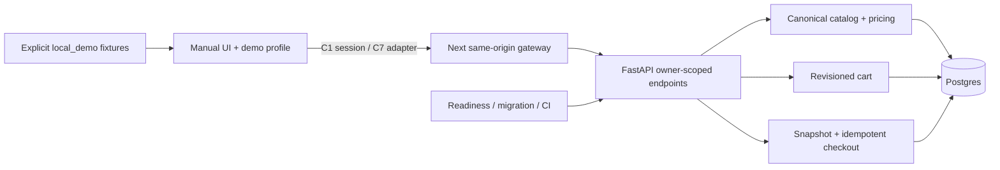
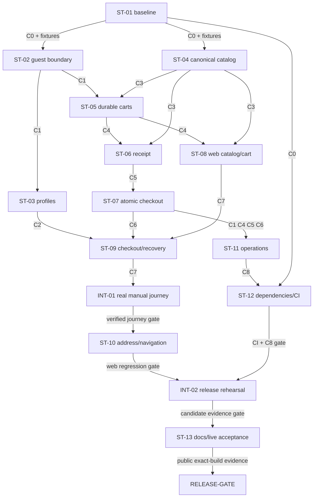

# OrderlyApp development guide — stabilization

Revision: 2 • Updated: 2026-10-04 • Assessed source: `9222c10435e3a96396ab7c1b39e4d6d79d839771` on `main` • Release status: **Not completed**.

This is the single execution guide for taking the existing application to a stable **public mock demo**. **ST-01 is now implemented and verified.** ST-02 through ST-13 and the integration/release gates remain **Not completed**. This guide began as planning-only documentation; the dated ST-01 evidence below records the authorized implementation that followed. No later ticket is implied complete by ST-01.

Think of the app as a shop made from Lego. The screens already look like a shop, but some connections behind them can lose a basket, show another visitor's receipt, or pretend an order succeeded when the server failed. First we strengthen those connections. Then we add more Lego.

## Navigation

1. [Project charter](#1-project-charter)
2. [Codebase reconnaissance](#2-codebase-reconnaissance)
3. [Architecture Decision Register](#3-architecture-decision-register)
4. [System invariants](#4-system-invariants)
5. [Component graph](#5-component-graph)
6. [Contract registry](#6-contract-registry)
7. [Dependency DAG](#7-dependency-dag)
8. [Workstreams and execution waves](#8-workstreams-and-execution-waves)
9. [Task index and remaining work](#9-task-index-and-remaining-work)
10. [Full implementation packets](#10-full-implementation-packets)
11. [Integration checkpoints](#11-integration-checkpoints)
12. [Test matrix](#12-test-matrix)
13. [Critical path and parallelization](#13-critical-path-and-parallelization)
14. [Release, migration, rollback, and observability gates](#14-release-migration-rollback-and-observability-gates)
15. [Risks and true blockers](#15-risks-and-true-blockers)
16. [Delegation readiness report](#16-delegation-readiness-report)

**Status rules:** A checked TODO means that step has evidence. A ticket becomes **Completed** only when its numbered acceptance criteria, required tests, migration/compatibility obligations and handoff pass on the identified build. “Code written,” “unit tests passed,” “CI passed,” “deployed” and “accepted on the public deployment” are separate states. A blocked or unrun check is never a pass. Keep the index, packet status and evidence ledger synchronized. Existing historical tracker labels are not proof that these new stabilization tickets are complete.

## 1. Project charter

**Goal:** A visitor can browse an authoritative restaurant menu, customize an item, edit a basket, select a demo delivery address, submit mock checkout once, and reopen the same complete receipt. Reloads, retries, another browser tab and temporary server failures must not corrupt this journey.

**Confirmed user decisions:** Stabilize before adding features; target a public mock demo; use password-free demo profiles; postpone voice until stabilization. The user requested a detailed `development.md` and explicitly said **no coding** for this documentation task.

**Scope:** Existing manual ordering, demo profile/address screens, scoped guest data, canonical pricing, cart persistence, honest error states, receipt/history correctness, safe startup, reproducible checks and verified public access. The mock payment screen must collect no real card information. A stored order means “mock order saved,” not a restaurant accepted it or a driver is coming.

**Mode boundary:** The public release uses `api`. `local_demo` is a development/test fixture preview limited to browsing, customization and a namespaced local basket. It shows a persistent “Local fixture preview — checkout unavailable” label, needs no guest session/backend, and disables checkout, receipt and history routes with an explanatory state. It creates no orders and promises no server persistence or guest isolation. It is not an alternative public release or an outage fallback. ST-08 owns these restrictions; ST-09 verifies direct checkout/receipt/history navigation cannot bypass them.

**Non-goals:** Real payments/refunds, restaurant onboarding, drivers, dispatch, real accounts/OAuth, email/SMS, LLMs, speech/microphone UI, new cuisines, loyalty, recommendations and administrator dashboards. These need later charters. Existing voice/parser code can remain unused; it must not be promoted as a working feature.

**Success measures:** All release-gate cases pass on one identified candidate; separate visitors cannot access each other's data; backend faults never create pretend API success; receipt totals and address survive refresh; one checkout key produces one durable order; restarting the backend preserves data/catalog; the public URL can be opened without developer sign-in. No arbitrary conversion, traffic or latency claims are made.

**Authority:** These are local Markdown tickets. Future coding, tracker publication and deployment are separate operations. Keep unrelated audit/graph files and user changes intact. Implementation owner is unassigned; no new thread is implied.

## 2. Codebase reconnaissance

Evidence baseline is the October 4 audit, not a new runtime test performed while saving this document. See [assessment](docs/audit-2026-10-04/ASSESSMENT.md), [verification record](docs/audit-2026-10-04/verification.json), [QA charters](docs/audit-2026-10-04/qa-charters.md) and [repository context](docs/repo_context.md). The older [implementation proposal](docs/audit-2026-10-04/IMPLEMENTATION_PLAN.md) included an assistant; this guide supersedes that scope and its pending audience/account decisions.

| Area / existing files and symbols | Observed state | Required outcome |
|---|---|---|
| `app/page.tsx`, `app/restaurants/page.tsx`, menu/item pages; `lib/marketplace.ts`, `lib/mock-data.ts` | Discovery and customization use local catalog fixtures despite API helpers | API-mode screens use canonical catalog; fixtures only in explicit local demo |
| `lib/api.ts`: `fetchRestaurants`, `fetchRestaurant`, `fetchCart`, `saveCart`, `createBackendOrder`, `fetchOrder`, `fetchOrders` | Different failures collapse to undefined/false; session IDs come from browser storage | Typed errors, server guest ownership, consistent same-origin transport |
| `lib/auth.ts`: credential helpers, local sessions; sign-in/account pages | Raw passwords stored locally; browser profile is not server authentication | Remove credential collection and legacy secrets; profile is presentation only |
| `app/checkout/page.tsx`, confirmation/history pages; `lib/cart.ts`, `lib/types.ts` | API failure can become local confirmed order; returned receipt can lose tip/address/total; unknown ID can display another order | Durable server receipt, no implicit fallback, exact-ID lookup, explicit retry |
| `backend/app/main.py`: `carts_*`, `orders_*`, `health`; `models.py` | Caller-chosen session paths and global order listing; incomplete order model | Owner derived server-side; bounded requests; complete snapshots |
| `backend/app/store.py`: `validate_cart_items`, `calculate_cart_pricing`, `write_cart`, `create_order` | Inconsistent validation, Redis/PG/JSON authority, order insert and cart clear not atomic | One canonical validator; durable revisioned cart; atomic idempotent checkout |
| `backend/app/database.py`, `redis_store.py` | Configured DB is treated as available; cache recovery may expose stale state | Actual readiness; Postgres authority; no production failover to another store |
| `backend/scripts/migrate.py`, `seed_postgres.py`, `migrations/001_initial.sql`, Docker/Render config | Startup seeding resets catalog; no existing backend test harness | Explicit seed/migration jobs; additive compatibility and recovery tests |
| `package.json`, `tests/`, `e2e/`, `playwright.config.ts` | Historical 37 unit tests passed; typecheck/build passed; five E2E attempts failed before browser launch | Reproducible backend + browser suites with product assertions |

Frontend baseline: Next 16.2.2, React 19.2.4, TypeScript, Vitest and Playwright. Backend: FastAPI/Pydantic with Postgres, Redis and JSON paths. Existing scripts: `npm run test`, `npm run typecheck`, `npm run build`, `npm run test:e2e`, `npm run test:e2e:list`. `npm run lint` currently runs only typecheck; it is not separate lint coverage.

**Evidence limits:** Full-stack tests were not run because Docker was unavailable. Matching Playwright Chromium was missing. The recorded Vercel deployment redirected to developer sign-in; other deployments were not thereby proven inaccessible. Formal CSO startup failed, so no formal CSO pass is claimed. Dependency advisory counts in the saved audit are historical and must be refreshed. The knowledge graph is discovery assistance, not execution evidence; remote indexing previously failed approval and was not bypassed.

**Command vocabulary used by tickets:** `WEB` = `npm run test:web`; `CONTRACTS-TS` = `npm run test:contracts`; `BACKEND` = `python -m pytest backend/tests -q`; `E2E-INSTALL` = `npm run test:e2e:install`; `E2E` = `npm run test:e2e`. ST-01 verified these interfaces on hosted Node 22 / Python 3.12 with PostgreSQL 16 and Playwright Chromium. Exact clean-install commands and resolver details are recorded in `docs/runbooks/ci.md`.

## 3. Architecture Decision Register

“Locked for this plan” describes design direction, not implemented or tested code. New evidence requiring a change must update this guide, schemas, fixtures and consumers before implementation continues.

| ID | Status / choice | Why / rejected alternative / consequence | Contracts |
|---|---|---|---|
| ADR-01 | User-confirmed: public mock demo, manual flow first | A real service adds payment/provider/operations obligations. Voice waits outside this DAG | All |
| ADR-02 | User-confirmed: password-free demo profiles; technical choice: server guest identity | A profile name is a label, not authentication. Changing it never grants another visitor's orders | C1, C2 |
| ADR-03 | Locked: Next same-origin `/api/orderly` gateway; FastAPI validates a signed HttpOnly guest cookie | Avoid direct browser ownership IDs and cross-site cookie complexity. Proxy does not trust browser-supplied internal headers | C1 |
| ADR-04 | Locked: Postgres authoritative in API mode; no Redis authority or JSON failover | Three writable copies cannot reliably agree. Redis is unused for correctness; local_demo remains explicitly local | C3, C4, C5 |
| ADR-05 | Locked: revision compare-and-swap carts and immutable receipts | A second tab must not silently overwrite a newer basket; menu edits must not change old receipts | C4, C5 |
| ADR-06 | Locked: owner-scoped idempotency, transaction includes order + cart clear | Browser disabling alone cannot prevent duplicate requests or recover lost responses | C6 |
| ADR-07 | Locked: public release uses `api`; explicit `local_demo` is development/test browsing and basket preview only | A server outage is an error, not permission to invent an accepted order; preview has no checkout/receipts/history | C0, C7 |
| ADR-08 | Locked: additive migrations, one deploy migration job, explicit fixture seed | Boot reseeding erases catalog edits. Preserve legacy records without claiming their ownership | C4–C6, C8 |
| ADR-09 | Locked: integer cents; round half up; server quote and snapshot | Python/JS rounding can differ. Promo is server policy, never a submitted discount amount | C3, C5 |
| ADR-10 | Locked: mock order remains `Placed`; no time-driven delivery claim | “Placed” is durable mock storage, not restaurant acknowledgement. Simulator features need later scope | C5, C7 |
| ADR-11 | Locked: 30-day guest session/data window, explicit forget/reset, no cross-device recovery | Anonymous cookies cannot securely recover lost identity. Use synthetic address/contact fixtures; expired guests receive new isolated scope | C1, C2, C8 |

## 4. System invariants

| ID | Always-true rule, in plain words | Enforcement | Proof owner |
|---|---|---|---|
| INV-01 | Your basket and receipts belong only to your browser guest | Verified cookie owner on every protected query | ST-02, INT-01 |
| INV-02 | Server failure never means an API order succeeded | Explicit mode and typed results | ST-09, INT-01 |
| INV-03 | Old receipts stay exactly as saved | Snapshot fields, no catalog reconstruction | ST-06, ST-09 |
| INV-04 | Retrying the same checkout creates at most one order | Owner/key unique constraint and atomic transaction | ST-07 |
| INV-05 | A basket contains valid items from one restaurant | Canonical validation, limits, availability | ST-04, ST-05 |
| INV-06 | An old tab cannot silently erase newer edits | Revision comparison; conflict preserves current state | ST-05, ST-08 |
| INV-07 | API data has one durable source | Postgres-only authority; required faults fail safely | ST-05, ST-11 |
| INV-08 | Names, prices and money are determined by server rules | Reject injected price/name/discount authority | ST-04, ST-06 |
| INV-09 | Demo profiles collect no passwords or real payment details | Remove credential UI/storage; mock payment only | ST-03, ST-10 |
| INV-10 | Restarting does not replace catalog or lose accepted receipts | Separate seed/migration; durability checks | ST-11, INT-02 |
| INV-11 | A displayed order is the exact requested order | Owner-scoped ID lookup; no latest-order fallback | ST-09 |
| INV-12 | Completion claims refer to evidence for a named build | Evidence ledger and release checklist | ST-12, ST-13 |

## 5. Component graph

| Boundary | Responsible tickets | Mutable authority |
|---|---|---|
| Contract/test foundation | ST-01 | Contract fixtures, documented test runner |
| Session/gateway | ST-02 | Signed session and origin enforcement |
| Profile/address | ST-03, then ST-10 | Browser presentation only, never ownership |
| Catalog/cart/order service | ST-04 → ST-05 → ST-06 → ST-07 | Postgres canonical data and transactions |
| Web integration | ST-08 → ST-09 → ST-10 | UI/drafts; API adapter cannot fabricate success |
| Operations/evidence | ST-11 → ST-12 → ST-13 | Deployment configuration and exact-build evidence |

## 6. Contract registry

A contract is a promise between two parts of the program. For example: “give me a valid basket revision and I either save the whole change or explain why I rejected it.” A consumer should need this promise and examples, not private database implementation details.

The contract designs below remain authoritative. **C0 is frozen by completed ST-01 at schema version 1. C1–C8 now have executable synthetic version-1 scaffolds but remain implementation-unfrozen until their named provider tickets pass provider conformance.** One source-of-truth owner is named for each contract; after the ST-01 scaffold handoff, the provider owns changes.

**Shared HTTP rules:** JSON envelope has `schema_version: 1`. API base is `/api/orderly/v1`; backend routes mirror `/v1`. Protected routes use the verified guest cookie, never a request `session_id` or `owner_id`. Error response is `{ "error": { "code": "cart_conflict", "message": "Basket changed in another tab", "request_id": "synthetic-request-1", "fields": [] } }`, with optional `current_cart` on cart conflicts. No tracebacks, tokens or DB URLs are returned. Reject unknown write fields. Limit request body to 64 KiB; notes 500 chars, address instructions 500 chars; max 50 lines, quantities 1–10, no duplicate group/option IDs. Strict money integers; invalid floats/negative amounts are rejected. Same-origin unsafe requests require exact allowed Origin; proxy forwards cookies and Set-Cookie safely, strips spoofable internal identity headers and never redirects to arbitrary targets.

**Common contract change protocol:** Provider proposes a versioned change here, updates every listed consumer and fixture, reruns conformance and affected integration gates, and freezes again. Additive optional fields may stay v1; changed required fields/semantics require v2 or a coordinated maintenance deployment. No mixed old browser/client assumptions silently fall back. Read-only legacy records remain preserved but inaccessible through unowned public endpoints.

### C0 — Mode and verification baseline

1. **Provider / owner:** ST-01.
2. **Consumers:** ST-02, ST-04, ST-08, ST-09, ST-12; integration/release gates consume their evidence.
3. **Interface type:** Configuration / reproducibility.
4. **Source of truth:** package.json; backend/pyproject.toml; CREATE tests/fixtures/contracts/baseline.json.
5. **Inputs:** ORDERLY_DATA_MODE=api|local_demo, exact source SHA, dependency locks.
6. **Outputs:** Explicit mode; repeatable WEB/BACKEND/E2E entry points; baseline hosted CI and current dependency assessment.
7. **Preconditions:** Valid environment and pinned dependencies.
8. **Postconditions:** Unknown/missing production mode fails startup; public release requires api; local_demo is a labelled development/test preview under the charter's mode boundary.
9. **Errors:** invalid_config; missing runtime/browser is blocked, never product pass.
10. **Retry / idempotency:** Checks are rerunnable on isolated fixtures; production records are never test seeds.
11. **Ordering / concurrency:** Setup precedes protected browser activity.
12. **Security / privacy:** No secrets in fixture/config evidence.
13. **Migration / lifecycle:** Mode changes require clearing namespaced local demo caches; no automatic API import.
14. **Fixture / stub:** `{"schema_version":1,"mode":"api","source_sha":"example-sha","backend_test_command":"python -m pytest backend/tests"}`. ST-01 materializes CREATE `tests/fixtures/contracts/c0.json`; provider extends with negative cases before freeze.
15. **Freeze point:** ST-01 after real clean-environment checks; script interface recorded.
16. **Post-freeze changes:** Shared version/change protocol above; owner updates all named consumers before refreeze.
17. **Conformance proof:** Consumers validate mode enum and runner evidence; real backend suite launch; hosted baseline jobs identify the assessed SHA. ST-08/09 prove local preview restrictions; ST-12 expands CI to final acceptance.
18. **Compatibility:** Version1; no implicit legacy ownership/fallback; expand before cutover and verify browser/API deployment together.

### C1 — Guest session and ownership

1. **Provider / owner:** ST-02.
2. **Consumers:** ST-03, ST-05, ST-07, ST-08, ST-11; integration/release gates consume their evidence.
3. **Interface type:** HTTP / cookie.
4. **Source of truth:** CREATE backend/app/identity.py; CREATE app/api/orderly/[...path]/route.ts.
5. **Inputs:** POST /v1/session with allowed Origin; verified cookie for protected routes; POST /v1/session/reset.
6. **Outputs:** Session bootstrap200 {schema_version:1,expires_at}; no public owner ID; signed opaque guest cookie.
7. **Preconditions:** API mode, >=32-byte random signing secret, exact allowed origins.
8. **Postconditions:** Valid bootstrap preserves identity; new/reset/expired session cannot read previous guest data.
9. **Errors:** 401 session_required/session_expired;403 origin_forbidden;503 storage_unavailable.
10. **Retry / idempotency:** Bootstrap repeat preserves valid guest; reset intentionally creates new guest and marks previous for deletion.
11. **Ordering / concurrency:** Bootstrap completes before protected requests; reset aborts pending client writes.
12. **Security / privacy:** HttpOnly; Secure on HTTPS; SameSite=Lax; Path=/api/orderly on browser; backend validates signature/expiry; no identity header bypass; generic404 for foreign orders.
13. **Migration / lifecycle:** 30-day expiry; API traffic never extends it silently; secret rotation invalidates old tokens; cleanup deletes expired scoped carts/orders/idempotency records; legacy unowned data remains offline.
14. **Fixture / stub:** `{"schema_version":1,"expires_at":"2030-01-31T00:00:00Z"} plus fixture jars guest-A/guest-B and expired/forged/missing tokens`. ST-01 materializes CREATE `tests/fixtures/contracts/c1.json`; provider extends with negative cases before freeze.
15. **Freeze point:** ST-02 after two-guest, expiry, proxy Set-Cookie and Origin conformance tests.
16. **Post-freeze changes:** Shared version/change protocol above; owner updates all named consumers before refreeze.
17. **Conformance proof:** ST-03/05/07/08 session cases and INT-01 two-cookie-jar matrix.
18. **Compatibility:** Version1; no implicit legacy ownership/fallback; expand before cutover and verify browser/API deployment together.

### C2 — Password-free presentation profile

1. **Provider / owner:** ST-03.
2. **Consumers:** ST-09, ST-10; integration/release gates consume their evidence.
3. **Interface type:** Browser data / UI.
4. **Source of truth:** lib/auth.ts; CREATE tests/fixtures/contracts/profile.json.
5. **Inputs:** Synthetic profile {schemaVersion:1,id,name,defaultAddressId}; validated address records; no password/email login.
6. **Outputs:** Display name and selected synthetic address; server guest remains unchanged.
7. **Preconditions:** C1 session established for API mode; profile has no ownership authority.
8. **Postconditions:** Profile rename/switch cannot change server access; reset removes legacy credential storage. ST-03 supplies validated synthetic address choices; ST-09 wires selection/default precedence and receipt persistence before INT-01. ST-10 subsequently hardens the UI.
9. **Errors:** invalid_profile and storage_unavailable are recoverable UI states; never fabricate authentication.
10. **Retry / idempotency:** Storage reads validate shape; failed write leaves last valid state and explains failure.
11. **Ordering / concurrency:** Profile updates are local; reset serializes against pending checkout.
12. **Security / privacy:** No password collection/storage, auth token or actual card details; old auth-account keys removed by exact key, not localStorage.clear.
13. **Migration / lifecycle:** Versioned namespace; discard invalid legacy credentials; legacy address data is not blindly imported; no cross-device account claim.
14. **Fixture / stub:** `{"schemaVersion":1,"id":"demo-profile-1","name":"Demo visitor","defaultAddressId":"demo-address-1"}`. ST-01 materializes CREATE `tests/fixtures/contracts/c2.json`; provider extends with negative cases before freeze.
15. **Freeze point:** ST-03 after no-secret storage inspection and profile/session separation tests.
16. **Post-freeze changes:** Shared version/change protocol above; owner updates all named consumers before refreeze.
17. **Conformance proof:** ST-09/10 use profile labels only; profile contract unit suite.
18. **Compatibility:** Version1; no implicit legacy ownership/fallback; expand before cutover and verify browser/API deployment together.

### C3 — Canonical catalog and cart validation

1. **Provider / owner:** ST-04.
2. **Consumers:** ST-05, ST-06, ST-08; integration/release gates consume their evidence.
3. **Interface type:** HTTP / domain.
4. **Source of truth:** backend/app/models.py; backend/app/store.py; CREATE backend/app/catalog.py.
5. **Inputs:** GET /v1/restaurants?q=&cuisine=&sort=&open_now=; GET /v1/restaurants/{id}; item IDs and modifier IDs.
6. **Outputs:** Canonical names/prices, is_open, available, modifier min/max, delivery_fee_cents; consistent sorted search; strict validated canonical lines.
7. **Preconditions:** Known restaurant/item; restaurant open for write; each required group meets min/max.
8. **Postconditions:** Unknown/duplicate/unavailable choices rejected; client price/name is never saved as truth.
9. **Errors:** 404 restaurant_not_found;422 invalid_cart with field paths;409 catalog_changed for changed quote validation.
10. **Retry / idempotency:** Reads safe to retry; invalid validation has no write effects.
11. **Ordering / concurrency:** Validation uses one coherent catalog read in transaction; no per-line whole-catalog scan.
12. **Security / privacy:** No SQL interpolation; query limits q<=100 chars, sort enum; strict IDs and bounded list.
13. **Migration / lifecycle:** Add availability/default fields in additive catalog migration; explicit seed preserves existing IDs.
14. **Fixture / stub:** `{"schema_version":1,"restaurants":[{"id":"fixture-r1","name":"Fixture cafe","is_open":true,"delivery_fee_cents":199,"menu":[{"id":"fixture-i1","name":"Fixture meal","price_cents":1000,"available":true,"modifier_groups":[]}]}]}`. ST-01 materializes CREATE `tests/fixtures/contracts/c3.json`; provider extends with negative cases before freeze.
15. **Freeze point:** ST-04 after search, pricing authority and adversarial modifier conformance.
16. **Post-freeze changes:** Shared version/change protocol above; owner updates all named consumers before refreeze.
17. **Conformance proof:** ST-05/06 reject wrong IDs; ST-08 adapter maps fixture; INT-01 real canonical menu.
18. **Compatibility:** Version1; no implicit legacy ownership/fallback; expand before cutover and verify browser/API deployment together.

### C4 — Durable revisioned cart

1. **Provider / owner:** ST-05.
2. **Consumers:** ST-06, ST-07, ST-08; integration/release gates consume their evidence.
3. **Interface type:** HTTP / database consistency.
4. **Source of truth:** backend/app/store.py; CREATE backend/app/cart_service.py; CREATE backend/migrations/004_guest_carts.sql.
5. **Inputs:** GET /v1/cart; PUT /v1/cart {expected_revision,items:[{id,restaurant_id,menu_item_id,quantity,modifiers:[{group_id,option_ids}],special_instructions?}]}; DELETE requires expected_revision.
6. **Outputs:** {schema_version,revision,items} with canonical names/prices, stable caller line IDs, owner implicit.
7. **Preconditions:** C1 identity; C3 valid items; expected_revision is strict nonnegative integer.
8. **Postconditions:** Whole basket accepted atomically; revision increments once; no-op GET never changes revision; empty cart initial revision0.
9. **Errors:** 409 cart_conflict with current_cart;422 invalid_cart;503 storage_unavailable;401 session_expired.
10. **Retry / idempotency:** Lost-response PUT retry with stale revision yields conflict and current cart; client compares/refetches, never blindly replays.
11. **Ordering / concurrency:** Row lock/CAS for owner; unique line IDs; checkout locks same cart row; two concurrent writes only one succeeds.
12. **Security / privacy:** Foreign owner impossible through path/body; request bounds before DB work; logs omit content.
13. **Migration / lifecycle:** New owner+revision columns/table; legacy carts isolated; Redis and JSON never production fallback.
14. **Fixture / stub:** `{"schema_version":1,"revision":1,"items":[{"id":"line-1","restaurant_id":"fixture-r1","menu_item_id":"fixture-i1","name":"Fixture meal","base_price_cents":1000,"quantity":1,"modifiers":[]}]}`. ST-01 materializes CREATE `tests/fixtures/contracts/c4.json`; provider extends with negative cases before freeze.
15. **Freeze point:** ST-05 after persistence, CAS conflict, Redis-off and DB-fault checks.
16. **Post-freeze changes:** Shared version/change protocol above; owner updates all named consumers before refreeze.
17. **Conformance proof:** ST-06/07 consume revision; ST-08 consumes conflict/current_cart without store internals.
18. **Compatibility:** Version1; no implicit legacy ownership/fallback; expand before cutover and verify browser/API deployment together.

### C5 — Server quote and immutable receipt

1. **Provider / owner:** ST-06.
2. **Consumers:** ST-07, ST-09; integration/release gates consume their evidence.
3. **Interface type:** HTTP / monetary snapshot.
4. **Source of truth:** backend/app/models.py; CREATE backend/app/pricing.py; CREATE backend/migrations/005_order_snapshots.sql.
5. **Inputs:** POST /v1/checkout/quote {expected_revision,tip_cents,promotion_code?}; GET /v1/orders; GET /v1/orders/{id}; complete checkout details for snapshot builder.
6. **Outputs:** Quote {schema_version,cart_revision,catalog_fingerprint,totals}; receipt {schema_version,id,status:"Placed",created_at,items,checkout,totals,pricing_version:"mock-v1"}.
7. **Preconditions:** C1/C3/C4; nonempty cart; strict validated synthetic checkout fields.
8. **Postconditions:** Integer cents; no order repricing on read; current catalog cannot mutate saved receipt.
9. **Errors:** 409 cart_conflict/catalog_changed;422 invalid_checkout;404 order_not_found for missing or foreign ID.
10. **Retry / idempotency:** Reads safe; quote does not submit/clear; old receipt stable indefinitely within its retention window.
11. **Ordering / concurrency:** Quote fingerprint covers menu and fee policy; submission revalidates fingerprint while cart is locked.
12. **Security / privacy:** No owner in response; list returns only current guest newest first max50 with cursor; no raw card data.
13. **Migration / lifecycle:** Legacy incomplete receipts preserved offline with legacy classification, never fabricated/backfilled from current catalog.
14. **Fixture / stub:** `{"schema_version":1,"cart_revision":1,"catalog_fingerprint":"fixture-catalog-v1","totals":{"subtotal_cents":1000,"discount_cents":500,"delivery_fee_cents":199,"service_fee_cents":249,"tax_cents":44,"tip_cents":200,"total_cents":1192}}`. ST-01 materializes CREATE `tests/fixtures/contracts/c5.json`; provider extends with negative cases before freeze.
15. **Freeze point:** ST-06 after money boundary cases and persisted snapshot roundtrip.
16. **Post-freeze changes:** Shared version/change protocol above; owner updates all named consumers before refreeze.
17. **Conformance proof:** ST-07 snapshot conformance; ST-09 receipt adapter equality across refresh.
18. **Compatibility:** Version1; no implicit legacy ownership/fallback; expand before cutover and verify browser/API deployment together.

### C6 — Atomic idempotent checkout

1. **Provider / owner:** ST-07.
2. **Consumers:** ST-09; integration/release gates consume their evidence.
3. **Interface type:** HTTP / transaction.
4. **Source of truth:** CREATE backend/app/order_service.py; CREATE backend/migrations/006_order_idempotency.sql.
5. **Inputs:** POST /v1/orders, Idempotency-Key UUID, body {expected_revision,catalog_fingerprint,checkout:{name,phone,email,street,apartment?,city,state,postal_code,delivery_instructions?,payment_method:"mock",tip_cents},promotion_code?}.
6. **Outputs:** 201 first accepted C5 receipt;200 identical replay of same stored receipt; order ID unchanged.
7. **Preconditions:** C1; C4 lock; C5 fingerprint/validation; key belongs to guest.
8. **Postconditions:** Order+snapshot+key record+cart clear commit together; cleared cart revision increments once.
9. **Errors:** 409 idempotency_conflict for changed body;409 cart_conflict/catalog_changed;422 invalid_checkout;503 storage_unavailable.
10. **Retry / idempotency:** Identical key/body returns original even after cart cleared; check existing key before empty-cart validation; unknown outcome retry same key.
11. **Ordering / concurrency:** Unique(owner,key); transaction locks cart; different keys against same cart revision yield one success; no partial effects on rollback.
12. **Security / privacy:** Hash canonical validated submission payload; key bounded<=64 chars; owner from session; logs omit address/contact/key.
13. **Migration / lifecycle:** Idempotency retained with order until guest expiry; migrations additive; old client routes disabled after coordinated cutover.
14. **Fixture / stub:** `Fixture uses key 11111111-1111-4111-8111-111111111111 and C5 quote; result order fixture-o1, status Placed, total1192; second request same result`. ST-01 materializes CREATE `tests/fixtures/contracts/c6.json`; provider extends with negative cases before freeze.
15. **Freeze point:** ST-07 after concurrent duplicate, lost response, changed payload and rollback injection tests.
16. **Post-freeze changes:** Shared version/change protocol above; owner updates all named consumers before refreeze.
17. **Conformance proof:** ST-09 retry state machine uses same key/body; INT-01 transaction and duplicate matrix.
18. **Compatibility:** Version1; no implicit legacy ownership/fallback; expand before cutover and verify browser/API deployment together.

### C7 — Web adapter and recovery state

1. **Provider / owner:** ST-08.
2. **Consumers:** ST-09, ST-10; integration/release gates consume their evidence.
3. **Interface type:** TypeScript / UI.
4. **Source of truth:** lib/api.ts; lib/types.ts; CREATE tests/fixtures/contracts/adapter.json.
5. **Inputs:** C1/C3/C4 responses, later C5/C6 responses; explicit data mode.
6. **Outputs:** Discriminated {ok:true,data}|{ok:false,error:{code,message,requestId?,currentCart?},kind:"validation"|"conflict"|"session"|"network"|"server"}; checkout state idle/submitting/uncertain/accepted/rejected.
7. **Preconditions:** Frozen response fixtures; browser calls same origin only.
8. **Postconditions:** No undefined-as-success; API failures never switch to local mode; stale response cannot replace newer cart/session. local_demo supports only the charter's fixture preview: no checkout, accepted orders, receipt/history or guest bootstrap.
9. **Errors:** Timeout/connection lost after submit -> uncertain; validation -> rejected; missing exact order -> not-found state.
10. **Retry / idempotency:** Mutations not automatically retried except deliberate same-key checkout recovery; reads bounded retry; refresh/conflict requires user review.
11. **Ordering / concurrency:** Abort obsolete read; sequence guard; serialize cart mutations; changing checkout requires a new key after reconciliation.
12. **Security / privacy:** No public owner IDs; safe text rendering; internal return path allowlist; checkout recovery persisted sessionStorage with synthetic data only.
13. **Migration / lifecycle:** Versioned local_demo and API-draft namespaces; never merge cached local basket into API without explicit review.
14. **Fixture / stub:** `{"ok":false,"kind":"conflict","error":{"code":"cart_conflict","message":"Basket changed","currentCart":{"schema_version":1,"revision":2,"items":[]}}}`. ST-01 materializes CREATE `tests/fixtures/contracts/c7.json`; provider extends with negative cases before freeze.
15. **Freeze point:** ST-08 initial cart/catalog adapter freeze; ST-09 additive order states conformance.
16. **Post-freeze changes:** Shared version/change protocol above; owner updates all named consumers before refreeze.
17. **Conformance proof:** ST-09/10 use shared results; INT-01 checks actual network failure rather than fake fixture-only success.
18. **Compatibility:** Version1; no implicit legacy ownership/fallback; expand before cutover and verify browser/API deployment together.

### C8 — Readiness, lifecycle and restart

1. **Provider / owner:** ST-11.
2. **Consumers:** ST-12, ST-13; integration/release gates consume their evidence.
3. **Interface type:** HTTP / operational runbook.
4. **Source of truth:** backend/app/main.py; Dockerfiles; docker-compose.yml; infra/render.yaml; CREATE docs/runbooks/stabilization.md.
5. **Inputs:** GET /health/live; GET /health/ready; required mode/DB/secret config; migration/explicit seed job; daily expired-guest cleanup.
6. **Outputs:** Live200 serving; ready200 only with required storage/schema;503 otherwise; {schema_version,ready,mode,source_sha}; no dependency secrets.
7. **Preconditions:** Correct configuration, migrated schema; source revision recorded at deployment.
8. **Postconditions:** No seeding or migration in probe/startup; startup does not reset catalog; expired scoped data purged by bounded maintenance command.
9. **Errors:** 503 not_ready; startup fails missing required config; cleanup/migration failures observable without fallback.
10. **Retry / idempotency:** Probe read-only and bounded; cleanup batches100 guests per transaction and reruns safely; migration uses lock/version ledger.
11. **Ordering / concurrency:** One migration writer; no seeding while serving; cleanup and checkout lock guest record to prevent retention race.
12. **Security / privacy:** Synthetic data only; no PII/credentials in health/logs; public mock: gateway POST orders cap10/min/guest plus aggregate rate limit at deploy edge; rate limit429 retry-after.
13. **Migration / lifecycle:** Forward additive expand/cutover; pre-migration backup; daily cleanup scheduled using platform job; no restore of erased secrets from evidence.
14. **Fixture / stub:** `{"schema_version":1,"ready":false,"mode":"api","source_sha":"fixture-sha"} with HTTP503 when PG is stopped`. ST-01 materializes CREATE `tests/fixtures/contracts/c8.json`; provider extends with negative cases before freeze.
15. **Freeze point:** ST-11 after startup/restart, failed PG, migration rehearsal and expired-guest cleanup evidence.
16. **Post-freeze changes:** Shared version/change protocol above; owner updates all named consumers before refreeze.
17. **Conformance proof:** ST-12 CI smoke; ST-13 exact-build live readiness and restart/rollback evidence.
18. **Compatibility:** Version1; no implicit legacy ownership/fallback; expand before cutover and verify browser/API deployment together.

### C5 pricing and checkout details — exact rules

For `mock-v1`: line unit = canonical item price + selected option deltas; subtotal = sum(unit × quantity). Recognized optional promo `DEMO5` discounts min(500, subtotal); no other code is accepted. Delivery fee = restaurant delivery fee for a nonempty cart; service fee =249 cents for a nonempty cart. Tax = round-half-up((subtotal−discount)×875/10000), implemented with integer arithmetic. Tip is integer0–10000 cents; total = subtotal−discount+delivery+service+tax+tip. Empty quote is rejected for checkout. These are mock policy numbers, not real tax/legal claims. UI must show code/fee policy explicitly rather than silently granting a discount. The above fixture produces 1192 cents. A taxable 40 cents yields tax4 cents, exercising half-up rather than Python bankers rounding.

Checkout fields: name1–100 chars, synthetic phone1–30, email valid shape≤254, street1–200, apartment≤50, city1–100, state2 uppercase letters, postal_code five digits or five+four, delivery_instructions≤500, payment_method exactly `mock`. The public demo offers supplied synthetic contact/address choices and warns against real personal data; no address provider or real deliverability promise. Receipt includes every field selected, canonical item/modifier labels, unit/line prices, all totals, timestamp and pricing version. Fingerprint changes invalidate quote; no automatic higher-price submission. The client must show new quote and obtain another deliberate submit.

**C6 persistence fields:** Guest table: UUID owner, created_at, expires_at, revoked_at. Cart: owner PK/FK, revision bigint, canonical items JSONB, updated_at. Orders: UUID id, owner FK, immutable snapshot JSONB, created_at. Idempotency: owner+key unique, canonical payload SHA256, order_id FK. Cart line ID is a bounded unique string inside its basket. Legacy existing tables are retained/read-isolated during cutover; do not infer owner from mutable browser/session IDs. Backend schema migrations add guest tables/columns without destructive conversion.

## 7. Dependency DAG

### Machine-readable edge table

Each row is a directed edge. `fixture` means provider-design schema plus executable ST-01 synthetic fixture; provider freeze/conformance is mandatory before merge. `released` means previous shared-file writer finished its reviewed diff. **ST-01 C0/fixture handoff is achieved; later provider freeze/release states are not.**

| From | To | Contract / gate | Start dependency | Merge dependency | Runtime dependency | Verification |
|---|---|---|---|---|---|---|
| ST-01 | ST-02 | C0 | Baseline fixture | Proven test setup | Valid mode | Session suite launches |
| ST-01 | ST-04 | C0 | Baseline fixture | Proven test setup; ST-02 shared files released | Valid mode | Catalog suite launches |
| ST-02 | ST-03 | C1 | Session fixture | Session provider passes | Gateway/session | Profile cannot change owner |
| ST-02 | ST-05 | C1 | Session fixture | Session provider passes | Verified guest | Two-guest cart isolation |
| ST-04 | ST-05 | C3 | Catalog fixture; shared files released | Catalog provider passes | Canonical catalog | Invalid selections matrix |
| ST-04 | ST-06 | C3 | Catalog fixture | Canonical pricing passes | Catalog snapshot | Money fixtures |
| ST-05 | ST-06 | C4 | Cart fixture; backend released | CAS and durable storage pass | Revisioned cart | Quote conflicts |
| ST-06 | ST-07 | C5 | Snapshot fixture; backend released | Receipt provider passes | Complete snapshot | Snapshot roundtrip |
| ST-04 | ST-08 | C3 | Catalog fixture | Provider tests pass | Catalog API | Adapter conformance |
| ST-05 | ST-08 | C4 | Cart fixture; ST-03 web shared files released | Cart provider passes | Cart API | Browser conflict test |
| ST-03 | ST-09 | C2 | Profile fixture | No-secret profile tests pass | Presentation profile | Selected address fixture |
| ST-07 | ST-09 | C6 | Checkout fixture | Atomic/idempotent tests pass | Order API | Same-key retry |
| ST-08 | ST-09 | C7 | Adapter fixture; web released | Catalog/cart integration passes | Adapter | Typed-error regression |
| ST-09 | INT-01 | C1–C7 gate | All providers integrated | Cross-component scenarios pass | Real web/API/PG | Full manual journey |
| INT-01 | ST-10 | Manual journey gate | Passing exact-build evidence | No regression after changes | Real manual flow | Address/keyboard/mobile tests |
| ST-07 | ST-11 | C1,C4,C5,C6 | Backend released | Backend contract suites pass | Migrated PG | Startup/readiness tests |
| ST-01 | ST-12 | C0 | Runner/fixtures and baseline workflow available | Reproducible hosted baseline and dependency assessment | CI runtime | Baseline jobs expanded to release matrix |
| ST-11 | ST-12 | C8 | Readiness fixture; config released | Operational rehearsal passes | Required PG | CI dependency fault test |
| ST-10 | INT-02 | Web regression gate | Web acceptance evidence | Mobile/keyboard/failure matrix passes | Complete web/API | Release regression |
| ST-12 | INT-02 | CI/C8 gate | Candidate build | Required exact-build jobs pass | Candidate stack | Restart/migration/fault rehearsal |
| INT-02 | ST-13 | Candidate gate | Rehearsal evidence | Candidate unchanged or reverified | Hosted candidate | Public smoke |
| ST-13 | RELEASE-GATE | Public evidence gate | Documentation + exact hosted identity | All release checks pass | Public mock demo | Two fresh browsers + recovery |

Ownership-only prerequisites are explicit in the wave table: ST-02→ST-04 for central backend files, ST-03→ST-08 for `lib/types.ts`, and ST-11→ST-12 for deployment/lock configuration. These supplement functional edges and cannot be ignored by parallel workers.

## 8. Workstreams and execution waves

| Wave | Start order / lanes | Merge order and shared-file constraint |
|---|---|---|
| W0 | ST-01 | Publish fixtures, current dependency assessment and hosted baseline CI first; resolve prerequisite upgrades before dependent work |
| W1 | ST-02 | Finish central API/session changes before ST-04 edits main/models |
| W2 | ST-03 web; ST-04 backend | Disjoint web/backend paths; each owns its tests |
| W3 | ST-05 backend | ST-03 types ownership must finish before later ST-08 |
| W4 | ST-06 backend; ST-08 web | Disjoint writes; ST-08 consumes frozen C3/C4 |
| W5 | ST-07 backend | Receipt provider completed; serialize store/model edits |
| W6 | ST-09 web; ST-11 operations/backend | Distinct paths; C6 frozen; no deployment changes in web lane |
| W7 | INT-01 then ST-10 web; ST-12 CI expansion/final dependency refresh | Baseline CI already runs from W0; no shared writes if a newly required upgrade needs source fixes |
| W8 | INT-02 | Integrate all changed dependency builds; earlier evidence invalidated by relevant upgrades |
| W9 | ST-13 then RELEASE-GATE | Final docs/live proof; no source changes after candidate without retest |

Consumers may prepare read-only designs after W0 fixtures; implementation starts at its wave. This conservative schedule avoids hidden shared-file races. No parallel agent work is launched by saving this guide.

## 9. Task index and remaining work

**ST-01 is Completed.** ST-02 through ST-13, INT-01, INT-02, and RELEASE-GATE remain **Not completed**. Effort is an estimate for one engineer familiar with the stack, excluding queue time and unavailable infrastructure. Split a ticket before starting if its concrete diff will exceed three engineer-days; preserve its contract seam, owned files and acceptance tests.

| Ticket / outcome / status | Wave | Dependencies | Effort | Critical path |
|---|---|---|---|---|

| [ST-01 — Reproduce the baseline and publish executable contracts](#st-01) — **Completed** | W0 | None | 3d | Yes |

| [ST-02 — Give each visitor a private server-issued guest session](#st-02) — **Not completed** | W1 | ST-01 via C0 | 3d | Yes |

| [ST-03 — Replace local passwords with honest demo profiles](#st-03) — **Not completed** | W2 | ST-02 via C1 | 2d | Convergence lane |

| [ST-04 — Validate and price items from one canonical catalog](#st-04) — **Not completed** | W2 | ST-01 via C0; ST-02 shared backend files released | 3d | Yes |

| [ST-05 — Persist baskets with revisions and no hidden failover](#st-05) — **Not completed** | W3 | ST-02 via C1; ST-04 via C3 | 3d | Yes |

| [ST-06 — Save complete receipts with deterministic money rules](#st-06) — **Not completed** | W4 | ST-04 via C3; ST-05 via C4 | 3d | Yes |

| [ST-07 — Make checkout atomic and safe to retry](#st-07) — **Not completed** | W5 | ST-06 via C5; C1/C4 providers complete | 3d | Yes |

| [ST-08 — Connect discovery, customization and basket to the API](#st-08) — **Not completed** | W4 | ST-04 via C3; ST-05 via C4; ST-03 web types released | 3d | Convergence lane |

| [ST-09 — Make checkout, confirmation and history recover honestly](#st-09) — **Not completed** | W6 | ST-03 via C2; ST-07 via C6; ST-08 via C7 | 3d | Yes |

| [ST-10 — Finish address selection, safe navigation and resilient UI](#st-10) — **Not completed** | W7 | ST-03 via C2; ST-09 via C7; INT-01 manual gate | 2d | Convergence lane |

| [ST-11 — Make startup, readiness, retention and recovery truthful](#st-11) — **Not completed** | W6 | ST-07 backend complete via C1/C4/C5/C6 | 3d | Yes |

| [ST-12 — Expand CI and refresh release dependencies](#st-12) — **Not completed** | W7 | ST-01 via C0; ST-11 via C8; source writers released before required upgrade fixes | 2d | Yes |

| [ST-13 — Reconcile documentation and verify the public candidate](#st-13) — **Not completed** | W9 | INT-02 candidate gate; ST-12 CI gate | 2d | Yes |

| [INT-01 — Real manual journey](#int-01) — **Not completed** | W7 | ST-09 and C1–C7 | 1d | Yes |
| [INT-02 — Release rehearsal](#int-02) — **Not completed** | W8 | ST-10, ST-12, C8 | 1d | Yes |
| [RELEASE-GATE — Accepted public demo](#release-gate) — **Not completed** | W9 | ST-13 + both checkpoints | 0.5d | Yes |

### Priority and execution rationale

P0: ownership/password removal, truthful checkout, canonical money/validation, durable cart/order consistency. P1: address/navigation resilience, restart/readiness, dependency/CI safeguards. Release proof is mandatory even though it is last. Existing visual improvements are lower priority unless they block manual/mobile/keyboard acceptance. No ticket says “add features until it feels done.”

## 10. Full implementation packets

**Common execution rule:** Each behavior ticket adds its required automated checks to the ST-01 CI workflow as it lands; serialize workflow edits and hand off the resulting job inventory to ST-12. This shared workflow permission does not authorize unrelated dependency or deployment changes. **ST-01 has been authorized and executed; all later packets still require their own authorized coding run.** Verify candidate branch/SHA and changed paths before starting. Read relevant contracts above; contract fixtures are delivered by ST-01. Use isolated synthetic databases. Every behavior ticket owns its tests now, rather than deferring tests to ST-12.

**Shared completion evidence form:** Record ticket, criterion number, exact SHA/build and uncommitted diff if applicable; environment/runtime; starting fixture/actions; expected result; observed result; passed/failed/blocked/not-run; timestamp+timezone; report/trace/screenshot links; coverage limits and reviewer. Attach migration/rollback proof when applicable. Downstream handoff carries schema/fixtures/error examples, not private implementation assumptions.

### ST-01 — Reproduce the baseline and publish executable contracts

**Status:** Completed. **Execution owner:** Anmol Sansi. **Objective:** A clean environment can install pinned test dependencies and run WEB and BACKEND; results identify source SHA.

**Why this task exists:** We cannot repair a journey we cannot run. Historical unit success did not exercise a browser or durable backend. This ticket establishes a reproducible environment and hosted baseline checks before behavior changes, and identifies prerequisite dependency upgrades before they cause late rework.

**Workstream / execution wave:** Operations/evidence / W0.

**Depends on:** None.

**Blocks / consumers:** ST-02, ST-04, ST-12; consumed contracts and checkpoint gates are named in the DAG. Ownership release gates in section8 also apply.

**Inputs:** None; current audit and this guide; baseline files/symbols in section2; exact shared HTTP rules and fixture data in section6. Do not use the older assistant-inclusive plan as scope authority.

**Outputs:** C0; initial C1–C8 fixture scaffolds; changed owned implementation/test files and criterion-indexed evidence. Contract fixtures and documentation must describe actual implementation before freeze.

**Owned files:**

- `package.json`
- `package-lock.json`
- `backend/pyproject.toml`
- `playwright.config.ts`
- **CREATE** `backend/tests/conftest.py`
- **CREATE** `backend/tests/test_baseline.py`
- **CREATE** `backend/requirements-test.lock`
- **CREATE** `.github/workflows/ci.yml` — Baseline workflow; ST-12 extends it after handoff.
- **CREATE** `docs/runbooks/ci.md` — Baseline jobs, dependency decisions and known failing product cases; ST-12 extends it.
- **CREATE** `tests/fixtures/contracts/c0.json`
- **CREATE** `tests/fixtures/contracts/c1.json`
- **CREATE** `tests/fixtures/contracts/c2.json`
- **CREATE** `tests/fixtures/contracts/c3.json`
- **CREATE** `tests/fixtures/contracts/c4.json`
- **CREATE** `tests/fixtures/contracts/c5.json`
- **CREATE** `tests/fixtures/contracts/c6.json`
- **CREATE** `tests/fixtures/contracts/c7.json`
- **CREATE** `tests/fixtures/contracts/c8.json`

**Non-owned / do-not-touch files:** backend/app/main.py; lib/api.ts; all app pages — no product implementation in foundation. Also all unrelated files, historical audit artifacts and graph output. Shared files in this packet are owned only during this wave; acquire earlier writer's handoff before editing.

**Contracts consumed:** None; current audit and this guide. Inputs, errors, retry/security/lifecycle rules are fully specified in section6.

**Contracts produced:** C0; initial C1–C8 fixture scaffolds. Output cannot be declared frozen until provider conformance and all numbered acceptance criteria pass.

**Implementation steps / TODOs:**

- [x] **ST-01.01** — Record current SHA, uncommitted changes, supported Python/Node versions and baseline command results; do not call historical results current.

- [x] **ST-01.02** — Pin a backend test environment with pytest and HTTP client compatible with installed FastAPI; create isolated DB fixtures with synthetic data and cleanup. Record exact clean-install instructions and prove BACKEND command.

- [x] **ST-01.03** — Materialize every C0–C8 inline positive example and negative envelopes; add schema/assertion helpers without implementing product behavior. Make fixture IDs internally consistent and assert the 1192-cent example.

- [x] **ST-01.04** — Provision matching Playwright Chromium in development/test runtime; retain launch failure separately from product failures. Establish API-backed E2E environment with isolated Postgres and gateway env, using actual existing e2e files.

- [x] **ST-01.05** — Keep existing behavior tests; record expected current failures as defects, not green assertions for unsafe behavior. Update this guide with verified runner/config details.

- [x] **ST-01.06** — Assess current frontend/backend dependencies against official advisories and runtime compatibility. Record exposure, prerequisite upgrades and release blockers. Apply compatible prerequisite lock/config upgrades now; if source compatibility fixes are necessary, split out a bounded prerequisite with explicit file ownership before W1. Do not defer a known foundational upgrade until ST-12 or silently expand ST-01 into product implementation.

- [x] **ST-01.07** — Establish clean-install hosted baseline CI for unit tests, typecheck/build, backend harness/contracts and Chromium product assertions. Record known baseline product failures explicitly: failing cases remain visible and cannot be relabelled successful or silently skipped. Baseline readiness means the environment/jobs execute reproducibly, not that the unsafe application passes acceptance. Each later behavior ticket adds its tests to this workflow when implemented; ST-12 completes the release matrix and genuine lint coverage.

**Invariants affected:** INV-12; acceptance/tests below are enforcement proof.

**Failure/error semantics:** Use exact error/status/state rules of consumed/produced contracts. Invalid input has no partial write. Required storage unavailable does not switch authority. A failed step stops dependent merge; uncertain writes are reconciled before retry. For documentation/setup failures, record blocked/not-run and preserve usable outputs.

**Security/privacy:** Follow consumed contract bounds and guest isolation; use synthetic profile/contact fixtures. Never log cookies, secrets, raw checkout contact/address or real payment data. No broader public permissions.

**Observability:** Use request_id and safe error code for API-related behavior; capture meaningful acceptance states, counts/status and timings with no payload contents. Do not introduce an analytics service for this ticket.

**Migration/backfill/compatibility:** Version browser namespaces/fixtures or locks where changed; preserve existing audit records. N/A — no database migration owned by this ticket.

**Required tests:** Unit: fixture schema, money example and environment validation. Integration: isolated FastAPI test request and real PG connection. Contract: positive/negative fixtures parse consistently in Python/TS. E2E: browser launches and runs a product assertion, with current defects recorded. Regression: existing WEB results are captured unchanged.

**Verification commands:** `WEB`, `CONTRACTS-TS`, `BACKEND`, `E2E-INSTALL`, and `E2E` are verified ST-01 interfaces. Hosted evidence uses Node 22, npm 11.20.0, Python 3.12, PostgreSQL 16, and Playwright Chromium; exact reproduction commands are in `docs/runbooks/ci.md`. Missing runtime remains blocked, never pass.

**Acceptance criteria / completion proof:**

1. **ST-01-AC1 — PASS:** A clean environment can install pinned test dependencies and run WEB and BACKEND; results identify source SHA. Attach the shared evidence form.

2. **ST-01-AC2 — PASS:** All C0–C8 fixture files exist, validate, contain synthetic data and are consumable without provider internals. Attach the shared evidence form.

3. **ST-01-AC3 — PASS:** E2E launches a browser; any failing product assertion has a reproduction and is not called launch success. Attach the shared evidence form.

4. **ST-01-AC4 — PASS:** Hosted baseline CI runs on the identified SHA with pinned dependencies and real PG/browser provisioning; all failing product cases have visible results and assigned owning tickets. Baseline defects remain open and release stays Not completed; missing infrastructure is not an accepted product failure. Attach the shared evidence form.

5. **ST-01-AC5 — PASS:** Current dependency assessment is recorded; prerequisite upgrades and their compatibility checks are complete before W1, and remaining release blockers have explicit owners. Attach the shared evidence form.

**Rollback / recovery:** Revert test/config scaffolding if needed; preserve evidence and original lockfiles; remove only isolated test records, never production data.

**Downstream handoff:** Deliver C0; initial C1–C8 fixture scaffolds, validated positive/negative fixtures, command results, error/status examples, schema version and evidence for each criterion. Consumer uses documented contracts and public results; it must not need to inspect provider database internals or reconstruct missing receipt values. Refreeze any changed contract and update all listed consumers.

**Definition of done:** All ST-01 criteria and foundation/fixture tests pass; hosted jobs actually execute; C0 is frozen and C1–C8 remain provider-owned scaffolds. Known pre-existing product failures may remain only with explicit failing evidence and owning tickets under AC4. This baseline exception does not cover missing runtime, failing foundation tests or unresolved prerequisite upgrades, and never satisfies a later behavior/release gate. Then change packet/index to Completed without marking any product defect resolved.

**Effort:** 3d, including baseline CI and dependency assessment moved from ST-12. If prerequisite upgrades exceed this estimate, split and re-estimate before implementation; do not hide compatibility work in later tickets.

### ST-02 — Give each visitor a private server-issued guest session

**Status:** Not completed. **Execution owner:** Unassigned. **Objective:** Guest A cannot read/list/change Guest B data by IDs, forged cookie or spoofed proxy headers.

**Why this task exists:** Today a browser-chosen session string is treated like ownership, and orders can be listed globally. That is like opening every visitor's locker with a label instead of a lock. A signed guest cookie provides actual isolation without adding real accounts.

**Workstream / execution wave:** Backend integrity / W1.

**Depends on:** ST-01 via C0.

**Blocks / consumers:** ST-03, ST-04, ST-05; consumed contracts and checkpoint gates are named in the DAG. Ownership release gates in section8 also apply.

**Inputs:** C0; shared session/origin rules; baseline files/symbols in section2; exact shared HTTP rules and fixture data in section6. Do not use the older assistant-inclusive plan as scope authority.

**Outputs:** C1; changed owned implementation/test files and criterion-indexed evidence. Contract fixtures and documentation must describe actual implementation before freeze.

**Owned files:**

- `backend/app/main.py`
- `backend/app/models.py`
- `backend/app/database.py`
- `lib/env.ts`
- `.env.example`
- `next.config.mjs`
- **CREATE** `backend/app/identity.py`
- **CREATE** `app/api/orderly/[...path]/route.ts`
- **CREATE** `backend/migrations/002_guest_sessions.sql`
- **CREATE** `backend/tests/test_identity.py`
- **CREATE** `tests/session.test.ts`
- **CREATE** `tests/fixtures/contracts/c1.json` — Planned upstream ST-01 deliverable; this ticket modifies it only after ST-01 handoff, not a second concurrent creator.

**Non-owned / do-not-touch files:** lib/auth.ts and app/sign-in/page.tsx — ST-03; backend/app/cart_service.py — ST-05. Also all unrelated files, historical audit artifacts and graph output. Shared files in this packet are owned only during this wave; acquire earlier writer's handoff before editing.

**Contracts consumed:** C0; shared session/origin rules. Inputs, errors, retry/security/lifecycle rules are fully specified in section6.

**Contracts produced:** C1. Output cannot be declared frozen until provider conformance and all numbered acceptance criteria pass.

**Implementation steps / TODOs:**

- [ ] **ST-02.01** — Implement signed random guest session bootstrap/expiry/reset and guest persistence. Require explicit mode, secret and allowed Origin; reject insecure/missing production config.

- [ ] **ST-02.02** — Create bounded same-origin gateway with method/path allowlist and safe cookie/Set-Cookie forwarding. Do not forward arbitrary upstream URLs, client owner headers or request-body ownership.

- [ ] **ST-02.03** — Make every cart/order route depend on verified session; remove global order listing and disable old /sessions/{id} access in API mode. Return generic404 for foreign order IDs.

- [ ] **ST-02.04** — Preserve valid guest bootstrap identity; handle expiry/reset by clearing client session-derived state. Create guest migration without adopting old session IDs.

- [ ] **ST-02.05** — Test cookie flags, signatures, Origin/forged-header attacks, reset/expiry and two guests through both real gateway and direct API. Freeze C1.

**Invariants affected:** INV-01, INV-09; acceptance/tests below are enforcement proof.

**Failure/error semantics:** Use exact error/status/state rules of consumed/produced contracts. Invalid input has no partial write. Required storage unavailable does not switch authority. A failed step stops dependent merge; uncertain writes are reconciled before retry. For documentation/setup failures, record blocked/not-run and preserve usable outputs.

**Security/privacy:** Follow consumed contract bounds and guest isolation; use synthetic profile/contact fixtures. Never log cookies, secrets, raw checkout contact/address or real payment data. No broader public permissions.

**Observability:** Use request_id and safe error code for API-related behavior; capture meaningful acceptance states, counts/status and timings with no payload contents. Do not introduce an analytics service for this ticket.

**Migration/backfill/compatibility:** Follow each consumed/produced contract lifecycle; additive schema only, preserve unowned legacy records offline; no automatic catalog reseed. Stage provider before dependent consumer and keep stale client failures explicit.

**Required tests:** Unit: signing/expiry/config. Integration: two-cookie-jar GET/list/PUT/DELETE isolation and revoked token. Contract: C1 cookie/gateway conformance. E2E: new visitor bootstrap and reset. Regression: public catalog remains readable, protected errors never expose DB details.

**Verification commands:** `WEB`; `BACKEND` after ST-01 establishes it; `E2E` for owned browser paths, using isolated real API/PG. Existing scripts are verified by package configuration; historical pass results are in section2. New backend commands remain conditional until ST-01. Record focused test selectors actually created rather than inventing existing file names or passing counts.

**Acceptance criteria / completion proof:**

1. **ST-02-AC1 — PASS/FAIL:** Guest A cannot read/list/change Guest B data by IDs, forged cookie or spoofed proxy headers. Attach the shared evidence form.

2. **ST-02-AC2 — PASS/FAIL:** Allowed-origin bootstrap preserves valid identity; forbidden-origin mutations fail403; missing/expired session fails401. Attach the shared evidence form.

3. **ST-02-AC3 — PASS/FAIL:** HTTPS cookie is HttpOnly/Secure/SameSite and no owner identifier/password appears in browser storage or API body. Attach the shared evidence form.

**Rollback / recovery:** Disable public API exposure if identity fails; do not reopen legacy unscoped endpoints. Roll back app only to a version compatible with additive guest schema; rotating secret safely forces isolated new sessions.

**Downstream handoff:** Deliver C1, validated positive/negative fixtures, command results, error/status examples, schema version and evidence for each criterion. Consumer uses documented contracts and public results; it must not need to inspect provider database internals or reconstruct missing receipt values. Refreeze any changed contract and update all listed consumers.

**Definition of done:** All TODOs and numbered acceptance criteria have current proof; required behavior tests pass; no undisclosed blocked check; compatible migration/rollback obligations complete; produced contracts frozen (or explicit gate accepted); owned docs/config current; consumer conformance passes. Then and only then change packet/index to Completed.

**Effort:** 3d, driven by integration and concurrency/failure verification. If estimate exceeds3d after reconnaissance, split along named contract seam before implementation; do not quietly expand this packet.

### ST-03 — Replace local passwords with honest demo profiles

**Status:** Not completed. **Execution owner:** Unassigned. **Objective:** No UI collects a password and no versioned/legacy application key retains one after migration.

**Why this task exists:** The old sign-up screen stores real-looking passwords without providing server authentication. A public mock demo should let a child pick a demo name without teaching them to trust a pretend login.

**Workstream / execution wave:** Web / W2.

**Depends on:** ST-02 via C1.

**Blocks / consumers:** ST-08, ST-09, ST-10; consumed contracts and checkpoint gates are named in the DAG. Ownership release gates in section8 also apply.

**Inputs:** C1; baseline files/symbols in section2; exact shared HTTP rules and fixture data in section6. Do not use the older assistant-inclusive plan as scope authority.

**Outputs:** C2; changed owned implementation/test files and criterion-indexed evidence. Contract fixtures and documentation must describe actual implementation before freeze.

**Owned files:**

- `lib/auth.ts`
- `lib/types.ts`
- `app/sign-in/page.tsx`
- `app/account/page.tsx`
- `app/components/MarketplaceNav.tsx`
- `tests/auth.test.ts`
- **CREATE** `tests/fixtures/contracts/c2.json` — Planned upstream ST-01 deliverable; this ticket modifies it only after ST-01 handoff, not a second concurrent creator.

**Non-owned / do-not-touch files:** backend/app/identity.py — ST-02; lib/api.ts — ST-08; checkout page — ST-09/ST-10. Also all unrelated files, historical audit artifacts and graph output. Shared files in this packet are owned only during this wave; acquire earlier writer's handoff before editing.

**Contracts consumed:** C1. Inputs, errors, retry/security/lifecycle rules are fully specified in section6.

**Contracts produced:** C2. Output cannot be declared frozen until provider conformance and all numbered acceptance criteria pass.

**Implementation steps / TODOs:**

- [ ] **ST-03.01** — Replace signUpWithCredentials/signInWithCredentials and raw AuthAccount password persistence with validated versioned presentation profiles. Retain wrapper compatibility only while updating all actual callers in the same diff.

- [ ] **ST-03.02** — Remove password fields, password prompts and claims of secure login. Label profile selection as demo-only, with synthetic contact/address defaults.

- [ ] **ST-03.03** — Delete exact legacy credential/session keys on upgrade without localStorage.clear; reject malformed/unknown data shapes. Handle storage access/write exceptions visibly.

- [ ] **ST-03.04** — Ensure profile changes and sign-out label actions do not grant access to any new guest order data; use explicit forget/reset for server scope change.

- [ ] **ST-03.05** — Update navigation/account/sign-in tests; freeze C2 with storage snapshots containing no credentials.

**Invariants affected:** INV-09; acceptance/tests below are enforcement proof.

**Failure/error semantics:** Use exact error/status/state rules of consumed/produced contracts. Invalid input has no partial write. Required storage unavailable does not switch authority. A failed step stops dependent merge; uncertain writes are reconciled before retry. For documentation/setup failures, record blocked/not-run and preserve usable outputs.

**Security/privacy:** Follow consumed contract bounds and guest isolation; use synthetic profile/contact fixtures. Never log cookies, secrets, raw checkout contact/address or real payment data. No broader public permissions.

**Observability:** Use request_id and safe error code for API-related behavior; capture meaningful acceptance states, counts/status and timings with no payload contents. N/A — browser profile has no server event stream; record local storage failures safely.

**Migration/backfill/compatibility:** Version browser namespaces/fixtures or locks where changed; preserve existing audit records. N/A — no database migration owned by this ticket.

**Required tests:** Unit: profile shape, malformed JSON, disabled storage, legacy secret removal. Integration: profile change leaves same verified guest identity. Contract: C2 profile fixture. E2E: create/select/rename/reset demo profile. Regression: browsing and existing checkout entry points remain reachable.

**Verification commands:** `WEB`; `BACKEND` after ST-01 establishes it; `E2E` for owned browser paths, using isolated real API/PG. Existing scripts are verified by package configuration; historical pass results are in section2. New backend commands remain conditional until ST-01. Record focused test selectors actually created rather than inventing existing file names or passing counts.

**Acceptance criteria / completion proof:**

1. **ST-03-AC1 — PASS/FAIL:** No UI collects a password and no versioned/legacy application key retains one after migration. Attach the shared evidence form.

2. **ST-03-AC2 — PASS/FAIL:** Changing profile name or local ID never changes access to server orders. Attach the shared evidence form.

3. **ST-03-AC3 — PASS/FAIL:** Malformed or unavailable storage does not crash the page; reset has a clear result. Attach the shared evidence form.

**Rollback / recovery:** Revert UI only with password-free compatibility adapter; never reintroduce secret storage. If migration fails, disable profile edits and offer explicit reset while preserving guest orders.

**Downstream handoff:** Deliver C2, validated positive/negative fixtures, command results, error/status examples, schema version and evidence for each criterion. Consumer uses documented contracts and public results; it must not need to inspect provider database internals or reconstruct missing receipt values. Refreeze any changed contract and update all listed consumers.

**Definition of done:** All TODOs and numbered acceptance criteria have current proof; required behavior tests pass; no undisclosed blocked check; compatible migration/rollback obligations complete; produced contracts frozen (or explicit gate accepted); owned docs/config current; consumer conformance passes. Then and only then change packet/index to Completed.

**Effort:** 2d, driven by bounded implementation and targeted regression proof. If estimate exceeds3d after reconnaissance, split along named contract seam before implementation; do not quietly expand this packet.

### ST-04 — Validate and price items from one canonical catalog

**Status:** Not completed. **Execution owner:** Unassigned. **Objective:** Every invalid fixture is rejected before persistence with stable field paths.

**Why this task exists:** The server currently trusts or inconsistently checks parts of the basket. A customer cannot write “this meal costs one cent” and have the shop accept it. The server menu must decide what exists and what it costs.

**Workstream / execution wave:** Backend integrity / W2.

**Depends on:** ST-01 via C0; ST-02 shared backend files released.

**Blocks / consumers:** ST-05, ST-06, ST-08; consumed contracts and checkpoint gates are named in the DAG. Ownership release gates in section8 also apply.

**Inputs:** C0; baseline files/symbols in section2; exact shared HTTP rules and fixture data in section6. Do not use the older assistant-inclusive plan as scope authority.

**Outputs:** C3; changed owned implementation/test files and criterion-indexed evidence. Contract fixtures and documentation must describe actual implementation before freeze.

**Owned files:**

- `backend/app/models.py`
- `backend/app/main.py`
- `backend/app/store.py`
- **CREATE** `backend/app/catalog.py`
- **CREATE** `backend/migrations/003_catalog_validation.sql`
- **CREATE** `backend/tests/test_catalog.py`
- **CREATE** `tests/fixtures/contracts/c3.json` — Planned upstream ST-01 deliverable; this ticket modifies it only after ST-01 handoff, not a second concurrent creator.

**Non-owned / do-not-touch files:** lib/marketplace.ts and all app pages — ST-08; backend/app/order_service.py — ST-07. Also all unrelated files, historical audit artifacts and graph output. Shared files in this packet are owned only during this wave; acquire earlier writer's handoff before editing.

**Contracts consumed:** C0. Inputs, errors, retry/security/lifecycle rules are fully specified in section6.

**Contracts produced:** C3. Output cannot be declared frozen until provider conformance and all numbered acceptance criteria pass.

**Implementation steps / TODOs:**

- [ ] **ST-04.01** — Add open/available and explicit modifier min/max semantics, including single-choice required defaults; reconcile existing fixture IDs and optional fields.

- [ ] **ST-04.02** — Build one canonical validation path for cart, quote and order. Bound lines, notes, quantity and modifiers; reject duplicate lines/groups/options, unknown groups/options, wrong restaurant and unavailable items.

- [ ] **ST-04.03** — Return canonical names/base prices/option deltas. Reject write payload price/name authority rather than retaining untrusted values.

- [ ] **ST-04.04** — Implement existing search/filter/sort behavior against authoritative catalog. Read a catalog once per operation; avoid repeated whole-catalog fetches per line.

- [ ] **ST-04.05** — Publish fixtures for closed restaurant, unavailable option, min/max, duplicate and unknown fields; freeze C3.

**Invariants affected:** INV-05, INV-08; acceptance/tests below are enforcement proof.

**Failure/error semantics:** Use exact error/status/state rules of consumed/produced contracts. Invalid input has no partial write. Required storage unavailable does not switch authority. A failed step stops dependent merge; uncertain writes are reconciled before retry. For documentation/setup failures, record blocked/not-run and preserve usable outputs.

**Security/privacy:** Follow consumed contract bounds and guest isolation; use synthetic profile/contact fixtures. Never log cookies, secrets, raw checkout contact/address or real payment data. No broader public permissions.

**Observability:** Use request_id and safe error code for API-related behavior; capture meaningful acceptance states, counts/status and timings with no payload contents. Do not introduce an analytics service for this ticket.

**Migration/backfill/compatibility:** Follow each consumed/produced contract lifecycle; additive schema only, preserve unowned legacy records offline; no automatic catalog reseed. Stage provider before dependent consumer and keep stale client failures explicit.

**Required tests:** Unit: quantity0/1/10/11/fraction, single/multiple min/max, duplicate/unknown groups/options, unavailable item, mixed restaurants and text limits. Integration: authoritative search and price reads from PG. Contract: C3 provider/consumer fixtures. E2E: N/A—ST-08 owns UI integration. Regression: existing restaurant fixtures and manual modifiers.

**Verification commands:** `WEB`; `BACKEND` after ST-01 establishes it; `E2E` for owned browser paths, using isolated real API/PG. Existing scripts are verified by package configuration; historical pass results are in section2. New backend commands remain conditional until ST-01. Record focused test selectors actually created rather than inventing existing file names or passing counts.

**Acceptance criteria / completion proof:**

1. **ST-04-AC1 — PASS/FAIL:** Every invalid fixture is rejected before persistence with stable field paths. Attach the shared evidence form.

2. **ST-04-AC2 — PASS/FAIL:** Submitted spoofed names/prices never become saved canonical cart fields. Attach the shared evidence form.

3. **ST-04-AC3 — PASS/FAIL:** Catalog filters preserve existing search/cuisine/open/sort behavior and availability is explicit. Attach the shared evidence form.

**Rollback / recovery:** Keep additive catalog fields backward readable. Roll back validator only with closed API writes if it would restore price/selection vulnerabilities; preserve catalog backup.

**Downstream handoff:** Deliver C3, validated positive/negative fixtures, command results, error/status examples, schema version and evidence for each criterion. Consumer uses documented contracts and public results; it must not need to inspect provider database internals or reconstruct missing receipt values. Refreeze any changed contract and update all listed consumers.

**Definition of done:** All TODOs and numbered acceptance criteria have current proof; required behavior tests pass; no undisclosed blocked check; compatible migration/rollback obligations complete; produced contracts frozen (or explicit gate accepted); owned docs/config current; consumer conformance passes. Then and only then change packet/index to Completed.

**Effort:** 3d, driven by bounded implementation and targeted regression proof. If estimate exceeds3d after reconnaissance, split along named contract seam before implementation; do not quietly expand this packet.

### ST-05 — Persist baskets with revisions and no hidden failover

**Status:** Not completed. **Execution owner:** Unassigned. **Objective:** Two writes with one expected revision yield one success and one409; no silent overwrite.

**Why this task exists:** If one tab edits a basket while another tab saves an old copy, the newer meal can disappear. Redis, Postgres and JSON copies also disagree after failures. Revisions act like page numbers: the server refuses to overwrite a newer page.

**Workstream / execution wave:** Backend integrity / W3.

**Depends on:** ST-02 via C1; ST-04 via C3.

**Blocks / consumers:** ST-06, ST-08; consumed contracts and checkpoint gates are named in the DAG. Ownership release gates in section8 also apply.

**Inputs:** C1, C3; baseline files/symbols in section2; exact shared HTTP rules and fixture data in section6. Do not use the older assistant-inclusive plan as scope authority.

**Outputs:** C4; changed owned implementation/test files and criterion-indexed evidence. Contract fixtures and documentation must describe actual implementation before freeze.

**Owned files:**

- `backend/app/store.py`
- `backend/app/main.py`
- `backend/app/models.py`
- `backend/app/database.py`
- `backend/app/redis_store.py`
- **CREATE** `backend/app/cart_service.py`
- **CREATE** `backend/migrations/004_guest_carts.sql`
- **CREATE** `backend/tests/test_carts.py`
- **CREATE** `tests/fixtures/contracts/c4.json` — Planned upstream ST-01 deliverable; this ticket modifies it only after ST-01 handoff, not a second concurrent creator.

**Non-owned / do-not-touch files:** backend/app/pricing.py — ST-06; lib/api.ts and cart page — ST-08. Also all unrelated files, historical audit artifacts and graph output. Shared files in this packet are owned only during this wave; acquire earlier writer's handoff before editing.

**Contracts consumed:** C1, C3. Inputs, errors, retry/security/lifecycle rules are fully specified in section6.

**Contracts produced:** C4. Output cannot be declared frozen until provider conformance and all numbered acceptance criteria pass.

**Implementation steps / TODOs:**

- [ ] **ST-05.01** — Create owner-keyed Postgres cart with revision and canonical JSONB lines. Establish absent-cart revision0 atomically.

- [ ] **ST-05.02** — Implement GET/PUT/DELETE using verified owner and expected_revision; lock row or compare-and-swap and validate all items before committing. Increment on accepted mutation only.

- [ ] **ST-05.03** — Return409 with current_cart when stale; reject missing revisions and strict integer violations. Preserve existing accepted basket on any error.

- [ ] **ST-05.04** — Remove Redis authority/JSON failover from API cart path. The local_demo browser fixture basket is independent, requires no backend and is never entered because PG failed; no alternate backend order store is implemented.

- [ ] **ST-05.05** — Rehearse legacy cart isolation and database failure/recovery. Freeze C4 after two-tab/concurrent mutation proof.

**Invariants affected:** INV-01, INV-05, INV-06, INV-07; acceptance/tests below are enforcement proof.

**Failure/error semantics:** Use exact error/status/state rules of consumed/produced contracts. Invalid input has no partial write. Required storage unavailable does not switch authority. A failed step stops dependent merge; uncertain writes are reconciled before retry. For documentation/setup failures, record blocked/not-run and preserve usable outputs.

**Security/privacy:** Follow consumed contract bounds and guest isolation; use synthetic profile/contact fixtures. Never log cookies, secrets, raw checkout contact/address or real payment data. No broader public permissions.

**Observability:** Use request_id and safe error code for API-related behavior; capture meaningful acceptance states, counts/status and timings with no payload contents. Do not introduce an analytics service for this ticket.

**Migration/backfill/compatibility:** Follow each consumed/produced contract lifecycle; additive schema only, preserve unowned legacy records offline; no automatic catalog reseed. Stage provider before dependent consumer and keep stale client failures explicit.

**Required tests:** Unit: revision bounds and canonical line serialization. Integration: simultaneous stale writes, DB unavailable, Redis unavailable, restart/reconnect and transaction rollback. Contract: C4 conflict envelope. E2E: N/A—ST-08 tests browser conflicts. Regression: single restaurant, modifier validation and empty basket behavior.

**Verification commands:** `WEB`; `BACKEND` after ST-01 establishes it; `E2E` for owned browser paths, using isolated real API/PG. Existing scripts are verified by package configuration; historical pass results are in section2. New backend commands remain conditional until ST-01. Record focused test selectors actually created rather than inventing existing file names or passing counts.

**Acceptance criteria / completion proof:**

1. **ST-05-AC1 — PASS/FAIL:** Two writes with one expected revision yield one success and one409; no silent overwrite. Attach the shared evidence form.

2. **ST-05-AC2 — PASS/FAIL:** A saved cart survives backend restart; Redis absence does not alter API authority. Attach the shared evidence form.

3. **ST-05-AC3 — PASS/FAIL:** PG failure returns503 and neither writes JSON nor returns invented success. Attach the shared evidence form.

**Rollback / recovery:** Quiesce writes before rollback; keep additive schema. Recover PG from verified backup if necessary; never import stale Redis automatically. Legacy carts remain offline rather than adopted.

**Downstream handoff:** Deliver C4, validated positive/negative fixtures, command results, error/status examples, schema version and evidence for each criterion. Consumer uses documented contracts and public results; it must not need to inspect provider database internals or reconstruct missing receipt values. Refreeze any changed contract and update all listed consumers.

**Definition of done:** All TODOs and numbered acceptance criteria have current proof; required behavior tests pass; no undisclosed blocked check; compatible migration/rollback obligations complete; produced contracts frozen (or explicit gate accepted); owned docs/config current; consumer conformance passes. Then and only then change packet/index to Completed.

**Effort:** 3d, driven by integration and concurrency/failure verification. If estimate exceeds3d after reconnaissance, split along named contract seam before implementation; do not quietly expand this packet.

### ST-06 — Save complete receipts with deterministic money rules

**Status:** Not completed. **Execution owner:** Unassigned. **Objective:** The fixture totals1192 cents and every checkout field roundtrips unchanged.

**Why this task exists:** The current receipt can be rebuilt from today's menu and lose the address, tip or discount. A receipt is a photograph of the order when submitted, not a fresh calculation tomorrow.

**Workstream / execution wave:** Backend integrity / W4.

**Depends on:** ST-04 via C3; ST-05 via C4.

**Blocks / consumers:** ST-07; consumed contracts and checkpoint gates are named in the DAG. Ownership release gates in section8 also apply.

**Inputs:** C1, C3, C4; baseline files/symbols in section2; exact shared HTTP rules and fixture data in section6. Do not use the older assistant-inclusive plan as scope authority.

**Outputs:** C5; changed owned implementation/test files and criterion-indexed evidence. Contract fixtures and documentation must describe actual implementation before freeze.

**Owned files:**

- `backend/app/models.py`
- `backend/app/main.py`
- `backend/app/store.py`
- **CREATE** `backend/app/pricing.py`
- **CREATE** `backend/migrations/005_order_snapshots.sql`
- **CREATE** `backend/tests/test_receipts.py`
- **CREATE** `tests/fixtures/contracts/c5.json` — Planned upstream ST-01 deliverable; this ticket modifies it only after ST-01 handoff, not a second concurrent creator.

**Non-owned / do-not-touch files:** backend/app/order_service.py — ST-07; checkout/confirmation pages — ST-09. Also all unrelated files, historical audit artifacts and graph output. Shared files in this packet are owned only during this wave; acquire earlier writer's handoff before editing.

**Contracts consumed:** C1, C3, C4. Inputs, errors, retry/security/lifecycle rules are fully specified in section6.

**Contracts produced:** C5. Output cannot be declared frozen until provider conformance and all numbered acceptance criteria pass.

**Implementation steps / TODOs:**

- [ ] **ST-06.01** — Implement integer mock-v1 pricing and quote route with revision/catalog fingerprint; validate tip/promo and half-up rounding. Reject stale cart/catalog before approval.

- [ ] **ST-06.02** — Define full immutable snapshot including canonical line labels/prices/modifiers, every checkout field, all totals, pricing version and created timestamp.

- [ ] **ST-06.03** — Create additive snapshot storage/read mapping; remove current-catalog reconstruction for new receipts. Keep status Placed with explicit mock meaning.

- [ ] **ST-06.04** — Scope receipt list/read to guest; bounded pagination newest first. Missing/foreign IDs return same404.

- [ ] **ST-06.05** — Persist synthetic snapshot in test fixture, change menu afterward, and verify byte-equivalent monetary/address fields on reread; freeze C5.

**Invariants affected:** INV-03, INV-08, INV-11; acceptance/tests below are enforcement proof.

**Failure/error semantics:** Use exact error/status/state rules of consumed/produced contracts. Invalid input has no partial write. Required storage unavailable does not switch authority. A failed step stops dependent merge; uncertain writes are reconciled before retry. For documentation/setup failures, record blocked/not-run and preserve usable outputs.

**Security/privacy:** Follow consumed contract bounds and guest isolation; use synthetic profile/contact fixtures. Never log cookies, secrets, raw checkout contact/address or real payment data. No broader public permissions.

**Observability:** Use request_id and safe error code for API-related behavior; capture meaningful acceptance states, counts/status and timings with no payload contents. Do not introduce an analytics service for this ticket.

**Migration/backfill/compatibility:** Follow each consumed/produced contract lifecycle; additive schema only, preserve unowned legacy records offline; no automatic catalog reseed. Stage provider before dependent consumer and keep stale client failures explicit.

**Required tests:** Unit: 1192-cent fixture, half-cent rounding, discount cap, zero/negative/fraction tip, all totals. Integration: PG snapshot roundtrip, catalog change, owner-scoped list/read. Contract: complete C5 fields. E2E: N/A—ST-09 consumes complete receipt. Regression: backend item/modifier pricing.

**Verification commands:** `WEB`; `BACKEND` after ST-01 establishes it; `E2E` for owned browser paths, using isolated real API/PG. Existing scripts are verified by package configuration; historical pass results are in section2. New backend commands remain conditional until ST-01. Record focused test selectors actually created rather than inventing existing file names or passing counts.

**Acceptance criteria / completion proof:**

1. **ST-06-AC1 — PASS/FAIL:** The fixture totals1192 cents and every checkout field roundtrips unchanged. Attach the shared evidence form.

2. **ST-06-AC2 — PASS/FAIL:** Changing menu prices after storing a receipt cannot change that receipt. Attach the shared evidence form.

3. **ST-06-AC3 — PASS/FAIL:** No old incomplete receipt is silently supplied with invented current address/tip/owner. Attach the shared evidence form.

**Rollback / recovery:** Keep snapshot fields intact and legacy tables separate. Roll back writes only to compatible schema/version; never reprice or destructively backfill saved orders.

**Downstream handoff:** Deliver C5, validated positive/negative fixtures, command results, error/status examples, schema version and evidence for each criterion. Consumer uses documented contracts and public results; it must not need to inspect provider database internals or reconstruct missing receipt values. Refreeze any changed contract and update all listed consumers.

**Definition of done:** All TODOs and numbered acceptance criteria have current proof; required behavior tests pass; no undisclosed blocked check; compatible migration/rollback obligations complete; produced contracts frozen (or explicit gate accepted); owned docs/config current; consumer conformance passes. Then and only then change packet/index to Completed.

**Effort:** 3d, driven by bounded implementation and targeted regression proof. If estimate exceeds3d after reconnaissance, split along named contract seam before implementation; do not quietly expand this packet.

### ST-07 — Make checkout atomic and safe to retry

**Status:** Not completed. **Execution owner:** Unassigned. **Objective:** At most one order exists per owner/key even with concurrent requests.

**Why this task exists:** Clicking twice or losing the response must not create two orders. The basket must also not disappear without an order. A database transaction makes those changes one sealed operation.

**Workstream / execution wave:** Backend integrity / W5.

**Depends on:** ST-06 via C5; C1/C4 providers complete.

**Blocks / consumers:** ST-09, ST-11; consumed contracts and checkpoint gates are named in the DAG. Ownership release gates in section8 also apply.

**Inputs:** C1, C4, C5; baseline files/symbols in section2; exact shared HTTP rules and fixture data in section6. Do not use the older assistant-inclusive plan as scope authority.

**Outputs:** C6; changed owned implementation/test files and criterion-indexed evidence. Contract fixtures and documentation must describe actual implementation before freeze.

**Owned files:**

- `backend/app/main.py`
- `backend/app/store.py`
- `backend/app/models.py`
- **CREATE** `backend/app/order_service.py`
- **CREATE** `backend/migrations/006_order_idempotency.sql`
- **CREATE** `backend/tests/test_checkout.py`
- **CREATE** `tests/fixtures/contracts/c6.json` — Planned upstream ST-01 deliverable; this ticket modifies it only after ST-01 handoff, not a second concurrent creator.

**Non-owned / do-not-touch files:** lib/api.ts and checkout pages — ST-09; deployment config — ST-11. Also all unrelated files, historical audit artifacts and graph output. Shared files in this packet are owned only during this wave; acquire earlier writer's handoff before editing.

**Contracts consumed:** C1, C4, C5. Inputs, errors, retry/security/lifecycle rules are fully specified in section6.

**Contracts produced:** C6. Output cannot be declared frozen until provider conformance and all numbered acceptance criteria pass.

**Implementation steps / TODOs:**

- [ ] **ST-07.01** — Add owner+idempotency key unique record and canonical request digest. Resolve existing identical key before checking an already-cleared cart.

- [ ] **ST-07.02** — Lock guest/cart; verify revision and catalog fingerprint; validate checkout; generate C5 snapshot; insert order/key and clear/increment cart in one PG transaction.

- [ ] **ST-07.03** — Return original receipt on identical replay; changed body same key returns409. Different keys against one revision yield one order and one conflict.

- [ ] **ST-07.04** — Translate precommit storage failure into safe rejection; connection loss after commit becomes uncertain at client, recoverable through same-key replay. Do not blindly start a new submission.

- [ ] **ST-07.05** — Inject failures before/after insert and before cart clear; test simultaneous keys/replays and lost response; freeze C6.

**Invariants affected:** INV-02, INV-04, INV-06; acceptance/tests below are enforcement proof.

**Failure/error semantics:** Use exact error/status/state rules of consumed/produced contracts. Invalid input has no partial write. Required storage unavailable does not switch authority. A failed step stops dependent merge; uncertain writes are reconciled before retry. For documentation/setup failures, record blocked/not-run and preserve usable outputs.

**Security/privacy:** Follow consumed contract bounds and guest isolation; use synthetic profile/contact fixtures. Never log cookies, secrets, raw checkout contact/address or real payment data. No broader public permissions.

**Observability:** Use request_id and safe error code for API-related behavior; capture meaningful acceptance states, counts/status and timings with no payload contents. Do not introduce an analytics service for this ticket.

**Migration/backfill/compatibility:** Follow each consumed/produced contract lifecycle; additive schema only, preserve unowned legacy records offline; no automatic catalog reseed. Stage provider before dependent consumer and keep stale client failures explicit.

**Required tests:** Unit: canonical digest, unknown fields/key bounds. Integration: simultaneous identical requests, changed payload/key, different keys same cart, transaction rollback, response loss after commit. Contract: first201/replay200/changed409. E2E: N/A—ST-09 owns submit UI. Regression: snapshot immutability and cart CAS.

**Verification commands:** `WEB`; `BACKEND` after ST-01 establishes it; `E2E` for owned browser paths, using isolated real API/PG. Existing scripts are verified by package configuration; historical pass results are in section2. New backend commands remain conditional until ST-01. Record focused test selectors actually created rather than inventing existing file names or passing counts.

**Acceptance criteria / completion proof:**

1. **ST-07-AC1 — PASS/FAIL:** At most one order exists per owner/key even with concurrent requests. Attach the shared evidence form.

2. **ST-07-AC2 — PASS/FAIL:** Rollback before commit leaves both order count and basket unchanged. Attach the shared evidence form.

3. **ST-07-AC3 — PASS/FAIL:** Lost-response retry returns same order ID and exact receipt, with basket cleared once. Attach the shared evidence form.

**Rollback / recovery:** Disable checkout writes if atomicity/uniqueness fails; preserve accepted records and key ledger. Restore only from transaction-consistent backup; reverting UI never permits a fresh key for an unresolved outcome.

**Downstream handoff:** Deliver C6, validated positive/negative fixtures, command results, error/status examples, schema version and evidence for each criterion. Consumer uses documented contracts and public results; it must not need to inspect provider database internals or reconstruct missing receipt values. Refreeze any changed contract and update all listed consumers.

**Definition of done:** All TODOs and numbered acceptance criteria have current proof; required behavior tests pass; no undisclosed blocked check; compatible migration/rollback obligations complete; produced contracts frozen (or explicit gate accepted); owned docs/config current; consumer conformance passes. Then and only then change packet/index to Completed.

**Effort:** 3d, driven by integration and concurrency/failure verification. If estimate exceeds3d after reconnaissance, split along named contract seam before implementation; do not quietly expand this packet.

### ST-08 — Connect discovery, customization and basket to the API

**Status:** Not completed. **Execution owner:** Unassigned. **Objective:** API-mode menu and basket prices match canonical backend responses.

**Why this task exists:** Good server rules do not help if the screens keep reading a separate toy menu. This ticket connects the visible shop to its real demo stockroom and explains conflicts instead of silently changing baskets.

**Workstream / execution wave:** Web / W4.

**Depends on:** ST-04 via C3; ST-05 via C4; ST-03 web types released.

**Blocks / consumers:** ST-09; consumed contracts and checkpoint gates are named in the DAG. Ownership release gates in section8 also apply.

**Inputs:** C1, C3, C4; baseline files/symbols in section2; exact shared HTTP rules and fixture data in section6. Do not use the older assistant-inclusive plan as scope authority.

**Outputs:** C7; changed owned implementation/test files and criterion-indexed evidence. Contract fixtures and documentation must describe actual implementation before freeze.

**Owned files:**

- `lib/api.ts`
- `lib/types.ts`
- `lib/cart.ts`
- `lib/marketplace.ts`
- `app/page.tsx`
- `app/restaurants/page.tsx`
- `app/restaurants/[restaurantId]/page.tsx`
- `app/restaurants/[restaurantId]/items/[itemId]/page.tsx`
- `app/cart/page.tsx`
- `tests/api.test.ts`
- `tests/cart.test.ts`
- `tests/marketplace.test.ts`
- **CREATE** `e2e/catalog-cart.spec.ts`
- **CREATE** `tests/fixtures/contracts/c7.json` — Planned upstream ST-01 deliverable; this ticket modifies it only after ST-01 handoff, not a second concurrent creator.

**Non-owned / do-not-touch files:** lib/auth.ts — ST-03; checkout/confirmation/history — ST-09; backend files — provider tasks. Also all unrelated files, historical audit artifacts and graph output. Shared files in this packet are owned only during this wave; acquire earlier writer's handoff before editing.

**Contracts consumed:** C1, C3, C4. Inputs, errors, retry/security/lifecycle rules are fully specified in section6.

**Contracts produced:** C7. Output cannot be declared frozen until provider conformance and all numbered acceptance criteria pass.

**Implementation steps / TODOs:**

- [ ] **ST-08.01** — Introduce shared typed API Result mapping and canonical model adapter. Use same-origin URLs, explicit api/local_demo selection, and no client-generated ownership IDs.

- [ ] **ST-08.02** — Replace API-mode discovery/menu/customization fixture reads with canonical responses; retain existing search/filter/sort UX and loading/empty/not-found/error states.

- [ ] **ST-08.03** — Fetch revisioned basket; serialize mutations; suppress obsolete read results. Await save result before claiming success; retain user intent separately when failure occurs.

- [ ] **ST-08.04** — Handle409 by showing current basket and offering explicit reapply/review; never automatically overwrite. Cross-restaurant replacement requires deliberate confirmation and correct revision.

- [ ] **ST-08.05** — Limit local_demo to browsing/customization/local basket under an isolated namespace and persistent fixture-preview label. Disable checkout entry; make no guest bootstrap or API requests in preview mode. Test fixture-only browsing/basket reload, namespace separation and zero order creation; API failures must leave API mode unchanged. Test real backend cart/catalog interactions and freeze C7.

**Invariants affected:** INV-02, INV-05, INV-06; acceptance/tests below are enforcement proof.

**Failure/error semantics:** Use exact error/status/state rules of consumed/produced contracts. Invalid input has no partial write. Required storage unavailable does not switch authority. A failed step stops dependent merge; uncertain writes are reconciled before retry. For documentation/setup failures, record blocked/not-run and preserve usable outputs.

**Security/privacy:** Follow consumed contract bounds and guest isolation; use synthetic profile/contact fixtures. Never log cookies, secrets, raw checkout contact/address or real payment data. No broader public permissions.

**Observability:** Use request_id and safe error code for API-related behavior; capture meaningful acceptance states, counts/status and timings with no payload contents. Do not introduce an analytics service for this ticket.

**Migration/backfill/compatibility:** Version browser namespaces/fixtures or locks where changed; preserve existing audit records. N/A — no database migration owned by this ticket.

**Required tests:** Unit: canonical snake_case mapping, error envelope variants, aborted/stale responses, malformed payload. Integration: adapters against C3/C4 fixtures and actual API. Contract: all typed Results. E2E: search/filter/customize/add/change/remove/reload/two-tab conflict and failed save. Regression: existing manual restaurant discovery.

**Verification commands:** `WEB`; `BACKEND` after ST-01 establishes it; `E2E` for owned browser paths, using isolated real API/PG. Existing scripts are verified by package configuration; historical pass results are in section2. New backend commands remain conditional until ST-01. Record focused test selectors actually created rather than inventing existing file names or passing counts.

**Acceptance criteria / completion proof:**

1. **ST-08-AC1 — PASS/FAIL:** API-mode menu and basket prices match canonical backend responses. Attach the shared evidence form.

2. **ST-08-AC2 — PASS/FAIL:** Failed or stale cart save leaves last accepted basket intact and displays actionable error. Attach the shared evidence form.

3. **ST-08-AC3 — PASS/FAIL:** No API error activates fixture mode; explicitly selected local_demo supports only labelled fixture browsing/customization/basket with no backend requests or checkout entry. Attach the shared evidence form.

**Rollback / recovery:** Disable problematic mutation controls and show unavailable state; public API mode cannot be replaced with a local preview as release recovery. Revert web with compatible C3/C4 adapter; preserve separate local fixture caches.

**Downstream handoff:** Deliver C7, validated positive/negative fixtures, command results, error/status examples, schema version and evidence for each criterion. Consumer uses documented contracts and public results; it must not need to inspect provider database internals or reconstruct missing receipt values. Refreeze any changed contract and update all listed consumers.

**Definition of done:** All TODOs and numbered acceptance criteria have current proof; required behavior tests pass; no undisclosed blocked check; compatible migration/rollback obligations complete; produced contracts frozen (or explicit gate accepted); owned docs/config current; consumer conformance passes. Then and only then change packet/index to Completed.

**Effort:** 3d, driven by bounded implementation and targeted regression proof. If estimate exceeds3d after reconnaissance, split along named contract seam before implementation; do not quietly expand this packet.

### ST-09 — Make checkout, confirmation and history recover honestly

**Status:** Not completed. **Execution owner:** Unassigned. **Objective:** API500/offline/timeout cannot display an invented accepted order or clear a failed basket.

**Why this task exists:** The current page can congratulate a visitor after the API failed. An honest checkout has three different outcomes: saved, rejected, or uncertain because the response was lost. Only the saved receipt earns a success screen.

**Workstream / execution wave:** Web / W6.

**Depends on:** ST-03 via C2; ST-07 via C6; ST-08 via C7.

**Blocks / consumers:** ST-10, INT-01; consumed contracts and checkpoint gates are named in the DAG. Ownership release gates in section8 also apply.

**Inputs:** C2, C5, C6, C7; baseline files/symbols in section2; exact shared HTTP rules and fixture data in section6. Do not use the older assistant-inclusive plan as scope authority.

**Outputs:** C7 order-state extension; INT-01 handoff; changed owned implementation/test files and criterion-indexed evidence. Contract fixtures and documentation must describe actual implementation before freeze.

**Owned files:**

- `lib/api.ts`
- `lib/types.ts`
- `app/checkout/page.tsx`
- `app/order-confirmation/page.tsx`
- `app/orders/page.tsx`
- `tests/api.test.ts`
- `tests/fixtures-checkout.test.ts`
- **CREATE** `e2e/checkout-recovery.spec.ts`
- **CREATE** `tests/fixtures/contracts/c7.json` — Planned upstream ST-01 deliverable; this ticket modifies it only after ST-01 handoff, not a second concurrent creator.

**Non-owned / do-not-touch files:** backend/app/order_service.py — ST-07; account/sign-in pages — ST-10. Also all unrelated files, historical audit artifacts and graph output. Shared files in this packet are owned only during this wave; acquire earlier writer's handoff before editing.

**Contracts consumed:** C2, C5, C6, C7. Inputs, errors, retry/security/lifecycle rules are fully specified in section6.

**Contracts produced:** C7 order-state extension; INT-01 handoff. Output cannot be declared frozen until provider conformance and all numbered acceptance criteria pass.

**Implementation steps / TODOs:**

- [ ] **ST-09.01** — Obtain server quote and display complete totals before submit. Generate one UUID key per immutable submission and keep key/body recovery in versioned sessionStorage before sending.

- [ ] **ST-09.02** — Use idle/submitting/uncertain/accepted/rejected states. Prevent duplicate clicks while pending; timeout after send shows uncertain with same-key retry, never new mock order.

- [ ] **ST-09.03** — On accepted response render exact snapshot and refetch durable cleared cart. On conflict display revised basket/quote; changed checkout gets new key only after unresolved prior attempt is reconciled.

- [ ] **ST-09.04** — Confirmation requires exact requested order ID and current guest; unknown ID shows not found. Orders page bootstraps session then fetches scoped list, never all orders before gating.

- [ ] **ST-09.05** — Remove local Confirmed fallback and fixture-derived receipt totals in API mode; test refresh/back/new tab/failed network and freeze order adapter extension.

- [ ] **ST-09.06** — Before INT-01, load ST-03's validated synthetic addresses, apply selected/default address only before deliberate user input, and allow explicit alternate selection. Submit the selected values in C6 and verify exact receipt equality after reload. ST-10 owns subsequent accessibility/storage/navigation hardening, not initial address wiring.

- [ ] **ST-09.07** — In local_demo, direct checkout, confirmation and history navigation renders “unavailable in fixture preview”; never submits, creates a local order or displays a cached accepted receipt. Test direct URLs as well as disabled entry controls.

**Invariants affected:** INV-02, INV-03, INV-04, INV-11; acceptance/tests below are enforcement proof.

**Failure/error semantics:** Use exact error/status/state rules of consumed/produced contracts. Invalid input has no partial write. Required storage unavailable does not switch authority. A failed step stops dependent merge; uncertain writes are reconciled before retry. For documentation/setup failures, record blocked/not-run and preserve usable outputs.

**Security/privacy:** Follow consumed contract bounds and guest isolation; use synthetic profile/contact fixtures. Never log cookies, secrets, raw checkout contact/address or real payment data. No broader public permissions.

**Observability:** Use request_id and safe error code for API-related behavior; capture meaningful acceptance states, counts/status and timings with no payload contents. Do not introduce an analytics service for this ticket.

**Migration/backfill/compatibility:** Version browser namespaces/fixtures or locks where changed; preserve existing audit records. N/A — no database migration owned by this ticket.

**Required tests:** Unit: checkout state transitions, key persistence, typed failures, selected/default address precedence and late-load protection. Integration: quote/order/receipt adapter conformance and selected address equality. Mode: direct local_demo checkout/receipt/history routes cannot submit or display accepted orders. E2E: double click, lost response after accepted commit, retry same key, API500/422, stale quote, refresh receipt, unknown/foreign ID, history isolation. Regression: manual checkout validation and full totals.

**Verification commands:** `WEB`; `BACKEND` after ST-01 establishes it; `E2E` for owned browser paths, using isolated real API/PG. Existing scripts are verified by package configuration; historical pass results are in section2. New backend commands remain conditional until ST-01. Record focused test selectors actually created rather than inventing existing file names or passing counts.

**Acceptance criteria / completion proof:**

1. **ST-09-AC1 — PASS/FAIL:** API500/offline/timeout cannot display an invented accepted order or clear a failed basket. Attach the shared evidence form.

2. **ST-09-AC2 — PASS/FAIL:** Lost-response retry shows one durable order with identical total/address/tip. Attach the shared evidence form.

3. **ST-09-AC3 — PASS/FAIL:** Unknown requested ID never shows another order; history contains only current guest records. Attach the shared evidence form.

4. **ST-09-AC4 — PASS/FAIL:** Selected/default synthetic address and explicit alternate selection work before INT-01; late profile loading never overwrites deliberate input and saved receipt fields match selection after reload. Attach the shared evidence form.

5. **ST-09-AC5 — PASS/FAIL:** Direct local_demo checkout/receipt/history routes show an unavailable state and cannot create or claim an accepted order. Attach the shared evidence form.

**Rollback / recovery:** Disable submit with a clear unavailable state if recovery breaks. Preserve unresolved keys and server receipts. Roll back only to compatible typed-error client, never silent fallback.

**Downstream handoff:** Deliver C7 order-state extension; INT-01 handoff, validated positive/negative fixtures, command results, error/status examples, schema version and evidence for each criterion. Consumer uses documented contracts and public results; it must not need to inspect provider database internals or reconstruct missing receipt values. Refreeze any changed contract and update all listed consumers.

**Definition of done:** All TODOs and numbered acceptance criteria have current proof; required behavior tests pass; no undisclosed blocked check; compatible migration/rollback obligations complete; produced contracts frozen (or explicit gate accepted); owned docs/config current; consumer conformance passes. Then and only then change packet/index to Completed.

**Effort:** 3d, driven by integration and concurrency/failure verification. If estimate exceeds3d after reconnaissance, split along named contract seam before implementation; do not quietly expand this packet.

### ST-10 — Finish address selection, safe navigation and resilient UI

**Status:** Not completed. **Execution owner:** Unassigned. **Objective:** Selected address appears exactly in saved receipt; default fill never overwrites deliberate input.

**Why this task exists:** Saved addresses should actually be used. A malformed browser value should not crash the shop, and a return-link parameter should not send the visitor to an arbitrary destination. These are small details that decide whether the existing journey feels dependable.

**Workstream / execution wave:** Web / W7.

**Depends on:** ST-03 via C2; ST-09 via C7; INT-01 manual gate.

**Blocks / consumers:** INT-02; consumed contracts and checkpoint gates are named in the DAG. Ownership release gates in section8 also apply.

**Inputs:** C2, C7; baseline files/symbols in section2; exact shared HTTP rules and fixture data in section6. Do not use the older assistant-inclusive plan as scope authority.

**Outputs:** Web regression gate; changed owned implementation/test files and criterion-indexed evidence. Contract fixtures and documentation must describe actual implementation before freeze.

**Owned files:**

- `app/account/page.tsx`
- `app/sign-in/page.tsx`
- `app/checkout/page.tsx`
- `app/cart/page.tsx`
- `lib/auth.ts`
- `lib/routes.ts`
- `tests/auth.test.ts`
- `tests/fixtures-checkout.test.ts`
- **CREATE** `e2e/profile-address.spec.ts`

**Non-owned / do-not-touch files:** lib/api.ts — ST-08/ST-09; backend files — provider tasks; dependency locks — ST-12. Also all unrelated files, historical audit artifacts and graph output. Shared files in this packet are owned only during this wave; acquire earlier writer's handoff before editing.

**Contracts consumed:** C2, C7. Inputs, errors, retry/security/lifecycle rules are fully specified in section6.

**Contracts produced:** Web regression gate. Output cannot be declared frozen until provider conformance and all numbered acceptance criteria pass.

**Implementation steps / TODOs:**

- [ ] **ST-10.01** — Harden the ST-09 address-selection flow: verify alternate selection, slow profile loads, empty/invalid defaults and recovery without overwriting deliberate edits. Preserve the address-to-receipt behavior already proven by INT-01.

- [ ] **ST-10.02** — Validate every persisted profile/address/cache read and handle getItem/setItem failures. Maintain known-good state; do not clear unrelated browser storage.

- [ ] **ST-10.03** — Constrain sign-in/profile return destination to known internal app routes; reject protocol-relative/external/encoded path bypasses and fall back to safe default.

- [ ] **ST-10.04** — Exercise keyboard focus, labelled validation/errors, disabled/pending buttons, empty states and 375px mobile checkout without horizontal overflow.

- [ ] **ST-10.05** — Verify selected address survives receipt reload and reset removes profile presentation state without falsely granting another guest data.

**Invariants affected:** INV-09, INV-11; acceptance/tests below are enforcement proof.

**Failure/error semantics:** Use exact error/status/state rules of consumed/produced contracts. Invalid input has no partial write. Required storage unavailable does not switch authority. A failed step stops dependent merge; uncertain writes are reconciled before retry. For documentation/setup failures, record blocked/not-run and preserve usable outputs.

**Security/privacy:** Follow consumed contract bounds and guest isolation; use synthetic profile/contact fixtures. Never log cookies, secrets, raw checkout contact/address or real payment data. No broader public permissions.

**Observability:** Use request_id and safe error code for API-related behavior; capture meaningful acceptance states, counts/status and timings with no payload contents. Do not introduce an analytics service for this ticket.

**Migration/backfill/compatibility:** Version browser namespaces/fixtures or locks where changed; preserve existing audit records. N/A — no database migration owned by this ticket.

**Required tests:** Unit: internal route allowlist, malformed JSON/schema, storage exceptions, selected/default address precedence. Integration: profile→checkout→receipt address equality. Contract: C2/C7. E2E: keyboard/mobile address edit/select/reload and safe return navigation. Regression: signed-out/demo profile entry and manual ordering.

**Verification commands:** `WEB`; `BACKEND` after ST-01 establishes it; `E2E` for owned browser paths, using isolated real API/PG. Existing scripts are verified by package configuration; historical pass results are in section2. New backend commands remain conditional until ST-01. Record focused test selectors actually created rather than inventing existing file names or passing counts.

**Acceptance criteria / completion proof:**

1. **ST-10-AC1 — PASS/FAIL:** Selected address appears exactly in saved receipt; default fill never overwrites deliberate input. Attach the shared evidence form.

2. **ST-10-AC2 — PASS/FAIL:** Bad local JSON or disabled storage yields recoverable UI, not uncaught crash. Attach the shared evidence form.

3. **ST-10-AC3 — PASS/FAIL:** External/protocol-relative next values cannot navigate outside app; keyboard/mobile critical journey passes. Attach the shared evidence form.

**Rollback / recovery:** Revert affected UI with validated defaults and safe navigation. If storage unavailable, offer ephemeral demo profile and explicit limitation; never restore passwords.

**Downstream handoff:** Deliver Web regression gate, validated positive/negative fixtures, command results, error/status examples, schema version and evidence for each criterion. Consumer uses documented contracts and public results; it must not need to inspect provider database internals or reconstruct missing receipt values. Refreeze any changed contract and update all listed consumers.

**Definition of done:** All TODOs and numbered acceptance criteria have current proof; required behavior tests pass; no undisclosed blocked check; compatible migration/rollback obligations complete; produced contracts frozen (or explicit gate accepted); owned docs/config current; consumer conformance passes. Then and only then change packet/index to Completed.

**Effort:** 2d, driven by bounded implementation and targeted regression proof. If estimate exceeds3d after reconnaissance, split along named contract seam before implementation; do not quietly expand this packet.

### ST-11 — Make startup, readiness, retention and recovery truthful

**Status:** Not completed. **Execution owner:** Unassigned. **Objective:** Required DB outage yields readiness503 and safe write failures; liveness does not claim storage readiness.

**Why this task exists:** A green health page is misleading if the database is dead. Restart should open the existing shop, not replace its shelves. The public demo also needs bounded guest data lifetime and a practical way to recover.

**Workstream / execution wave:** Operations/evidence / W6.

**Depends on:** ST-07 backend complete via C1/C4/C5/C6.

**Blocks / consumers:** ST-12; consumed contracts and checkpoint gates are named in the DAG. Ownership release gates in section8 also apply.

**Inputs:** C1, C4, C5, C6; baseline files/symbols in section2; exact shared HTTP rules and fixture data in section6. Do not use the older assistant-inclusive plan as scope authority.

**Outputs:** C8; changed owned implementation/test files and criterion-indexed evidence. Contract fixtures and documentation must describe actual implementation before freeze.

**Owned files:**

- `backend/app/main.py`
- `backend/app/database.py`
- `backend/scripts/migrate.py`
- `backend/scripts/seed.py`
- `backend/scripts/seed_postgres.py`
- `backend/Dockerfile`
- `Dockerfile`
- `docker-compose.yml`
- `infra/render.yaml`
- `.env.example`
- **CREATE** `backend/scripts/cleanup_guests.py`
- **CREATE** `backend/tests/test_operations.py`
- **CREATE** `docs/runbooks/stabilization.md`
- **CREATE** `tests/fixtures/contracts/c8.json` — Planned upstream ST-01 deliverable; this ticket modifies it only after ST-01 handoff, not a second concurrent creator.

**Non-owned / do-not-touch files:** app pages and lib/api.ts — web tickets; package-lock.json — ST-12. Also all unrelated files, historical audit artifacts and graph output. Shared files in this packet are owned only during this wave; acquire earlier writer's handoff before editing.

**Contracts consumed:** C1, C4, C5, C6. Inputs, errors, retry/security/lifecycle rules are fully specified in section6.

**Contracts produced:** C8. Output cannot be declared frozen until provider conformance and all numbered acceptance criteria pass.

**Implementation steps / TODOs:**

- [ ] **ST-11.01** — Separate live and ready checks; readiness verifies required PG/schema with bounded read-only operation. Fail missing API mode/secret/origin configuration; emit safe request IDs and dependency status.

- [ ] **ST-11.02** — Remove migration/reseed from serving startup. Reconcile migration numbering/ledger, serialize one deploy migration job and require explicit nonproduction fixture seed.

- [ ] **ST-11.03** — Rehearse additive migrations on a copy of existing schema/data; preserve legacy records offline. Document pre-backup, maintenance cutover, app rollback and restore commands actually proven in ST-01 runtime.

- [ ] **ST-11.04** — Create idempotent daily expired/revoked guest cleanup, batching100 under guest locks; verify no cleanup/order race. Apply checkout abuse bounds from C8 using configured edge aggregate limiter and per-guest limit.

- [ ] **ST-11.05** — Record backend restart, DB-off/on, readiness503→200, catalog edit preservation and transaction-consistent backup/restore. Freeze C8 and runbook.

**Invariants affected:** INV-01, INV-07, INV-10; acceptance/tests below are enforcement proof.

**Failure/error semantics:** Use exact error/status/state rules of consumed/produced contracts. Invalid input has no partial write. Required storage unavailable does not switch authority. A failed step stops dependent merge; uncertain writes are reconciled before retry. For documentation/setup failures, record blocked/not-run and preserve usable outputs.

**Security/privacy:** Follow consumed contract bounds and guest isolation; use synthetic profile/contact fixtures. Never log cookies, secrets, raw checkout contact/address or real payment data. No broader public permissions.

**Observability:** Use request_id and safe error code for API-related behavior; capture meaningful acceptance states, counts/status and timings with no payload contents. Do not introduce an analytics service for this ticket.

**Migration/backfill/compatibility:** Follow each consumed/produced contract lifecycle; additive schema only, preserve unowned legacy records offline; no automatic catalog reseed. Stage provider before dependent consumer and keep stale client failures explicit.

**Required tests:** Unit: readiness response redaction, config requirements, retention selection. Integration: PG unavailable/recovery, startup without seed, migration old→new, expired cleanup concurrent checkout, rate429, backup/restore. Contract: C8. E2E: N/A—INT-02 consumes operational stack. Regression: all backend contract suites.

**Verification commands:** `WEB`; `BACKEND` after ST-01 establishes it; `E2E` for owned browser paths, using isolated real API/PG. Existing scripts are verified by package configuration; historical pass results are in section2. New backend commands remain conditional until ST-01. Record focused test selectors actually created rather than inventing existing file names or passing counts.

**Acceptance criteria / completion proof:**

1. **ST-11-AC1 — PASS/FAIL:** Required DB outage yields readiness503 and safe write failures; liveness does not claim storage readiness. Attach the shared evidence form.

2. **ST-11-AC2 — PASS/FAIL:** Restart preserves edited catalog and accepted orders, and serving startup never reseeds. Attach the shared evidence form.

3. **ST-11-AC3 — PASS/FAIL:** Expired guest data is purged safely, active guest preserved, and backup/restore rehearsal recovers verified receipts. Attach the shared evidence form.

**Rollback / recovery:** Stop ingress and writes, restore transaction-consistent backup if forward migration is unrecoverable, then deploy compatible app. Never automatically down-migrate destructive fields; retain originals until verification.

**Downstream handoff:** Deliver C8, validated positive/negative fixtures, command results, error/status examples, schema version and evidence for each criterion. Consumer uses documented contracts and public results; it must not need to inspect provider database internals or reconstruct missing receipt values. Refreeze any changed contract and update all listed consumers.

**Definition of done:** All TODOs and numbered acceptance criteria have current proof; required behavior tests pass; no undisclosed blocked check; compatible migration/rollback obligations complete; produced contracts frozen (or explicit gate accepted); owned docs/config current; consumer conformance passes. Then and only then change packet/index to Completed.

**Effort:** 3d, driven by integration and concurrency/failure verification. If estimate exceeds3d after reconnaissance, split along named contract seam before implementation; do not quietly expand this packet.

### ST-12 — Expand CI and refresh release dependencies

**Status:** Not completed. **Execution owner:** Unassigned. **Objective:** Clean-install hosted application CI runs lint/typecheck/build, backend and browser assertions on candidate SHA.

**Why this task exists:** ST-01 establishes hosted baseline CI, and behavior tickets add coverage as they land. This ticket completes the full release matrix, adds genuine linting and refreshes dependency evidence on the final candidate; it is not the first CI or dependency assessment.

**Workstream / execution wave:** Operations/evidence / W7.

**Depends on:** ST-01 via C0; ST-11 via C8; source writers released before required upgrade fixes.

**Blocks / consumers:** ST-13, INT-02; consumed contracts and checkpoint gates are named in the DAG. Ownership release gates in section8 also apply.

**Inputs:** C0, C8; all provider conformance gates; baseline files/symbols in section2; exact shared HTTP rules and fixture data in section6. Do not use the older assistant-inclusive plan as scope authority.

**Outputs:** CI candidate gate; changed owned implementation/test files and criterion-indexed evidence. Contract fixtures and documentation must describe actual implementation before freeze.

**Owned files:**

- `package.json`
- `package-lock.json`
- `backend/pyproject.toml`
- **CREATE** `backend/requirements-test.lock` — Planned upstream ST-01 deliverable; this ticket modifies it only after ST-01 handoff, not a second concurrent creator.
- `playwright.config.ts`
- `vitest.config.ts`
- **CREATE** `eslint.config.mjs`
- `.github/workflows/ci.yml` — Planned ST-01 deliverable; extend after its handoff.
- `docs/runbooks/ci.md` — Planned ST-01 deliverable; extend after its handoff.

**Non-owned / do-not-touch files:** backend business logic/app pages — owning ticket must supply any necessary fix sequentially; seed/catalog data — ST-04/ST-11. Also all unrelated files, historical audit artifacts and graph output. Shared files in this packet are owned only during this wave; acquire earlier writer's handoff before editing.

**Contracts consumed:** C0, C8; all provider conformance gates. Inputs, errors, retry/security/lifecycle rules are fully specified in section6.

**Contracts produced:** CI candidate gate. Output cannot be declared frozen until provider conformance and all numbered acceptance criteria pass.

**Implementation steps / TODOs:**

- [ ] **ST-12.01** — Refresh ST-01's dependency assessment against the candidate and official advisories; classify runtime/development exposure and resolve remaining/new relevant blockers. Prerequisite upgrades already belong to W0. Apply newly necessary compatible patches, pin tested versions and rerun affected suites.

- [ ] **ST-12.02** — Introduce genuine lint command/config and retain separate typecheck. Fix only necessary upgrade/lint source issues through the owning ticket and serialize writes; no broad cosmetic rewrite.

- [ ] **ST-12.03** — Extend the existing ST-01 workflow to the complete release matrix: clean frontend/backend install, isolated PG, all provider/consumer suites, genuine lint/typecheck/build and provisioned Chromium API-backed E2E. Resolve every recorded baseline defect required by this release; required jobs fail on missing/skipped product assertions.

- [ ] **ST-12.04** — Capture SHA, runtime/dependency versions, results and trace/screenshots on failure; redact secrets. No production DB credentials in CI or pull-request jobs.

- [ ] **ST-12.05** — Run upgraded candidate through all affected behavior suites; document workflow triggers, job names and hosted run identity. Do not claim branch protection was enabled unless actually verified/authorized.

**Invariants affected:** INV-12; acceptance/tests below are enforcement proof.

**Failure/error semantics:** Use exact error/status/state rules of consumed/produced contracts. Invalid input has no partial write. Required storage unavailable does not switch authority. A failed step stops dependent merge; uncertain writes are reconciled before retry. For documentation/setup failures, record blocked/not-run and preserve usable outputs.

**Security/privacy:** Follow consumed contract bounds and guest isolation; use synthetic profile/contact fixtures. Never log cookies, secrets, raw checkout contact/address or real payment data. No broader public permissions.

**Observability:** Use request_id and safe error code for API-related behavior; capture meaningful acceptance states, counts/status and timings with no payload contents. Do not introduce an analytics service for this ticket.

**Migration/backfill/compatibility:** Version browser namespaces/fixtures or locks where changed; preserve existing audit records. N/A — no database migration owned by this ticket.

**Required tests:** Unit/integration/contract: rerun provider and adapter suites on upgraded versions. E2E: manual flow and failure recovery against real isolated stack. Regression: all historical tests updated only for intentional contract changes. Security: refreshed dependency report with reachability notes; no secrets in artifacts.

**Verification commands:** `WEB`; `BACKEND` after ST-01 establishes it; `E2E` for owned browser paths, using isolated real API/PG. Existing scripts are verified by package configuration; historical pass results are in section2. New backend commands remain conditional until ST-01. Record focused test selectors actually created rather than inventing existing file names or passing counts.

**Acceptance criteria / completion proof:**

1. **ST-12-AC1 — PASS/FAIL:** Clean-install hosted application CI runs lint/typecheck/build, backend and browser assertions on candidate SHA. Attach the shared evidence form.

2. **ST-12-AC2 — PASS/FAIL:** Missing Chromium, PG or skipped mandatory cases fail jobs rather than report green. Attach the shared evidence form.

3. **ST-12-AC3 — PASS/FAIL:** Every remaining critical/high relevant advisory has a documented remediation or explicit release-blocking decision; no stale scan treated as current. Attach the shared evidence form.

**Rollback / recovery:** Revert incompatible dependency/config changes with locks intact while retaining security blocker. Do not publish vulnerable candidate because older tests passed. Preserve failed CI evidence.

**Downstream handoff:** Deliver CI candidate gate, validated positive/negative fixtures, command results, error/status examples, schema version and evidence for each criterion. Consumer uses documented contracts and public results; it must not need to inspect provider database internals or reconstruct missing receipt values. Refreeze any changed contract and update all listed consumers.

**Definition of done:** All TODOs and numbered acceptance criteria have current proof; required behavior tests pass; no undisclosed blocked check; compatible migration/rollback obligations complete; produced contracts frozen (or explicit gate accepted); owned docs/config current; consumer conformance passes. Then and only then change packet/index to Completed.

**Effort:** 2d for final CI expansion and dependency refresh; baseline setup/assessment moved to ST-01. If estimate exceeds3d after reconnaissance, split along named contract seam before implementation; do not quietly expand this packet.

### ST-13 — Reconcile documentation and verify the public candidate

**Status:** Not completed. **Execution owner:** Unassigned. **Objective:** README accurately describes password-free mock manual demo and modes; no unsupported voice/payment/account claim.

**Why this task exists:** A public demo is not finished when a deployment service says success. A new visitor must actually reach the intended build and complete its mock journey. The documentation must describe what exists rather than promise unavailable voice or real accounts.

**Workstream / execution wave:** Operations/evidence / W9.

**Depends on:** INT-02 candidate gate; ST-12 CI gate.

**Blocks / consumers:** RELEASE-GATE; consumed contracts and checkpoint gates are named in the DAG. Ownership release gates in section8 also apply.

**Inputs:** C0–C8; exact-build evidence; baseline files/symbols in section2; exact shared HTTP rules and fixture data in section6. Do not use the older assistant-inclusive plan as scope authority.

**Outputs:** Public acceptance / RELEASE-GATE; changed owned implementation/test files and criterion-indexed evidence. Contract fixtures and documentation must describe actual implementation before freeze.

**Owned files:**

- `README.md`
- `backend/README.md`
- `development.md`
- `PROJECT_PLAN.md`
- `PRODUCT_CHARTER.md`
- `docs/PROJECT_PLAN_V0.2.0.md`
- `docs/VISION_AND_ROADMAP.md`
- `docs/TASKS.md`
- `docs/PRODUCT_FLOWS.md`
- `docs/ARCHITECTURE.md`
- `docs/DEPLOYMENT.md`
- `docs/INFRASTRUCTURE.md`
- `docs/QUALITY.md`
- `docs/RELEASE.md`
- `docs/DEMO_SCRIPT.md`
- `docs/SCREENSHOTS.md`
- **CREATE** `docs/releases/stabilization-acceptance.md`

**Non-owned / do-not-touch files:** all application/config/lock files — completed provider owners; existing audit evidence — preserve dated history. Also all unrelated files, historical audit artifacts and graph output. Shared files in this packet are owned only during this wave; acquire earlier writer's handoff before editing.

**Contracts consumed:** C0–C8; exact-build evidence. Inputs, errors, retry/security/lifecycle rules are fully specified in section6.

**Contracts produced:** Public acceptance / RELEASE-GATE. Output cannot be declared frozen until provider conformance and all numbered acceptance criteria pass.

**Implementation steps / TODOs:**

- [ ] **ST-13.01** — Reconcile every owned active planning, product, architecture, setup, demo and release document with the verified candidate: API-only public ordering, password-free profiles, fixture-preview limits, guest expiry, explicit seed/migrations and deferred voice. Put a dated superseded notice linking to development.md on retained historical plans/claims; preserve historical release records and checked tasks as history, not current acceptance evidence. Keep the dated audit unchanged. Validate current demo steps and setup commands against actual results; do not rewrite planned behavior as already implemented.

- [ ] **ST-13.02** — Prepare release record identifying source SHA, dependency lock/build identity, immutable deployment URL where available, environment and exact QA criteria. Public deployment itself requires the separately authorized release operation.

- [ ] **ST-13.03** — Open candidate in two fresh browser contexts without developer sign-in; complete manual flow, verify guest isolation, reload exact receipt and exercise controlled failure/recovery against isolated staging.

- [ ] **ST-13.04** — Reconcile existing Linear hardening/acceptance labels as evidence notes only; do not edit tracker without a tracker-write request. Mark this guide tickets Completed only when supporting current evidence exists.

- [ ] **ST-13.05** — Record runtime limitations, failed/blocked cases and owner follow-up. Complete release gate only if required public access, identity, durability/recovery and current checks pass.

**Invariants affected:** INV-12; acceptance/tests below are enforcement proof.

**Failure/error semantics:** Use exact error/status/state rules of consumed/produced contracts. Invalid input has no partial write. Required storage unavailable does not switch authority. A failed step stops dependent merge; uncertain writes are reconciled before retry. For documentation/setup failures, record blocked/not-run and preserve usable outputs.

**Security/privacy:** Follow consumed contract bounds and guest isolation; use synthetic profile/contact fixtures. Never log cookies, secrets, raw checkout contact/address or real payment data. No broader public permissions.

**Observability:** Use request_id and safe error code for API-related behavior; capture meaningful acceptance states, counts/status and timings with no payload contents. Do not introduce an analytics service for this ticket.

**Migration/backfill/compatibility:** Version browser namespaces/fixtures or locks where changed; preserve existing audit records. N/A — no database migration owned by this ticket.

**Required tests:** Document validation: links/anchors/task statuses/contract references. Integration/E2E: exact hosted candidate manual journey and two-guest isolation; staging failure/restart/rollback proof. Regression: CI SHA matches deployed candidate and no subsequent source change. Unit/contract: consume upstream reports rather than invent new passes.

**Verification commands:** `WEB` and `E2E` on candidate; `BACKEND` and hosted CI identity/report from upstream; document links/status validation. Live browser checks require actual hosted access. Existing scripts are verified by package configuration; historical pass results are in section2. New backend commands remain conditional until ST-01. Record focused test selectors actually created rather than inventing existing file names or passing counts.

**Acceptance criteria / completion proof:**

1. **ST-13-AC1 — PASS/FAIL:** Every owned active document agrees with the verified mock manual release, API/public and fixture-preview boundaries; retained historical plans have dated superseded notices and a working link to this guide. Demo/setup instructions have current evidence; no active unsupported voice/payment/account/fallback claim remains. Attach the shared evidence form.

2. **ST-13-AC2 — PASS/FAIL:** Fresh visitor reaches the identified deployment without developer login and saves/reopens complete mock receipt. Attach the shared evidence form.

3. **ST-13-AC3 — PASS/FAIL:** Release record ties every mandatory criterion to current observed evidence; blocked/unrun criteria keep release Not completed. Attach the shared evidence form.

**Rollback / recovery:** Withdraw inaccurate release claims; restore previous compatible release or disable public checkout on regressions. Keep failed evidence and never mark public acceptance from a protected deployment screen alone.

**Downstream handoff:** Deliver Public acceptance / RELEASE-GATE, validated positive/negative fixtures, command results, error/status examples, schema version and evidence for each criterion. Consumer uses documented contracts and public results; it must not need to inspect provider database internals or reconstruct missing receipt values. Refreeze any changed contract and update all listed consumers.

**Definition of done:** All TODOs and numbered acceptance criteria have current proof; required behavior tests pass; no undisclosed blocked check; compatible migration/rollback obligations complete; produced contracts frozen (or explicit gate accepted); owned docs/config current; consumer conformance passes. Then and only then change packet/index to Completed.

**Effort:** 2d, driven by bounded implementation and targeted regression proof. If estimate exceeds3d after reconnaissance, split along named contract seam before implementation; do not quietly expand this packet.

## 11. Integration checkpoints

Checkpoints are real stop/go nodes, not a final “test everything” wish. They own cross-component verification; behavior unit/contract tests stay with their tickets. Integration defects return to the contract/provider owner, followed by exact-build retest. A fix can invalidate earlier evidence.

### INT-01 — Real manual ordering journey — Not completed

**Owner:** Assigned QA/reviewer in the future implementation run; if unavailable, perform a disclosed separate testing pass. **Inputs:** ST-02 through ST-09 completed; frozen C1–C7; isolated seeded Postgres, real FastAPI and Next gateway; two fresh browser contexts. **Dependencies:** ST-09 integrated plus all its providers. **Outputs:** Criterion-indexed report, exact SHA/env, trace/screenshots and negative request evidence. **Files:** CREATE `docs/qa/int-01.md`; existing behavior test owners supply fixes. **Non-owned:** Product files and provider contract schemas.

- [ ] **INT-01.01** — Browse/search/filter restaurant, customize required options, add item, change quantity, remove/readd, reload basket. Observe actual network responses and canonical totals.
- [ ] **INT-01.02** — Select synthetic profile/address, quote with DEMO5 and tip, submit once, reload exact receipt/history. Stored address, modifier labels, tip and all totals equal approved snapshot.
- [ ] **INT-01.03** — Guest B cannot access Guest A basket/order/list. Forged owner fields and foreign IDs fail without leakage.
- [ ] **INT-01.04** — Two tabs conflict without overwrite; closed/unavailable/duplicate options and changed catalog quote are rejected; present corrected basket/quote for review.
- [ ] **INT-01.05** — Duplicate click/retry and dropped response after commit produce one order. API500/503/offline never become invented success; failed transaction preserves basket.

**Commands:** WEB, proven BACKEND, E2E. Run against real PG/API, not only stubbed responses. **Compatibility:** Verify legacy records remain isolated and new browser never invokes old unscoped endpoints. **Security/privacy:** Synthetic data only, redact cookies/addresses from exported traces. **Observability:** Exact request/error IDs correlate with safe backend logs. **Exit criteria:** Each numbered case has passed evidence on one candidate; mandatory blocked cases keep gate Not completed. **Rollback/recovery:** Halt downstream ST-10 on failure; fix in owning ticket, obtain new SHA, repeat reproduction and affected regression. **Handoff:** Manual journey report unlocks ST-10 and feeds INT-02; implementation internals are not required. **Effort:** 1d excluding fixes.

### INT-02 — Release, persistence and recovery rehearsal — Not completed

**Owner:** Future release reviewer. **Inputs:** ST-10 and ST-12 completed, INT-01 evidence, C8 runbook, upgraded candidate, isolated staging stack, pre-migration backup. **Outputs:** CREATE `docs/qa/int-02.md` plus identity-linked CI/backup/recovery reports. **Non-owned:** Product/config changes; assign defects to ST-11/ST-12 or relevant provider. **Runtime:** Actual required PG, gateway and staged environment; no production fault injection.

- [ ] **INT-02.01** — Run all candidate unit/backend/contract/browser suites plus actual lint/typecheck/build; ensure jobs did not silently skip tests.
- [ ] **INT-02.02** — Rehearse schema migration from copied legacy structure; start compatible app, inspect isolation, preserve stored catalog/receipts; record coordinated browser/API cutover behavior.
- [ ] **INT-02.03** — Edit catalog, save order, restart process/container, stop/start PG, observe readiness503/recovery200 and unchanged durable receipt. Redis absent must not affect correctness.
- [ ] **INT-02.04** — Restore transaction-consistent backup into separate database, compare saved receipt/cart/catalog and rehearse app rollback compatible with additive schema.
- [ ] **INT-02.05** — Expired/revoked guest cleanup under concurrent requests cannot remove active guest data or commit orphan order; bounded abuse yields429; no secrets appear in probes/logs.
- [ ] **INT-02.06** — Repeat manual journey on 375px viewport and keyboard; malformed local storage, session expiry, safe return navigation and selected address recover visibly.

**Commands:** WEB, BACKEND and E2E plus migration/backup/restore/cleanup commands proven and recorded by ST-11 runbook. Those operations are not yet verified commands; do not invent production shell instructions here. **Failure semantics:** Any required failed/blocked/unrun case prevents release. **Compatibility:** Additive upgrade and compatible rollback proven with fixture copy; old unsafe client routes remain disabled. **Evidence:** Timestamped reports identify candidate SHA, database fixtures and platform versions. **Exit criteria:** All six scenarios pass; CI SHA/build equals candidate; no further source/dependency changes without affected retest. **Recovery:** Freeze release, assign owning-ticket defect, preserve failed evidence, retest new build. **Handoff:** Candidate evidence unlocks ST-13 public acceptance. **Effort:** 1d excluding fixes and platform waiting.

## 12. Test matrix

“E2E” here means operating the real app; fixture tests alone cannot check server durability. Each cell names required cases, not current results.

| Requirement / invariants / contracts | Unit | Integration / contract | E2E / regression | Owner |
|---|---|---|---|---|
| Explicit mode / C0 / INV-02,12 | Env enum; preview route guards | Reproducible runner; no preview API traffic | No implicit fallback; local preview cannot checkout/show receipts; public release is API | ST-01, ST-08, ST-09 |
| Guest isolation / C1 / INV-01 | Signature, expiry | Two guests, forged headers, Origin | Fresh browsers, reset, foreign ID | ST-02, INT-01 |
| No passwords / C2 / INV-09 | Schema and legacy removal | Profile is not authority | Demo entry/reset, storage inspection | ST-03, ST-10 |
| Catalog validity / C3 / INV-05,08 | min/max, unavailable, duplicates, quantity bounds | Canonical price/name, search/sort | Customize/search, closed menu | ST-04, ST-08 |
| Durable cart / C4 / INV-06,07 | Revision shape | Concurrent CAS, PG fault, Redis absent | Reload, two tabs, save failure | ST-05, ST-08 |
| Complete money/receipt / C5 / INV-03,08 |1192c, half-up, promo/tip bounds | Snapshot after menu edit | Refresh receipt, tip/address equality | ST-06, ST-09 |
| Exactly one order / C6 / INV-04 | Key/digest | Simultaneous same/different keys, rollback | Double click, lost-response replay | ST-07, ST-09 |
| Truthful recovery / C7 / INV-02,11 | State machine, stale response | Typed validation/conflict/server errors | Offline/500, unknown ID, history isolation | ST-08, ST-09 |
| Existing UX boundaries / C2,C7 / INV-09,11 | Bad JSON, navigation bypass | Address precedence | Keyboard/mobile, default/alternate address | ST-10 |
| Safe operations / C8 / INV-07,10 | Config/redaction | PG outage, no reseed, cleanup race, rate limits | Restart/readiness/recovery rehearsal | ST-11, INT-02 |
| Current reproducible build / INV-12 | Baseline checks; final genuine lint | W0 hosted CI/dependency assessment; W7 refresh/full matrix | Browser provisioning + real assertions; baseline defects resolved for release | ST-01, behavior owners, ST-12 |
| Accepted public demo / INV-12 | N/A — evidence/document checks | SHA/deployment identity | Fresh visitor journey + all gates | ST-13, RELEASE-GATE |

Every contract edge must have both provider conformance and named consumer checks. ST-01 initial fixtures are necessary but are not evidence that the future provider already behaves correctly. Fixing a regression belongs to its behavior owner; there is no generic tests-later ticket.

## 13. Critical path and parallelization

Core path: ST-01 → ST-02 → ST-04 → ST-05 → ST-06 → ST-07 → ST-09 → INT-01 → ST-10 → INT-02 → ST-13 → RELEASE-GATE. Operational convergence: ST-07 → ST-11 → ST-12 → INT-02. The slower convergence controls release. ST-03 can run with ST-04; ST-08 with ST-06; ST-11 with ST-09; ST-12 with ST-10 once shared writers have finished. These are bounded possibilities, not permission to spawn workers.

Shared main/models/store writes are serialized through backend waves. `lib/types.ts` moves from ST-03 to ST-08 to ST-09; account/profile code moves ST-03 to ST-10. Locks/test-runner config moves ST-01 to ST-12. Baseline CI starts in ST-01; behavior owners serialize additions to their test jobs before ST-12 completes the release matrix. Provider contract fixture ownership moves from ST-01 to the named provider. If a dependency update requires source fixes, assign them back to the owning ticket and retest, rather than allowing CI ticket to secretly rewrite the app.

Summed implementation estimates are 35 engineer-days; integration/release verification adds2.5 days. These are planning estimates, not a promised calendar date. Infrastructure access, discoveries and fix/retest cycles can change them. Adding developers does not remove transaction/contract/shared-file dependencies. The first useful vertical slice ends at INT-01; do not wait for live release to discover basic basket/checkout mismatches.

## 14. Release, migration, rollback, and observability gates

### RELEASE-GATE — Stable public mock demo — Not completed

**Owner:** Future release coordinator. **Inputs:** INT-01, INT-02 and ST-13 exact-build evidence, C0–C8 frozen providers, current dependency evaluation. **Output:** Acceptance record linked from this guide. **Owned file:** CREATE `docs/releases/stabilization-acceptance.md` (ST-13 hands it to coordinator). **Non-owned:** Product source and deployment settings unless separately authorized.

- [ ] **RG-01** — All ticket criteria completed; WEB, BACKEND, E2E and real lint pass on candidate; hosted CI record names the same source SHA. Empty/skipped suites and launch-only checks fail gate.
- [ ] **RG-02** — Identity/Origin/negative tests pass; old unscoped routes closed; profiles/password/payment UI truthful; synthetic data, retention/cleanup and rate-limit safeguards verified.
- [ ] **RG-03** — Backups, additive migration rehearsal, single migration job, explicit seed, compatible rollback and restore verified. No destructive automatic startup or fallback.
- [ ] **RG-04** — Deployment uses explicit mode, secret/origin config, required PG and readiness probe; public URL is accessible to fresh visitor without developer sign-in. Source SHA/build identity pinned; moving alias alone insufficient.
- [ ] **RG-05** — Hosted manual journey saves/reopens complete receipt; two guests isolated. Staging verifies response-loss retry, DB outage/recovery and restart; never inject faults into public user data.
- [ ] **RG-06** — Safe operational signals include readiness failures, request/error counts, checkout replay/conflict counts and bounded request latency. Configure existing platform alerts/log access and record who reviews failures; no new analytics vendor required.
- [ ] **RG-07** — All active documents owned by ST-13, backend runbook, this guide and acceptance record agree; historical plans carry superseded notices. Accepted limitations are explicit; voice/new features remain deferred; no tracker status substitutes for runtime proof.

**Completion proof:** Each check records build/env/actions/observed results/timestamp/evidence and reviewer. All must pass before state becomes Completed. **Performance:** Check bounded body/line/query limits and repeated demo journeys for runaway queries/process growth; document environment and observations. No benchmark/SLO is invented from source. **N/A:** Real payment/webhook reconciliation, workers/queues and driver/provider monitoring — absent from mock scope. **Effort:** 0.5d assuming upstream evidence is complete.

**Deployment order:** Backup isolated/current database → migration job under lock → compatible API/gateway with required secrets/mode → frontend candidate → readiness and smoke → public exact-build acceptance. First compatible candidate can use maintenance window; no unsafe old client write path stays enabled just to claim zero downtime.

**Rollback triggers:** Foreign data exposure, duplicate durable orders, receipt mismatch, invented success, required storage failure with false-ready, or destructive reseed immediately blocks/withdraws candidate. Disable checkout or ingress safely, preserve orders/key ledger and logs, restore compatible previous app if possible. Restore backup only with incident owner and consistency checks; do not indiscriminately down-migrate or import stale cache. Record incident and rerun failed criteria on replacement build.

### Evidence ledger template

| Ticket / criterion | SHA / build / deployment | Environment and starting fixture | Expected / observed | Result | Timestamp + timezone | Evidence link / limits / reviewer |
|---|---|---|---|---|---|---|
| Not yet executed | Not yet built | N/A | N/A | Not run | N/A | No stabilization acceptance claimed |

## 15. Risks and true blockers

**Current execution prerequisites, not unanswered product design:** ST-01 has now verified isolated PostgreSQL, browser runtime, workflow publication, and hosted CI execution. ST-11 still requires its own isolation proof, and later release work still requires deployment read access. Public deployment configuration/credentials and existing platform aggregate rate limiting must be verified before exposing checkout; if unavailable, keep public checkout disabled until the supported mechanism is configured. No spending or infrastructure purchase is authorized here.

**Data compatibility risk:** Legacy carts/orders have insufficient verified ownership and incomplete receipt fields. Preserve them offline and explicitly classify legacy data; do not migrate guesses into a new guest. For a demo this is a defensible reset of reachable data, but backups still matter.

**Anonymous identity tradeoff:** Losing cookie/signing secret loses access to prior scoped demo history. This is explicit behavior, not a bug repaired by trusting an email/profile label. Real account recovery is later work.

**Scope drift risk:** Voice/AI, real payments and real restaurant status look attractive before the foundations work. They are excluded from stabilization and cannot be slipped into acceptance tickets. local_demo is a development/test fixture preview, not a second complete ordering implementation. After RELEASE-GATE, a separate backlog may evaluate deterministic typed assistant, accessible speech input, real identity, payment sandbox/provider integration and operator tooling, each with new evidence and product decisions.

**Evidence drift risk:** Framework advisories and deployment URLs change. Refresh when implementing/releasing. Historical 37 passing tests, earlier tracker Done labels and successful deploy state do not prove this candidate is stable.

No additional user product decision blocks this document: audience, profiles and voice timing were answered. Technical choices are recorded above. Authorization for coding/deployment/tracker writes remains outside this documentation request.

## 16. Delegation readiness report

The guide remains a **staged handoff plan**. **Execution readiness: ST-01 is complete; later waves remain gated by their named dependencies and provider conformance/freeze points.** ST-01 now proves the executable baseline, while the remaining stabilization tickets are not complete until their own evidence gates pass.

| Readiness check | Document state | Execution condition |
|---|---|---|
| Bounded outcome, inputs/outputs, consumers, owned/non-owned paths per task | Specified | Future owner assigned; scope verified against current branch |
| Existing paths versus CREATE paths identified | Specified and path-checked at document save | Recheck before implementation if branch changed |
| Numbered TODOs and PASS/FAIL criteria | Specified | Evidence filled only after actual runs |
| Error, security, migration, observability and recovery semantics | Specified | Provider tests and operational rehearsal |
| Every contract has one provider and named consumers | Specified | ST-01 fixtures then provider conformance/freeze |
| Retry, order, money, identity and retention semantics | Specified | Negative/concurrency/lifecycle tests pass |
| DAG, start/merge/runtime semantics and shared-file release gates | Specified | Enforce wave ownership and documented handoff |
| Every invariant and named defect has verification route | Specified in test matrix | Tests run on same candidate |
| Backend runner and clean-install reproduction | Verified by ST-01 | Preserve the pinned commands and rerun them on each assessed candidate |
| Cross-component integration and public release proof | Planned, not verified | INT-01, INT-02, ST-13 and RELEASE-GATE pass |
| True blockers/product ambiguity disclosed | ST-01 runtime/hosted baseline resolved; later deployment access remains | Product scope is confirmed; satisfy each later ticket's explicit runtime/release prerequisites |
| Completion/publishing claims truthful | ST-01 implementation evidence is recorded; no release claimed | Keep ST-02 through ST-13 and release gates incomplete until their own proof passes |

**Provider→consumer test:** Section6 records schema, positive/negative errors, fixtures, retry/security/lifecycle and conformance for every named interface. Section7 records each consumer gate. Consumers do not need private SQL or pricing code; they need the public contracts and executable fixtures ST-01 supplies. A provider may not freeze incomplete examples and ask the consumer to guess missing fields. If fixture/conformance fails, repair it in the provider before releasing the dependent wave.

**Maintenance rules:** Update only the affected packet/contract/DAG rows when discoveries change the plan; preserve dated evidence and failed runs. Any new task gets an ID, explicit ownership and acceptance proof. No unchecked release blocker disappears merely because an engineer wrote the code.

## ST-01 implementation evidence — 2026-10-04

This section records the executed foundation evidence for **ST-01 — Reproduce the baseline and publish executable contracts**. It does not mark ST-02 through ST-13 complete and does not claim the current product is production-ready.

### Verified source and runners

- Starting `main` SHA: `78b8fa6a7d6a779a8985d34413d81d8b23673403`.
- Work branch: `chore/st-01-baseline-contracts`.
- Frontend runtime: Node 22; supported range in `package.json` is `>=20.9.0 <25`.
- Lock resolver used for ST-01 evidence: npm `11.20.0`.
- Backend hosted runtime: Python `3.12`; application metadata remains `>=3.9`.
- Database baseline: PostgreSQL `16`.
- Browser baseline: Playwright Chromium installed with `playwright install --with-deps chromium`.
- WEB verification: `npm run test`, `npm run typecheck`, `npm run build`, plus `npm audit --audit-level=high`.
- CONTRACTS-TS verification: `npm run test:contracts`.
- BACKEND verification: `python -m pytest backend/tests -q` after applying repository migrations against real Postgres.
- E2E verification: the existing Playwright product suite with a seeded real Postgres backend and live FastAPI health check.

Hosted run `37199252860`, assessed at SHA `ca097fe195f30fbab198e3b635a72b6d47788d41`, passed WEB, BACKEND/Postgres, standalone Chromium launch, API-backed product E2E, and the baseline evidence summary. C0–C8 executable fixtures live under `tests/fixtures/contracts/` and are consumed by both Python and TypeScript conformance tests.

### Dependency assessment and decisions

- Next.js moved from `16.2.2` to `16.3.8`, the available non-major fix path identified by the repository's current advisory evidence.
- Vitest moved from the earlier `4.1.x` range to `4.1.11`, outside the recorded affected range.
- The regenerated lockfile is committed and hosted WEB evidence passes `npm audit --audit-level=high`.
- npm `10.9.9` crashed inside Arborist with `Cannot read properties of null (reading 'edgesOut')` while reconciling the old lockfile. ST-01 regenerated the lock with npm `11.20.0` instead of hand-editing it.
- The earlier missing Chromium runtime is resolved by explicit provisioning and a separate browser-launch gate. Browser infrastructure failure is now distinct from product assertion failure.

### Contract freeze status

C0 is frozen by ST-01 at schema version `1`, including the explicit runner and mode/reproducibility fixture. C1–C8 are executable version-1 scaffolds only. Their named provider tickets remain responsible for provider conformance and their later freeze points exactly as defined in the contract registry above.

