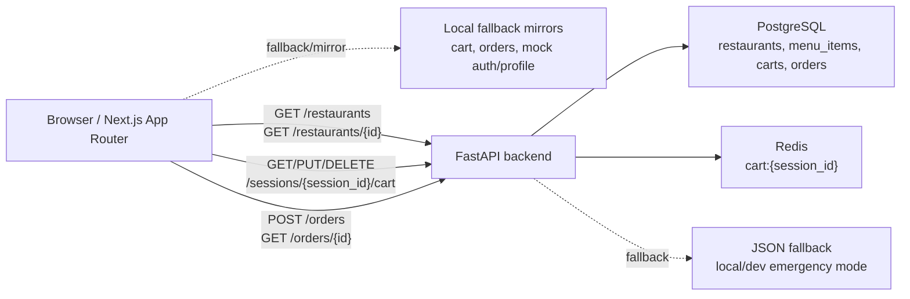

# OrderlyApp — Architecture

## v0.2.0 target shape

## Current v0.2.0 state
- Frontend can load restaurant/menu data from the backend API.
- Frontend falls back to local fixtures if the API is unavailable.
- Frontend uses backend cart sessions and backend order creation/lookup as the primary path, then mirrors cart/order data locally as fallback.
- Backend uses PostgreSQL when `DATABASE_URL` and `psycopg` are available.
- Backend uses Redis for cart sessions when `REDIS_URL` and `redis` are available.
- Backend falls back to JSON persistence when Postgres/Redis are unavailable or `ORDERLY_FORCE_JSON_STORE=1`.
