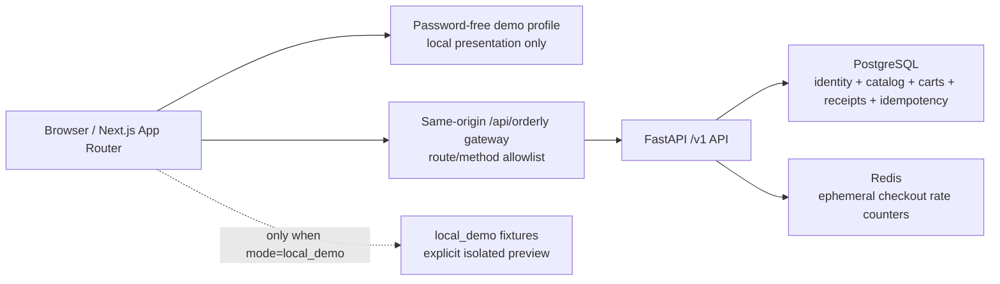

# OrderlyApp — Stabilized Architecture

This document describes the current C1–C8 implementation on the stabilization candidate. [`../development.md`](../development.md) is the canonical contract/ticket plan; [`repo_context.md`](repo_context.md) records detailed repository handoffs.

## System Overview

```mermaid
flowchart LR
  Browser["Browser / Next.js App Router"]
  Profile["Password-free demo profile\nlocal presentation only"]
  Gateway["Same-origin /api/orderly gateway\nroute/method allowlist"]
  API["FastAPI /v1 API"]
  PG["PostgreSQL\nidentity + catalog + carts + receipts + idempotency"]
  Redis["Redis\nephemeral checkout rate counters"]
  Preview["local_demo fixtures\nexplicit isolated preview"]

  Browser --> Profile
  Browser --> Gateway
  Gateway --> API
  API --> PG
  API --> Redis
  Browser -. "only when mode=local_demo" .-> Preview
```

There is no runtime authority failover arrow from the API path to `local_demo`, JSON, or Redis. A required API dependency failure is reported as failure/not-ready rather than converted to local success.

## Browser Data Modes

### `api`

The accepted ordering mode. Browser code uses the same-origin gateway and canonical C3–C7 contracts. Server/PostgreSQL state determines catalog, accepted cart, quote, checkout, receipt, and history behavior.

### `local_demo`

Explicit fixture preview only. It is labelled, isolated in its own browser namespace, performs no guest/API bootstrap, and exposes browse/customize/local-preview-cart behavior only. Checkout, order confirmation, and order history are unavailable.

API failure never switches modes.

## C1 — Guest Identity

- Backend generates a cryptographically random opaque browser token with integrity/expiry protection.
- Only a token hash plus separate guest ownership ID is stored server-side.
- Browser cookie is HttpOnly, SameSite=Lax, and Secure on HTTPS.
- Protected routes resolve ownership from the verified cookie; owner IDs are not public request parameters.
- Unsafe mutations enforce the allowed same-origin boundary.
- Explicit guest reset revokes old ownership and issues a new scope.

## C2 — Demo Profile

- Local browser presentation contract only.
- Password-free; no real account/auth provider.
- Stores validated display-name/synthetic-address choices.
- Cannot create/change server ownership.
- Local profile forget and explicit server guest reset are separate operations.
- Corrupt/unavailable browser storage has explicit recovery/temporary synthetic-profile handling.

## C3 — Canonical Catalog

PostgreSQL-backed catalog data owns:

- restaurant/item/option availability;
- canonical labels;
- base prices and modifier deltas;
- modifier min/max/default rules.

Cart input is validated/canonicalized against one coherent catalog snapshot. Client labels/prices are never accepted as pricing authority. Configured database/catalog failure produces typed unavailable behavior instead of fixture fallback.

## C4 — Revisioned Cart

`guest_carts` in PostgreSQL is the API cart authority.

- New cart revision begins at 0.
- PUT/DELETE require `expected_revision`.
- Accepted mutations increment exactly once.
- Concurrent stale writes return `409 cart_conflict` plus the current cart.
- Redis/JSON are not consulted as API cart authority.
- Frontend keeps the last accepted cart visible while a mutation is unresolved/failed.

## C5 — Quote and Immutable Receipt

- `POST /v1/checkout/quote` uses current verified guest cart + canonical catalog.
- `mock-v1` pricing is deterministic integer arithmetic with defined promotion/tax/tip rules.
- Complete receipt snapshot stores canonical line/modifier labels/prices, checkout fields, totals, timestamps, and pricing identity.
- Existing receipt reads never reconstruct from the current catalog.
- Receipt list/exact read is guest scoped.

## C6 — Atomic Idempotent Checkout

One PostgreSQL transaction:

1. verifies/reuses an existing owner+idempotency-key record when appropriate;
2. locks the guest/cart state;
3. validates expected revision and canonical catalog/pricing fingerprint;
4. writes one immutable receipt;
5. writes the idempotency mapping;
6. clears/increments the cart exactly once;
7. commits all-or-nothing.

Identical replay returns the exact stored receipt. Same key with changed canonical body conflicts. Different concurrent keys against the same revision serialize so only one cart-consuming order can win.

## C7 — Web Adapter and Honest Recovery

- Same-origin browser API returns typed success/error results.
- Malformed/network/server/session/conflict states remain explicit.
- API discovery/menu/cart never fall back to fixtures because the API failed.
- Cart writes are serialized in a tab and update accepted UI state only after server acceptance.
- Conflict supplies current cart and explicit review/reapply path.
- Checkout persists only unresolved immutable key/body recovery state in session storage.
- Transport uncertainty after submit is not treated as accepted or retried with a new key.
- Confirmation/history read exact server receipts only in API mode.

## C8 — Operational Lifecycle

### Health

- `/health/live`: process-only liveness.
- `/health/ready`: required configuration + PostgreSQL + migration state + rate-limit configuration; fails closed with 503.
- `/health`: legacy compatibility endpoint, not release readiness.

### Migrations

- Separate lifecycle command: `backend/scripts/migrate.py`.
- Ordered/version-validated.
- Serialized by PostgreSQL advisory transaction lock.
- SHA-256 checksums recorded and drift rejected.
- Serving startup does not run migrations.

### Seed

- Explicit fixture operation only.
- Requires allowed non-production environment plus `ORDERLY_ALLOW_FIXTURE_SEED=1`.
- Serving startup does not reseed.

### Retention

- Anonymous guest cleanup is a separate job.
- Candidate rows processed in batches of at most 100 with `FOR UPDATE SKIP LOCKED`.
- Checkout acquires the guest ownership lock before durable work so cleanup cannot remove a committing owner.

### Checkout Abuse Boundary

- Redis stores only short-lived per-guest and aggregate counters.
- Limits return 429 with `Retry-After`.
- If required limiter enforcement is unavailable, new checkout fails closed with 503.
- PostgreSQL remains durable ordering authority.

## Same-Origin Gateway Boundary

`app/api/orderly/[...path]/route.ts` is a bounded proxy, not an arbitrary fetch relay. It uses a fixed upstream origin, explicit route/method allowlist, bounded request body, safe header/cookie forwarding, redirect rejection, timeout, and origin controls. Browser-facing code uses this gateway for protected API behavior.

## Durable Data Ownership

| Data | Authority | Browser role |
| --- | --- | --- |
| Guest ownership | PostgreSQL + verified cookie token | Holds opaque cookie only |
| Demo profile/address | Browser local presentation | Validated local storage / temporary state |
| Canonical catalog | PostgreSQL | Renders canonical response |
| Accepted cart | PostgreSQL `guest_carts` | Renders last accepted revision; may keep failed intent separately |
| Quote | Server calculation from current canonical state | Displays server totals |
| Accepted receipt | PostgreSQL immutable snapshot | Displays exact response/read |
| Checkout idempotency | PostgreSQL owner/key ledger | Persists unresolved key/body for safe retry |
| Checkout abuse counters | Redis ephemeral TTL counters | None |
| `local_demo` basket | Isolated browser preview namespace | Preview only; never API authority |

## Failure Semantics

- Invalid input: typed 4xx, no partial write.
- Stale cart: 409 with current cart.
- Catalog/pricing drift: 409 / explicit review flow.
- Required Postgres unavailable: 503 / readiness not ready.
- Required rate-limit enforcement unavailable: checkout 503; do not bypass.
- Lost checkout response: uncertain; retry exact key/body.
- Unknown/foreign receipt: generic not found.
- Browser profile storage failure: recoverable presentation error; no server-ownership mutation.

## Security / Privacy Boundaries

Never log or expose:

- guest cookie values/token hashes;
- session secret;
- database/Redis credentials or full URLs;
- raw checkout contact/address payloads;
- another guest’s receipt/cart data.

No real passwords/cards are required by the stabilized demo.

## Deployment / Release Boundary

A green repository candidate is not equivalent to a publicly accepted deployment. Public acceptance must identify exact frontend/backend build/source identity, prove unauthenticated access, prove durable receipt reload/guest isolation, and complete required controlled failure/recovery rehearsal. See [`releases/stabilization-acceptance.md`](releases/stabilization-acceptance.md).