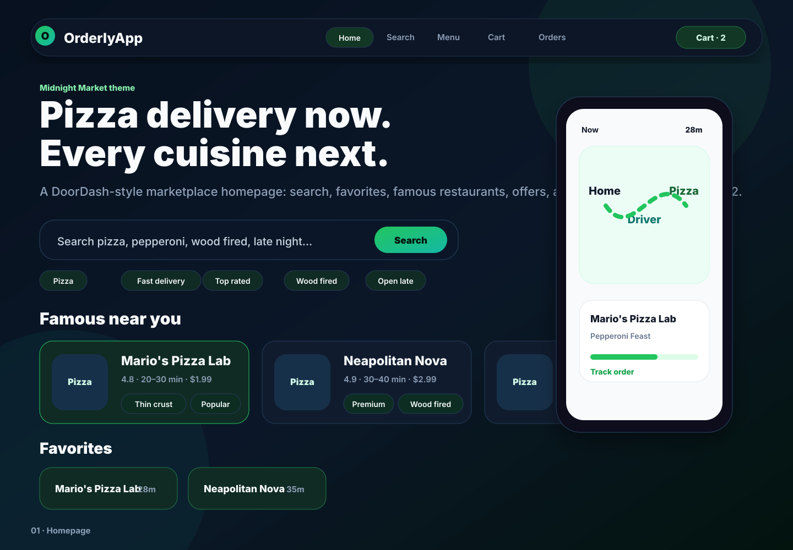
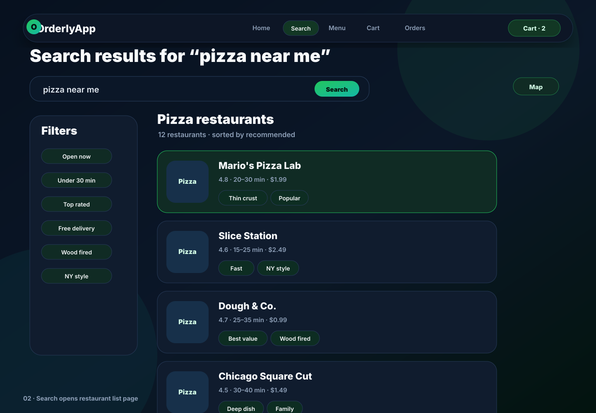
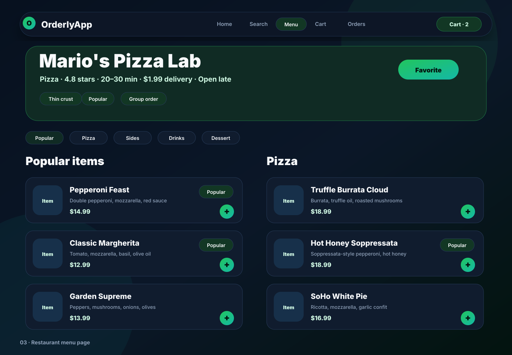
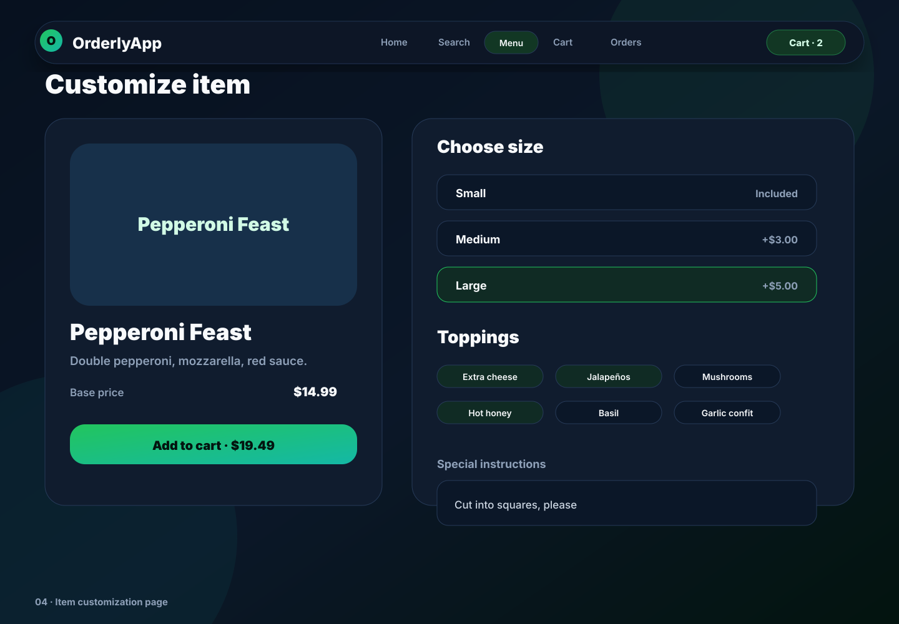
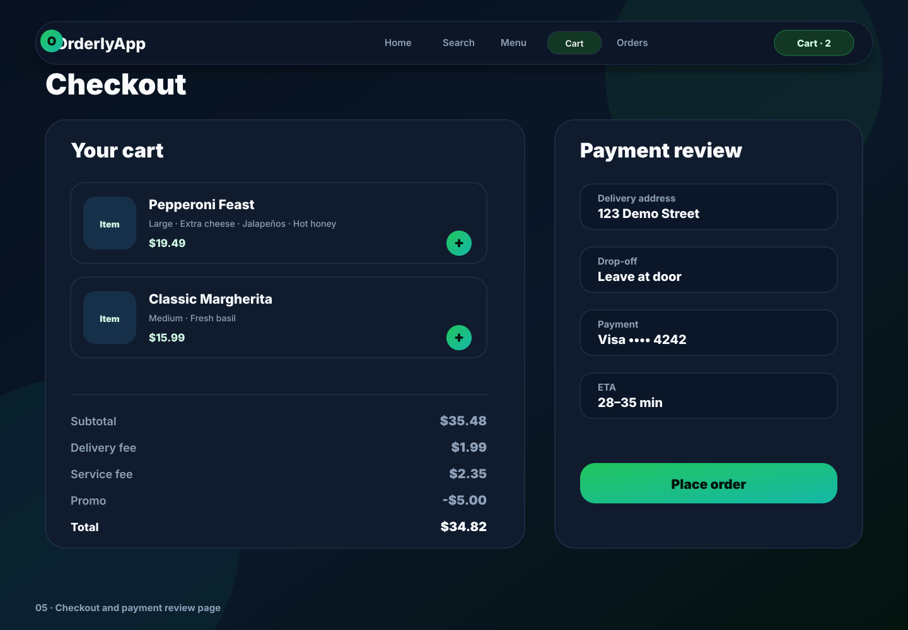
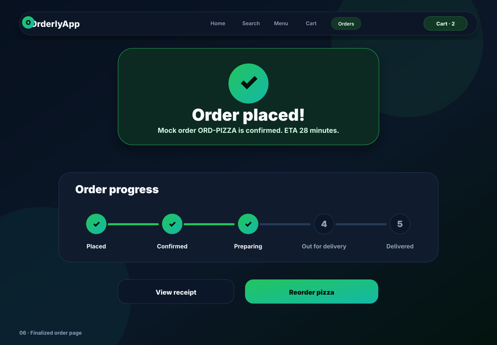

# OrderlyApp UI Mockups — Midnight Market

These picture mockups show the intended multi-page flow for the pizza-first v1 marketplace while keeping the layout expandable for v2 all-cuisine ordering.

## Theme

The selected direction is **Midnight Market**: deep navy surfaces, low-glow marketplace cards, mint/green trust CTAs, and teal delivery accents. This keeps v1 pizza-specific imagery but avoids a pizza-only visual system so v2 can add sushi, burgers, tacos, dessert, and grocery rails without redesigning the product.

## 1. Homepage

Landing page with hero search, quick filters, famous restaurants, favorites, and delivery preview.

## 2. Restaurant search results

After searching, a new page opens with restaurant list, sorting context, and filters.

## 3. Restaurant menu

After choosing a restaurant, a new page opens with restaurant details, categories, and menu cards.

## 4. Item customization

After choosing a menu item, a customization page opens with size, toppings, notes, and add-to-cart CTA.

## 5. Checkout and payment review

The checkout page shows cart totals, address, payment method, ETA, and place-order CTA.

## 6. Finalized order

The confirmation page shows ETA, order progress, receipt, and reorder CTA.

