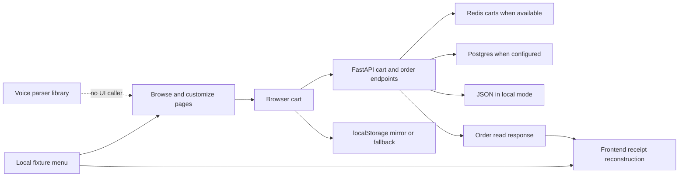
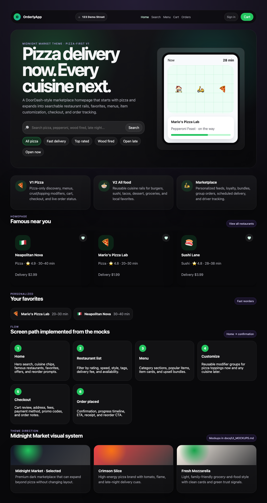

# OrderlyApp: what exists, what is missing, and what to build next

Assessed October 4, 2026. Source: `main` at `9222c10435e3a96396ab7c1b39e4d6d79d839771`. This is an assessment and proposed roadmap. Application code was not fixed or shipped.

## The honest answer

OrderlyApp has a substantial restaurant-ordering demo: browsing, menus, customization, carts, mock account screens, checkout, receipts, and backend storage paths. It builds successfully and its 37 existing unit tests pass. That is useful work.

However, the strongest product claims run ahead of the current implementation. Voice ordering is not connected to the screens. Menu browsing reads local fixtures, not the restaurant API. An unsuccessful backend checkout can become a successful-looking local order. Orders lack server-side ownership checks. Receipts are partly reconstructed instead of being durable records of what was submitted.

My recommendation is to finish one trustworthy voice-assisted portfolio demonstration before expanding into a real food marketplace. The goal should be: **a visitor can build one correct order, see exactly what the assistant understood, deliberately confirm it, and reopen an unchanged mock receipt.** A real customer pilot requires another level of identity, fulfillment, payment, privacy, and operational work.

## 1. Understand the project like a small pizza shop

Think of the app as a shop with several workers:

| Project part | Shop analogy | Programming meaning |
|---|---|---|
| Next.js / React frontend | Counter and menu board | Screens, buttons, forms, and browser state |
| FastAPI backend | Worker taking orders | Python functions responding to HTTP requests |
| PostgreSQL | Official order book | Persistent structured records |
| Redis | Temporary basket shelf | Fast short-lived cart storage |
| JSON files | Practice notebook | Simple local fixture/storage alternative |
| localStorage | Notes in one customer's pocket | Data saved by that browser, editable by its owner |
| Voice parser | Helper interpreting a sentence | Rules turn text into a proposed action |

An API is simply a way for programs to talk. The browser sends a request such as “save my cart.” A Python function checks it, saves it, and sends back an answer.

Today, the menu board and the order-taking worker do not consistently read the same menu book. The browser has its own menu and prices. The backend has another copy. Matching fixtures hide the disagreement until someone changes a price or availability.

### Actual flow today

This diagram describes source behavior. It is not a claim that every storage path was exercised in this session.

## 2. Current state: implemented, partial, missing

| Capability | Current assessment | What that means |
|---|---|---|
| Homepage and marketplace styling | Implemented; local homepage observed | Dark theme, navigation, search form, restaurant rails, preview illustration |
| Restaurant search/filter/sort | Implemented using fixtures | Results are not fetched through the restaurant API |
| Restaurant menus and customization | Implemented using fixtures | Modifier groups, notes, quantity and availability UI exist |
| Backend cart requests | Implemented, reliability partial | Pages read/write API carts but often ignore unsuccessful saves |
| Checkout form | Implemented as mock | Name/contact/address/tip fields; no real payment |
| Backend order creation | Implemented, incomplete record | Validates cart/subtotal; persists only a subset of checkout information |
| Confirmation and history | Implemented, integrity partial | Backend reads exist; totals/details/identity may be reconstructed incorrectly |
| Local sign-up/sign-in/sign-out | Implemented as demo behavior | Browser stores passwords directly; backend does not authenticate users |
| Account profile and addresses | Local-only, integration partial | Address edits do not drive checkout's default address selection |
| Voice parser | Implemented library | Rule-based, unit-tested; no current page imports or invokes it |
| Microphone / typed-command panel | Missing from current app | No SpeechRecognition implementation or visible voice workflow found |
| Order progress | Display implemented; updates missing | Timeline reflects stored status; no progression worker/polling/provider updates |
| Favorites / nearby / live tracking | Mostly illustrative | Homepage favorites are fixture-defined; distance/tracking are not live services |
| Pickup | Discovery presentation only | Fulfillment selection is not a durable checkout/order field |
| Telemetry | Helper exists; application integration missing | Buffer has no app caller, persistence, alerting, or dashboard |
| Real payments / restaurant acceptance / drivers | Missing, deliberately outside charter | Must not be implied by mock success |
| Tests | Unit/typecheck/build pass | E2E launch blocked; existing API tests mock fetch, not backend persistence |
| Hosted completion | Unverified | Linear OPE-83 open; recorded deployment redirects to Vercel sign-in |

Evidence: [home](../../app/page.tsx), [discovery](../../app/restaurants/page.tsx), [marketplace helpers](../../lib/marketplace.ts), [API adapter](../../lib/api.ts), [voice parser](../../lib/voice.ts), [backend routes](../../backend/app/main.py), [models](../../backend/app/models.py), [browser tests](../../e2e/orderly.spec.ts).

“Implemented” means source exists. “Observed” means I actually saw a runtime result. Neither automatically means production-ready.

## 3. The most important problems, in priority order

### A. Checkout can show success after failure — first portfolio fix

`lib/api.ts:185–205` turns HTTP errors, network errors, and timeouts into `undefined`. `app/checkout/page.tsx:111` then chooses local mock creation when no backend order comes back, calls it Confirmed, clears local cart, and may also clear the backend cart.

Imagine a cashier calls the kitchen, gets no answer, and tells you your pizza is confirmed anyway. That is the current fallback problem.

It is especially dangerous when the backend saved the order but the response arrived after the frontend's 1.5-second timeout. The customer can see a different local order while a backend order already exists. A retry could create another backend order because the server has no durable duplicate-request protection.

**Implement:** separate explicit demo-only ordering from API ordering. API errors must preserve the cart and show a clear retry/recovery message. Give each checkout attempt an idempotency key: a unique label that means “this is the same request again.” Save that label with the order so repeating it returns the same order. A disabled button helps one page; it does not protect reloads, two tabs, or uncertain network results.

**Proof:** simulate an HTTP 400, HTTP 500, and timeout after successful save. No invented confirmation; repeated key produces one order; recovery retrieves that exact order.

### B. Orders and carts have no server-side owner boundary — blocker for a shared deployment

`backend/app/main.py:122` returns `list_orders()` without identity or session filtering. `GET /orders/{id}` and session cart routes likewise have no authentication/ownership check. `app/orders/page.tsx` fetches the order list even when its rendered screen says sign-in is required.

Hiding the classroom's grade book behind a “please sign in” poster does not lock the book. A frontend gate controls what the screen shows; a backend gate controls who can actually read or change data.

Current order data includes session IDs, cart contents, instructions, and timestamps. The global list exposes session IDs that can identify cart paths. Customer/address fields are not currently persisted in backend orders, so this finding must not be exaggerated into a claim that all checkout contact details are exposed there. Those details do exist in local browser receipts.

**Implement:** for a portfolio demo, use a server-issued guest identity and scope every cart/order operation to it. For real accounts, use verified server-side identity from an authentication system. The server must derive ownership from identity, not trust a user ID supplied in a request body. Make order history scoped, and reject another owner's cart/order reads and writes. Remove raw-password collection from the demo, or replace it with genuine authentication before collecting real credentials.

**Proof:** browser A can read its own order; browser B cannot list, retrieve, update, or clear A's data. API tests must establish this even when the frontend gate is bypassed.

### C. The receipt is not a faithful saved order — first portfolio fix

The request model accepts name, phone, email, delivery address, and tip. `orders_create` passes only session, items, and subtotal to `create_order`. The database and response omit final totals and checkout details.

`normalizeOrder` recalculates fees/tax using browser fixtures, gives every returned order the demo user's identity, and defaults missing tip to zero. Checkout displays a fixed $5 promo; fetched receipts do not preserve that promo. The confirmation fetch can replace the richer local receipt with the poorer backend version.

Imagine buying a notebook for $8 and the shop later rebuilding your receipt using today's price. A receipt should remember what happened at purchase time.

**Implement:** store a versioned order snapshot: canonical item name/options/unit price, quantities, fees, discount, tax, tip, total, fulfillment mode, address/contact fields needed for that mode, and truthful status. Backend calculates totals; frontend displays the returned snapshot. Existing demo records with missing fields must be identified as legacy, not silently “completed” using invented details.

**Proof:** receipt values before and after refresh match exactly. Changing menu prices later does not change old receipts. Missing requested order IDs produce a missing-order state; the current confirmation fallback can show the latest unrelated order instead.

### D. There are competing carts and competing catalog authorities

Menus come from `lib/mock-data.ts`; backend validation uses `backend/data/restaurants.json` or Postgres. Frontend totals use local calculations; the backend pricing route is not consumed by checkout. API normalization also invents defaults for missing open/availability/distance fields, while backend models cannot represent several UI fields.

Cart updates send whole snapshots without a revision. Two quick changes can overwrite each other. The item add button is not disabled while saving; rapid clicks can perform competing read-then-write operations.

Carts stored in Redis are not also durably written to Postgres. During Redis failure, a different Postgres/JSON cart can be used. When Redis returns, its old or empty cart wins again. This is switching between different notebooks, not seamless recovery.

**Implement:** choose one authoritative catalog and one durable cart store. For this project's size, Postgres can hold both; Redis is optional later. Add a cart revision and reject stale writes, or implement narrow atomic cart commands. Centralize browser cart state and explicitly report “saved,” “saving,” and “could not save.” Local storage can support a draft, but it cannot promise a backend save.

**Proof:** concurrent updates cannot silently discard changes; dependency outage/recovery cannot resurrect an older cart; changed catalog prices are reflected before checkout.

### E. Voice exists in documentation more than in the product

The current app has no microphone implementation or command panel. `parseVoiceIntent` is used by tests, not application pages. Existing documentation still tells a presenter to demonstrate a typed/voice command.

The parser also searches menu items globally instead of restricting to a selected restaurant. It does not parse quantities or targeted removal. Simple substring rules miss negation: “don't clear cart” still contains “clear cart”; “no mushrooms” still contains “mushrooms.” These are source-level limitations, not demonstrated live voice incidents.

**Implement:** start with typed commands so microphone reliability is separate. Sentence → proposed structured action → preview → user correction/confirmation → normal cart API. Resolve names to real IDs in the current restaurant/catalog. Ask questions when item/size/quantity is ambiguous. Destructive actions require clear confirmation. Never let interpretation invent prices, decide ownership, or place an order on its own.

Browser speech recognition has limited availability and may send audio to a server in some browsers. Provide permission/error/cancel states, typed fallback, and accurate privacy copy. [MDN SpeechRecognition](https://developer.mozilla.org/en-US/docs/Web/API/SpeechRecognition) and [Using Web Speech](https://developer.mozilla.org/en-US/docs/Web/API/Web_Speech_API/Using_the_Web_Speech_API).

**Proof:** “two large pepperoni pizzas from Mario's” matches the intended restaurant and quantity; “no mushrooms” does not add mushrooms; an ambiguous removal asks which item; microphone denial leaves manual ordering available. Add an LLM only if measured failures justify it.

### F. Catalog validation needs to be stricter

The server checks required modifiers and subtotal, which is a good start. But single-choice groups without `max_selected` can accept multiple sizes/crusts. Duplicate modifier groups are not rejected; validation reads the first matching group while pricing loops over all groups. Unknown groups can be ignored. Quantities have a minimum but no server-side maximum of ten like the UI. Arrays/text are unbounded. Client-supplied names/base prices remain in saved items instead of being canonicalized.

**Implement:** one canonical validator, one occurrence per group, unique option IDs, explicit single-choice cardinality, only allowed groups/options, available restaurant/item/options, integer quantity 1–10, bounded cart/text size. Rebuild saved names and prices from the catalog. Do not turn the pricing route's arbitrary `discount_cents` into an accepted real promotion; a future promo must be server-validated.

**Proof:** malformed or oversized payloads fail with useful field errors and no storage writes; saved items contain authoritative values.

### G. Deployment and dependency safety need work

The startup command seeds the database each boot. `write_restaurants` deletes menu items and restaurants before inserting fixtures. This resets catalog edits on restart; it does not directly delete orders, so the risk should be described precisely.

`/health` always returns `ok: true`, even with configured dependency errors. The container healthcheck only checks that this endpoint returns successfully. `postgres_available` checks configuration/import, not whether the database is reachable. JSON storage uses a shared temporary filename and read-modify-write without concurrency control, so it is suitable only for isolated local demo use.

**Implement:** explicit one-time seed, tracked migrations, separate liveness from readiness, fail safely when required durable storage is down, synthetic staging data, and a tested restore/rollback procedure. Keep JSON storage explicitly local; do not silently shift production writes into it. Add bounded connection/query timeouts and enough structured logs to distinguish API acceptance from UI fallback.

The npm advisory query reported 8 affected package entries including a critical aggregate rating for Next.js 16.2.2. This is a dependency maintenance signal, not evidence of eight reachable attacks. Some advisories require specific features/platforms not found in this app. Upgrade supported versions and rerun regression checks, then assess relevant advisory paths. One verified upstream advisory covers affected Next.js 16 releases below 16.2.3, but fixing only that advisory is insufficient for the full current audit set. [Next.js advisory](https://github.com/advisories/GHSA-q4gf-8mx6-v5v3).

## 4. Product devil's advocate

### What problem is the product actually solving?

“DoorDash, but with voice” is too broad to guide a small project. A useful hypothesis is: **people who already know what they want can assemble a customized order faster with a short sentence, while still seeing and correcting every choice.** That is testable.

Compare voice-assisted and manual ordering on the same five tasks. Measure completion, corrections, time, and accidental changes. Do not promise a percentage improvement before measuring it. A pretty assistant that causes more corrections is not an improvement.

### Three paths, with real tradeoffs

| Path | Gain | Cost / weakness | Recommendation |
|---|---|---|---|
| Honest portfolio demo | Demonstrates engineering and product judgment with mock food/payment | Limited commercial realism | Finish this first |
| Pilot with one restaurant | Tests actual ordering/acceptance with a narrow operating model | Requires ownership, fulfillment process, support, refunds/payment decision, uptime responsibility | Only after a committed restaurant partner and pilot scope |
| Multi-vendor delivery marketplace | Broad potential product | Restaurant onboarding, supply, delivery logistics, disputes, fraud, payments, support, integrations | Separate program; not the next release |

Adding burgers or sushi is mainly a reusable-menu test. It does not solve restaurant acquisition or delivery. Likewise, driver tracking is not just drawing a scooter on a map: someone must supply reliable location, handle permissions, and own the delivery process.

### What makes it feel premium?

Reliability comes before more animation. A customer should know whether a cart is saved, why a choice is unavailable, what the final price includes, and whether an order was accepted. Keyboard access, readable mobile forms, clear error text, and an unchanged receipt will improve trust more than extra theme previews.

The homepage currently includes engineering presentation copy such as theme options and implemented screen-path cards. For the portfolio, put architecture and rationale on an About/demo page. Keep the ordering surface focused on choosing food. Keep the illustrated map visibly a preview. A heart icon inside a restaurant link is not a favorite toggle.

## 5. What can be added, and when

| Addition | User benefit | Prerequisite / hidden work | Priority |
|---|---|---|---|
| Typed command preview + correction | Makes the voice idea usable and understandable | Catalog IDs, safe cart commands, ambiguity handling | Next |
| Microphone with typed fallback | Faster hands-free input when supported | Permissions, browser/device checks, privacy copy | After typed flow |
| Safe repeat-order | Rebuilds a familiar meal quickly | Revalidate current prices, availability and modifiers; never copy old receipt totals | Next after core reliability |
| Functional favorites and saved addresses | Less repeated input | Chosen guest/account ownership; checkout address integration | Small follow-up |
| Accessibility and mobile polish | Wider usability | Real keyboard/mobile/zoom testing, labelled quantity buttons, focus/error handling | Alongside core flow |
| Real opening hours and availability | Prevents impossible orders | Backend model, timezone, exception hours, canonical catalog | Before pilot |
| Clearly simulated order progress | Shows a complete demo story | Demo state machine; prominent simulation label | Portfolio follow-up |
| Restaurant acceptance dashboard | Gives a pilot an actual operator | Staff identity/roles, permitted status transitions, rejection/recovery | Pilot |
| Pick-up / scheduled orders | Practical fulfillment options | Store selected mode/time; hours, cutoff, capacity and fees | Pilot, if partner needs it |
| Server-validated promotions | Reliable discounts | Eligibility, expiration, limits, durable order breakdown | Later |
| Dietary/allergen fields | Helps users filter and ask useful questions | Restaurant-maintained provenance and unknown-state handling; do not infer safety from AI | Later, with reliable data |
| Group ordering | Helps several people share a cart | Participant ownership, concurrency, finalization rules | Later |
| LLM interpretation / multilingual commands | Understands a broader range of sentences | Evaluation set, validated output, latency/cost cap, deterministic permissions/prices, privacy and fallback | Only after evidence of parser limits |
| Real payments | Commercial checkout | Provider tokenization, verified webhooks, idempotency, refunds/disputes, reconciliation | Separate approved pilot milestone |
| Driver location / live delivery ETA | Delivery visibility | Delivery operator, location stream, privacy, stale-data handling | Separate integration |

My strongest recommendation: build fewer capabilities with complete failure behavior. Save every future idea, but do not let it obscure the next measurable outcome.

## 6. A sensible implementation order

1. Agree on the next release being a mock portfolio demo or a real pilot. The proposed plan assumes a mock portfolio demo; that is a recommendation, not a recorded user decision.
2. Establish honest API/demo modes and guest ownership; remove raw credential collection from demo screens.
3. Make catalog, cart revisions, and validation consistent; use one durable cart authority.
4. Store complete server-priced order snapshots and make retries safe.
5. Wire the frontend to those contracts; fix exact-order lookup, saved address use, and recovery states.
6. Add the typed assistant, then microphone capture; reuse normal customization and cart logic.
7. Add CI and real backend integration checks; verify the public deployed flow on its exact build.

See [IMPLEMENTATION_PLAN.md](IMPLEMENTATION_PLAN.md) for component boundaries, contracts, dependencies, task packets, tests, and rollback. No task in that plan is marked implemented by this audit.

## 7. What was actually verified

| Evidence | Result | Limit |
|---|---|---|
| Local Git vs GitHub main | Same commit | No publication performed |
| Unit suite | 9 files / 37 passed | Does not establish backend persistence/ownership |
| TypeScript | Passed | Not behavioral acceptance |
| Production frontend build | Passed | Not a production journey |
| Lint command | Alias of typecheck | Independent linting absent |
| Existing E2E | Blocked: missing Chromium executable | Five launch failures; zero completed product cases |
| Local homepage browser | Rendered; screenshot saved | Desktop baseline only; no order flow tested |
| Browser console | Logs included prior Vercel-login errors; clean immediately after clearing | No attributable local console defect or sustained clean-run claim |
| GitHub Actions | One old Copilot run; no application CI workflow found | No green current release suite |
| Deployment metadata | Historical Production success on assessed SHA | Recorded URL redirects to Vercel authentication |
| Linear | Seven archived Done issues, OPE-83 Todo | Historical status does not erase new findings |
| Docker/full stack | Blocked: daemon absent | Postgres/Redis, outage, migration/recovery untested |
| Formal CSO workflow | Incomplete: trusted startup rejected schema | Static findings are assessment findings, not helper-verified exploit results |
| Graphify | 483 nodes / 1,037 edges / 70 communities | Missing/dangling/collapsed relationships; discovery, not execution proof |

This is an actual local screenshot, not one of the six design SVGs. It establishes the displayed homepage only.

## 8. Documentation and backlog reconciliation

[OPE-83](https://linear.app/openclaw-neutron/issue/OPE-83/verify-deployed-portfolio-demo) is a real unfinished item. It is not the only remaining engineering work revealed by the current source. The archived hardening work added API calls, local authentication behavior, mocks and documentation; it did not establish server-side ownership, idempotency or faithful receipt persistence.

`docs/DEMO_SCRIPT.md` asks for a voice panel and automatic status progress that the current application does not provide. `docs/DEPLOYMENT.md` asks for a “Connected to FastAPI” signal, but current pages do not render the catalog adapter's source result. `docs/SCREENSHOTS.md` is a capture checklist rather than saved evidence. Update these claims in the implementation that either supplies the behavior or explicitly narrows the promise.

There were no commits in the seven-day retrospective window ending October 4. The most recent assessed commit was May 15. No team productivity conclusions can reasonably be drawn from that empty window.

## 9. Assessment boundaries

The requested skills were applied as assessment lenses: local graph, product challenge, architecture/spec planning, QA evidence, security questions, release gates, and retrospective reconciliation. Shipping and micro-commit execution were not appropriate to a request for explanation. No Linear issue was created/closed, no PR was opened, and no deployment was changed. Observational lessons are staged here, not written to global memory or reusable skills.

Automatic approval review rejected MCP indexing because it would send potentially private repository source/configuration to an unverified MCP destination. Local extraction supplied the map without that export. The guard helper reported an existing lock; the repository edit boundary was followed manually. These are tooling limitations, not application vulnerabilities.

The available Vitest and playwright-cli plugins may help future test work if installed. The immediate browser-suite prerequisite is the matching Chromium runtime; plugin installation alone does not satisfy it.
