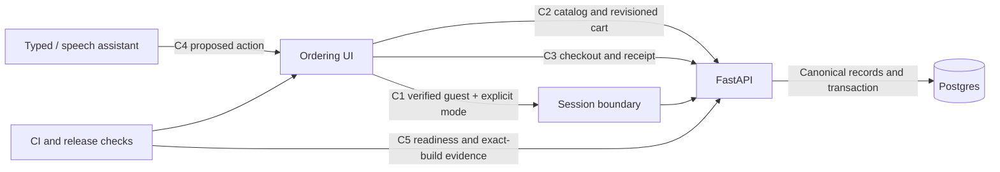
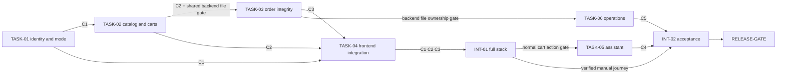

# Proposed OrderlyApp execution plan

> **Superseded for execution — October 4, 2026:** The current [development guide](../../development.md) replaces this proposal's scope and pending decisions. It targets a public manual-ordering mock demo and defers voice. The original proposal below is retained as dated audit context, not a second active implementation plan.

This plan is **not authorized implementation**. Every task is **Not completed**. It assumes the recommended next release is a mock portfolio demo. Architecture choices are proposed; contract examples and integration fixtures must be committed and checked before delegation. A real restaurant pilot requires a separate charter.

## 1. Project charter

Goal: a visitor can browse one authoritative menu, customize an order manually or through a reviewable command, submit mock checkout once, and reopen the same complete receipt. Users: portfolio visitors and test participants. Current behavior: fixture menus plus backend-first cart/orders with silent fallback and local accounts. Desired behavior: explicit mode, scoped guest data, server-priced receipts, safe recovery, working typed assistant and optional microphone.

Success measures: all acceptance scenarios pass; receipt values survive reload; retries create one order; foreign guest data is inaccessible; no backend error becomes invented success; manual flow remains available; deployed evidence identifies source SHA and data mode. Voice/manual completion and correction time are measured, with no invented performance target.

Scope: mock payments and simulated fulfillment only. Exclusions: commercial payments, restaurant/provider automation, drivers, marketplace onboarding, LLM subscription, OAuth vendor integration. Local source changes, issues, branches, PRs and publication require a subsequent implementation request. The user accepted the repository as the audit-document boundary, not this product redesign.

## 2. Codebase reconnaissance

See [repo_context.md](../repo_context.md) for exact paths and verified commands. Key seams: `lib/api.ts`, `lib/cart.ts`, `lib/mock-data.ts`, `lib/marketplace.ts`, `lib/auth.ts`, `lib/voice.ts`; application pages; `backend/app/{main,models,store,database,redis_store}.py`; migration001; startup seed/migrate scripts. No worker, payment webhook, real authentication service, or application CI pipeline was found.

Verified commands: `npm run test` (37 pass), `npm run typecheck` (pass), `npm run build` (pass), `npm run test:e2e` (blocked at missing browser); `npm run lint` is a typecheck alias. There is no existing persistent backend test runner. Proposed backend test commands must be established by TASK-02; they are not described as currently passing.

## 3. Architecture Decision Register

| ID | Status | Recommended choice / rationale | Alternatives and consequences | Tasks |
|---|---|---|---|---|
| ADR-01 | Proposed; audience decision pending | Finish a mock portfolio demo | Pilot/marketplace adds real operating and legal/payment requirements | All |
| ADR-02 | Proposed | Server-issued guest identity; password-free demo personas | Real accounts later require verified provider identity; frontend session is insufficient | 01–04 |
| ADR-03 | Proposed | Same-origin `/api/orderly` proxy to FastAPI; guest HttpOnly signed session | Direct cross-site cookies add third-party-cookie/CORS complexity; validate proxy path/header behavior | 01,04,06 |
| ADR-04 | Proposed | Postgres owns catalog/cart/orders; Redis optional cache later | Redis-only carts plus fallback have divergent authority; Postgres simpler at demo scale | 02,03,06 |
| ADR-05 | Proposed | Immutable order snapshot + transaction + owner-scoped idempotency | Recalculated receipts or UI-only duplicate prevention cannot recover uncertain outcomes | 03,04 |
| ADR-06 | Proposed | Typed deterministic action preview first; speech supplies text | LLM now adds latency/cost/privacy without an evaluated need; later adapter must obey same schema | 05 |
| ADR-07 | Proposed | Local-only fixture mode explicitly selected; API writes fail safely | Silent mode switching masks faults; drafts cannot represent accepted orders | 01,04,06 |
| ADR-08 | Proposed | No automatic production seed; additive migrations and explicit seed | Boot reseed resets catalog; migration rollback cannot undo existing business records | 02,03,06 |

These are not locked merely because they appear here. TASK-01 must confirm ADR-01/02/03/07 and publish contract fixtures; TASK-02/03 freeze their data contracts before consumer implementation starts.

## 4. System invariants

| ID | Statement | Owner / enforcement | Verification |
|---|---|---|---|
| INV-01 | Only the current guest can access/change its cart and orders | Identity + every API query derives owner from verified session | Two guest jars; list/read/update/delete negative cases |
| INV-02 | An order is confirmed only after durable acceptance in selected mode | Order service + typed frontend result | 400/500/offline/timeout never invent accepted order |
| INV-03 | Old receipts never change when catalog changes | Stored immutable canonical snapshot | Refresh and menu-price-change receipt equality |
| INV-04 | One checkout key produces at most one order | Unique owner/key, payload hash, database transaction | Sequential and concurrent duplicate requests |
| INV-05 | One cart uses one restaurant and only valid available choices | Canonical catalog validator, bounded quantity/text | Invalid/duplicate groups/options; mixed restaurant; unavailable item |
| INV-06 | Stale writes never silently replace a newer cart | Revision compare-and-swap | Competing clients, conflict response and recovery |
| INV-07 | Interpretation proposes; user and deterministic rules authorize mutations | Voice action schema and preview UI | Negation, ambiguity, wrong restaurant, destructive confirmation |
| INV-08 | Storage faults cannot silently switch production authority | Explicit mode + readiness and failure result | Required Postgres unavailable; restart/recovery evidence |
| INV-09 | Demo collects no reusable passwords or real payment details | Password-free personas, payment mock label | Storage/payload inspection; full manual checkout |

Affected tasks: 01 owns INV-01/09 foundation; 02 INV-05/06/08; 03 INV-02/03/04; 04 all client-facing consequences; 05 INV-05/07; 06 integration/release enforcement.

## 5. Component graph



| Component | Owns | Provides / consumes | Owner |
|---|---|---|---|
| Session/mode boundary | Guest identity lifecycle, mode configuration | C1 → API/UI; no client-chosen ownership | TASK-01 |
| Catalog/cart service | Canonical menu, validation, cart revision | C2; consumes C1 | TASK-02 |
| Order service | Receipt snapshot, idempotency, checkout transaction | C3; consumes C1/C2 | TASK-03 |
| Frontend | Draft/rendering state, error/recovery, address selection | consumes C1/C2/C3; exposes cart actions to C4 | TASK-04 |
| Assistant | Capture, interpretation proposal, clarification | C4; consumes catalog/cart IDs | TASK-05 |
| Operations | CI, dependency hygiene, deployment/migrations/readiness | C5; verifies all contracts | TASK-06 |

## 6. Contract registry

All contracts are **proposed/unfrozen**. New paths below are explicitly marked CREATE. Version fields use `schema_version: 1`. APIs use bounded JSON with a stable `{error:{code,message,fields?,request_id}}` envelope. Numeric money uses integer cents. No consumer may depend on undocumented fallback. Contract fixture paths are proposed deliverables, not existing evidence.

### C1 — Guest identity and explicit data mode

1. Provider/task: session boundary / TASK-01. 2. Consumers/tasks: API (02/03), web (04), release (06). 3. Type: HTTP/session/config. 4. Truth: `backend/app/main.py`; CREATE `backend/app/identity.py`, `docs/contracts/identity-mode.md`. 5. Inputs: same-origin session bootstrap, mode enum `api|local_demo`, signed guest session; never request-body owner ID. 6. Outputs: opaque guest identity stored only in HttpOnly Secure-on-HTTPS SameSite session cookie, expiration, public mode indicator; no passwords/tokens in response body. 7. Preconditions: server signing secret supplied through environment, origin policy configured. 8. Postconditions: valid identity on every protected operation; expired identity yields explicit recovery rather than access to previous guest data. 9. Errors: `401 session_required|session_expired`, `403 origin_forbidden`, invalid mode fails startup/build validation. 10. Retry: session bootstrap repeat preserves valid identity. 11. Ordering: bootstrap completes before protected requests. 12. Security: verify signature/expiry; validate same-origin unsafe requests; cross-site requester cannot act with cookie authority; no broad public order endpoint. 13. Lifecycle: cookie lifetime 30 days proposed; secret rotation invalidates old guest sessions with visible reset; legacy local credentials discarded, legacy orders never adopted without owner evidence. 14. Fixture: CREATE `tests/fixtures/contracts/identity.json` with valid guest A/B, missing/expired cases; synthetic secrets only. 15. Freeze: TASK-01 publishes fixture and provider tests after ADR confirmation. 16. Change: update all named consumers/fixtures before incompatible change. 17. Verification: real API request matrix with separate cookie jars; same-origin proxy preserves Set-Cookie and forwards only necessary headers. 18. Compatibility: old unscoped endpoints disabled in API mode; local demo remains separately labelled.

### C2 — Canonical catalog and revisioned cart

1. Provider/task: catalog/cart / TASK-02. 2. Consumers/tasks: orders (03), web (04), assistant (05), release (06). 3. Type: API/schema. 4. Truth: backend models/store/main; CREATE `docs/contracts/catalog-cart.md`. 5. Inputs: item IDs, quantity integer1–10, declared group/option IDs, note ≤500 chars, ≤50 cart lines, `expected_revision` ≥0; one restaurant. 6. Outputs: canonical menu including availability/open status and explicit fees; cart `{schema_version,revision,items,pricing}` with canonical names/prices and integer totals. 7. Preconditions: C1 identity; seeded catalog; required choices validated. 8. Postconditions: accepted mutation increments revision once; no invalid partial write. 9. Errors: `422 invalid_cart` field errors, `409 cart_conflict` with current revision/cart, `503 storage_unavailable`; missing item returns404. 10. Retry: PUT same content with old revision returns conflict; client rehydrates and requires deliberate reapply, not automatic overwrite. 11. Concurrency: compare revision inside database transaction; one writer wins. 12. Security: owner from C1; ignores/rejects client prices/owner; rejects unknown/duplicate choices and unavailable products. 13. Lifecycle: additive schema, demo-data catalog migration; compatibility window documented before old shape removal. 14. Fixture: CREATE `tests/fixtures/contracts/catalog-cart.json` with valid/invalid/conflict/unavailable examples. 15. Freeze: TASK-02 provider contract checks. 16. Change protocol: update03/04/05/06 and mock fixtures together. 17. Verification: provider/consumer cases plus two-client race and unchanged state after rejection. 18. Availability: Postgres required in API mode; no Redis/JSON write failover.

### C3 — Idempotent checkout and immutable receipt

1. Provider/task: order service / TASK-03. 2. Consumers/tasks: web (04), release (06). 3. Type: API/schema/transaction. 4. Truth: backend order routes/models/store, CREATE migration and `docs/contracts/orders.md`. 5. Inputs: owner implicit from C1, `idempotency_key` UUID, `expected_cart_revision`, fulfillment enum, structured delivery/contact fields where needed, integer tip0–100000; no trusted submitted price. 6. Outputs: order ID, schema version, immutable canonical lines and monetary breakdown, saved fulfillment/details, status `Placed` for mock server acceptance, timestamps; first201/repeat200. 7. Preconditions: valid cart/ownership/revision; mocked payment label. 8. Postconditions: order and idempotency record saved and cart cleared in one Postgres transaction. 9. Errors:400 invalid checkout,409 changed payload for same key or cart conflict,503 no confirmed acceptance; uncertain transport state tells client to recover by key. 10. Retry: same owner/key/payload returns exact saved snapshot; changed payload409; distinct owners may use same key. 11. Concurrency: unique(owner,key), transaction and appropriate cart lock; no after-commit cart-clear failure response ambiguity. 12. Security: list/detail/recovery scoped to C1; customer data excluded from logs. 13. Lifecycle: old subtotal-only orders labelled legacy; do not manufacture missing address/tip/total; original records preserved. 14. Fixture: CREATE `tests/fixtures/contracts/orders.json` with full receipt, legacy, retry, conflict, missing and503. 15. Freeze: TASK-03 provider tests and fixtures. 16. Change: named consumers/fixtures updated together. 17. Verification: equality after reload/catalog price change, parallel retry count1, injected transaction failure has no partial effects. 18. Cancellation/status: immutable receipt; future status changes require separate authorized transition contract; no real acceptance or delivery claimed.

### C4 — Reviewable assistant action

1. Provider/task: assistant / TASK-05. 2. Consumer/task: ordering UI within TASK-05, using TASK-04's normal validated cart actions; release06. 3. Type: function/UI boundary. 4. Truth: `lib/voice.ts`; CREATE `app/components/OrderAssistant.tsx`, `docs/contracts/assistant.md`. 5. Inputs: transcript≤500chars, selected restaurant ID, canonical catalog, current cart/revision. 6. Outputs: discriminated `proposal|clarification|unsupported` result; proposal contains real item IDs, quantity/modifiers and review summary; no prices/authorization/order-submit action. 7. Preconditions: available catalog; supported declared command. 8. Postconditions: interpretation alone makes no cart mutation. 9. Errors: clarification lists valid candidates; microphone denial/unavailable/timeout/cancel keeps typed/manual path; API mutation uses C2 errors. 10. Retry: each confirm has a pending guard; use normal cart revision conflict recovery; no repeated destructive action on repeated recognition events. 11. Concurrency: proposal invalidated/revalidated when cart/catalog changes. 12. Security/privacy: untrusted transcript, no arbitrary code/URLs; no raw transcript/audio logging; explicit microphone disclosure; clearing/removal confirmation. 13. Lifecycle: v1 rule-based; optional model must preserve schema and validation. 14. Fixture: CREATE `tests/fixtures/contracts/assistant.json` covering negation, restaurant collision, targeted remove, ambiguity, quantity and unsupported input. 15. Freeze: TASK-05 parser/action examples before UI wiring. 16. Change: parser/UI/evaluation fixture atomically updated. 17. Verification: no mutate until confirm; selected restaurant respected; manual flow available. 18. Microphone support: capability detection, no promise of universal offline speech.

### C5 — Readiness and release evidence

1. Provider/task: operations / TASK-06. 2. Consumer: INT-02 and RELEASE-GATE. 3. Type: HTTP/CI/runbook. 4. Truth: health route, Dockerfiles/infra, CREATE application CI and `docs/contracts/readiness.md`. 5. Inputs: exact source SHA, mode, required dependency configuration. 6. Outputs: liveness200 when process serves; readiness200 only if required storage works, otherwise503; safe dependency state and revision/mode. 7. Preconditions: build/deploy identity captured. 8. Postconditions: a failed required dependency cannot be presented as ready. 9. Errors: readiness503; no credentials or connection strings. 10. Retry: bounded platform probe; no seed or database mutation on health request. 11. Concurrency: migration serialized by deploy gate, not every replica startup. 12. Security: public health reveals no secret/PII; release fixtures synthetic. 13. Lifecycle: additive endpoint before platform healthcheck change. 14. Fixture: CREATE `tests/fixtures/contracts/readiness.json` for local_demo and api good/bad states. 15. Freeze: TASK-06 tests and runbook. 16. Change: platform config/runbook/test consumer updated together. 17. Verification: required DB fault →503; restart does not reset catalog; exact-build hosted smoke evidence. 18. Evidence: logs/test reports link to SHA and environment; “deployed” is separate from “accepted.”

## 7. Dependency DAG



Machine-readable edge records: `start` = prerequisite before editing; `merge` = prerequisite before landing; `runtime` = deployed capability; `verify` = handoff check.

```yaml
edges:
  - {from: TASK-01, to: TASK-02, contracts: [C1], start: identity_fixture_frozen, merge: identity_provider_passes, runtime: session_boundary, verify: owner_negative_matrix}
  - {from: TASK-02, to: TASK-03, contracts: [C2], start: backend_owner_released_and_cart_fixture_frozen, merge: cart_provider_passes, runtime: canonical_cart, verify: revision_and_price_contract}
  - {from: TASK-01, to: TASK-04, contracts: [C1], start: identity_fixture_frozen, merge: identity_provider_passes, runtime: same_origin_session, verify: proxy_cookie_flow}
  - {from: TASK-02, to: TASK-04, contracts: [C2], start: catalog_cart_fixture_frozen, merge: cart_provider_passes, runtime: catalog_cart_api, verify: adapter_conformance}
  - {from: TASK-03, to: TASK-04, contracts: [C3], start: order_fixture_frozen, merge: order_provider_passes, runtime: order_api, verify: receipt_and_retry_contract}
  - {from: TASK-04, to: INT-01, contracts: [C1, C2, C3], start: frontend_provider_integrated, merge: real_stack_passes, runtime: full_stack, verify: manual_order_reload}
  - {from: INT-01, to: TASK-05, gate: normal_cart_action_verified, start: verified_manual_flow, merge: assistant_tests_pass, runtime: C2, verify: same_action_path}
  - {from: TASK-03, to: TASK-06, gate: backend_shared_file_owner_released, start: backend_owner_released, merge: required_checks_pass, runtime: migrated_backend, verify: readiness_contract}
  - {from: TASK-05, to: INT-02, contracts: [C4], start: assistant_fixture_frozen, merge: assistant_journey_passes, runtime: assistant_ui, verify: command_preview_confirm}
  - {from: TASK-06, to: INT-02, contracts: [C5], start: ops_fixture_frozen, merge: ci_and_readiness_pass, runtime: configured_deployment, verify: fault_and_restart_checks}
  - {from: INT-01, to: INT-02, gate: verified_manual_journey, start: integration_evidence, merge: no_regression, runtime: full_stack, verify: manual_and_assisted_acceptance}
  - {from: INT-02, to: RELEASE-GATE, gate: all_acceptance_evidence, start: exact_build_evidence, merge: release_checklist_passes, runtime: public_demo, verify: hosted_smoke_and_recovery}
```

Topology has no cycles. Shared backend files force01→02→03→06 serialization; shared web files force04→05. Read-only access to neighboring code is allowed; simultaneous write ownership is not.

## 8. Workstreams and execution waves

W0: confirm charter/ADRs and TASK-01. W1: TASK-02. W2: TASK-03. W3: TASK-04 and TASK-06 may run in parallel after their contract/ownership start gates. W4: INT-01, then TASK-05. W5: INT-02 and RELEASE-GATE. Start order is governed by fixture freeze; merge order additionally requires provider tests. No speculative same-wave backend writes. Existing fixtures permit adapter scaffolding early only after freeze; scaffolding is not integration acceptance.

## 9. Task index

| Task | Outcome | Wave | Depends on | Produces | Estimate | Critical path | State |
|---|---|---|---|---|---|---|---|
| 01 | Scoped password-free demo and explicit mode | W0 | ADR confirmation | C1 | 2–3 days | Yes | Not completed |
| 02 | Canonical catalog and durable revisioned cart | W1 | 01/C1 | C2 | 3 days | Yes | Not completed |
| 03 | Complete receipts and safe checkout retries | W2 | 02/C2 | C3 | 3 days | Yes | Not completed |
| 04 | Consistent frontend manual journey | W3 | C1/C2/C3 | integrated consumers | 3 days | Yes | Not completed |
| 05 | Typed assistant and optional speech | W4 | INT-01 | C4 | 2–3 days | Yes | Not completed |
| 06 | CI, dependency and deploy/recovery evidence | W3 | 03/file gate | C5 | 2–3 days | Release gate | Not completed |

Estimates are planning ranges for an experienced engineer, not promised delivery dates. Learning time, access, and migration discoveries may increase them.

## 10. Full implementation packets

Packets below share these explicit rules: current source SHA is the audit input; no real payments/production mutations are authorized; ownership tables prohibit overlapping writes; `npm run test`, `npm run typecheck`, `npm run build` are current verified frontend commands. `npm run test:e2e` requires Chromium. Backend runner is CREATE work in02; until then no invented passing command. Definition of done for each packet requires source + tests + fixture + documentation, enumerated acceptance, unchanged manual behavior where relevant, and frozen produced contract. Source fixes alone do not close a task.

### TASK-01 — Scope every API operation to a guest and label data mode

**Objective / why:** provide a real owner boundary for the shared mock demo; stop collecting reusable passwords and claiming frontend sign-in protects API data.

**Workstream / wave:** identity, W0. **Depends on:** confirmed ADR-01/02/03/07. **Blocks:**02/03/04 via C1. **Inputs:** existing auth/session code, session cart/order routes, C1 draft. **Outputs:** guest boundary, mode policy, password-free personas, C1 fixtures.

**Owned files:** `backend/app/main.py`, CREATE `backend/app/identity.py`, `backend/pyproject.toml` for session dependency, `lib/auth.ts`, `lib/env.ts`, `app/sign-in/page.tsx`, `app/components/MarketplaceNav.tsx`, `next.config.mjs`, CREATE identity tests/contract files. **Do not touch:** cart/store/schema changes owned02/03; assistant05; operations06.

**Consumed/produced contracts:** consumes no project provider; produces C1.

**Implementation steps:**1 confirm demo audience and identity lifecycle;2 add signed server session and same-origin proxy with safe forwarding/origin checks;3 derive owner before all cart/order reads/writes and remove unscoped list access;4 replace password entry/storage with explicit demo persona selection;5 validate modes in production as well as development;6 commit provider fixtures and two-guest negative tests.

**Invariants:**01/09, foundation for08. **Failure semantics:** expired/missing identity has explicit recovery; foreign objects404/403 per frozen policy; invalid signature never reuses payload owner. **Security/privacy:** secret only server-side; no passwords, tokens or contacts in logs; Secure/HttpOnly cookies and cross-site unsafe-request tests. **Observability:** request ID, safe session outcome counts, no raw cookie.

**Migration/compatibility:** clear legacy credential keys; do not reassign global historical orders to a new guest; document legacy local-only records. **Tests:** valid/missing/tampered/expired sessions, guest A/B ownership, cross-site write rejection, proxy cookie roundtrip, password storage absent; frontend existing auth tests updated to honest persona behavior. **Commands:** existing frontend checks; CREATE backend identity runner later unified in02.

**Acceptance:**1 unauthenticated/foreign API access cannot read/change another guest data;2 normal guest flow works through proxy;3 no raw password form/storage;4 selected mode remains explicit when API fails. **Rollback/recovery:** disable shared API ordering until boundary restored; secret rotation invalidates sessions rather than exposing records. **Handoff:** C1 fixture, origin/error matrix and session lifecycle; consumers need no signing internals. **Done:** shared definition plus C1 frozen. **Effort:**2–3d, cookie/proxy and ownership tests.

### TASK-02 — Give menus and carts one durable authority

**Objective / why:** browsing, validation and pricing use the same canonical catalog; stale writes cannot erase newer carts.

**Workstream / wave:** data, W1. **Depends on:**01/C1. **Blocks:**03/04/05 via C2. **Inputs:** schema001, backend fixtures, browser fixture fields, C1. **Outputs:** canonical catalog response, revisioned Postgres cart, strict validator, integration runner and C2 fixtures.

**Owned files:** `backend/app/models.py`, `store.py`, `main.py`, `database.py`, `redis_store.py` only to remove its cart authority in API mode, CREATE `backend/migrations/002_catalog_cart.sql`, CREATE `backend/tests/test_catalog_cart.py`, `backend/pyproject.toml` test dependencies, CREATE contract/test fixtures. **Do not touch:** frontend adapter04; order fields/transaction03; deployment06. Serialize all backend writes after01.

**Consumed/produced:** C1 → C2.

**Steps:**1 specify canonical open/availability/menu/fee fields and fixture mapping;2 add additive schema and cart revision;3 implement transaction-based compare-and-swap;4 canonicalize names/options/prices and reject unknown/duplicate choices, multiple single choices, unavailable products, out-of-range/oversized values;5 make API mode require Postgres, local demo explicit;6 establish documented Python integration command with disposable Postgres and C2 fixtures.

**Invariants:**05/06/08. **Failure:**409 contains current cart;503 preserves durable state; invalid payload writes nothing. **Security/privacy:** owner from verified C1; bounded data; caller prices untrusted. **Observability:** revision conflict/storage-failure counters, validation codes; safe request IDs.

**Migration/compatibility:** migrate compatible demo carts only when owner mapping exists; unresolved Redis/local drafts labelled for manual recovery, never automatically merged into a new guest. Add fields before response migration. **Tests:** group cardinality/duplicates, ownership, one restaurant, quantity1/10/11, text/line limits, two-client ordering, outage/recovery, catalog parity. **Commands:** existing frontend regression checks; CREATE and document backend integration command rather than claiming it exists.

**Acceptance:**1 displayed catalog matches API fixture;2 API records canonical prices;3 exactly one stale-write winner and conflict for other;4 dependency recovery cannot restore an older Redis cart. **Rollback:** disable API mutations; additive columns retained; preserve authoritative carts before reverting service, never resume divergent automatic failover. **Handoff:** C2 samples/error matrix/runner and migration notes, no consumer knowledge of SQL. **Done:** shared definition plus disposable-DB tests pass. **Effort:**3d, schema/validator/concurrency.

### TASK-03 — Save a complete receipt exactly once per checkout key

**Objective / why:** retry an uncertain checkout safely and reopen unchanged receipt details.

**Workstream / wave:** order integrity,W2. **Depends:**02/C2 and C1. **Blocks:**04 via C3;06 backend ownership. **Inputs:** canonical cart/pricing, schema001, existing order route. **Outputs:** order snapshot/idempotency transaction and owner-scoped recovery endpoint.

**Owned:** backend `models.py`, `main.py`, `store.py`, CREATE `backend/migrations/003_order_snapshots.sql`, CREATE `backend/tests/test_orders.py`, C3 fixture/contract. **Do not touch:** client04, identity internals01, deployed config06. **Consumes/produces:** C1/C2 → C3.

**Steps:**1 freeze complete receipt and legacy schema;2 unique owner/key plus canonical request hash;3 lock current cart and validate expected revision;4 calculate all totals and save canonical snapshot/order/key while clearing cart within one transaction;5 return same response for matching retry, conflict for changed key payload;6 scoped list/detail/key recovery;7 add rollback/fault tests.

**Invariants:**01/02/03/04/05. **Failure:** rollback leaves no accepted order or cleared cart; lost response recoverable by key; invalid checkout preserves cart. **Security:** owner implicit, validate contact/address, do not expose PII in logs. **Observability:** safe key hash/request/order ID, created/replayed/conflict/failure counters.

**Migration/compatibility:** additive JSON snapshot/version fields; legacy records retain missing-field marker; do not infer money/identity. Old API response only retained in local_demo or a documented transition. **Tests:** identical sequential/parallel key →1 order, changed payload409, foreign owner denied, cart revision conflict, failure before commit, read after price change, full tip/promo/address equality. **Commands:**02's newly documented runner plus frontend unit/typecheck/build as consumers change.

**Acceptance:**1 one durable order for repeated key;2 order save/cart clear atomic;3 reload matches all monetary/fulfillment fields;4 missing/foreign order never yields different latest receipt. **Rollback:** disable checkout; retain snapshots/key uniqueness; never discard accepted orders or rerun keys through old non-idempotent service. **Handoff:** C3 fixtures, status/error examples, recovery behavior; client need not understand database locks. **Done:** shared plus transactional tests pass. **Effort:**3d, transaction and partial-failure coverage.

### TASK-04 — Connect the manual frontend to the real contracts

**Objective / why:** one consistent browse→customize→cart→mock checkout→receipt flow with honest failure/recovery.

**Workstream/wave:** web,W3. **Depends:**C1/C2/C3 fixtures frozen; providers pass before merge. **Blocks:**INT-01 and05. **Inputs:** proposed fixtures, current routes/components, existing tests. **Outputs:** typed API results, canonical menus/cart/pricing, persistent complete receipt rendering.

**Owned:** `lib/api.ts`, `lib/cart.ts`, `lib/types.ts`, `lib/marketplace.ts`, relevant home/discovery/menu/item/cart/checkout/confirmation/orders/account pages, `tests/api.test.ts`, cart/marketplace/auth tests, `e2e/orderly.spec.ts`, README/product-flow docs. **Do not touch:** backend providers01–03; voice05; CI06. **Consumes/produces:** C1/C2/C3; provides documented normal cart actions for C4.

**Steps:**1 replace undefined/boolean failure with discriminated error/unknown-result types;2 wire catalog pages to canonical data, retain explicit local_demo fixtures only;3 central cart hydration/mutation with revisions and visible save/error state;4 use server pricing/receipt without fixture reconstruction;5 create/store checkout key before submit and recover uncertain results;6 use saved default address;7 exact missing-order state, malformed-local-data recovery, bounded safe internal `next` navigation;8 update E2E mocks and add real-provider acceptance at INT-01;9 reconcile docs and mock labels.

**Invariants:**01–06/08/09. **Failure:** retry preserves draft/cart; no synthetic API-mode success; stale mutation requires rehydrate/review; bad local JSON does not blank screen. **Security/privacy:** internal route allowlist, no raw account credentials, no foreign order cache; local draft retention explained. **Observability:** safe failure/mode/save/recovery events; no transcript/contact logging.

**Migration:** namespaced v2 local keys, old receipts visibly legacy; never mix owners or overwrite valid draft with failed response. **Tests:**400/500/timeout paths, immutable receipt, exact ID404, wrong guest, malformed storage, address selection, catalog changed, rapid writes; E2E manual flow and conflict recovery, existing discovery behaviors. **Commands:**`npm run test`, `npm run typecheck`, `npm run build`, `npm run test:e2e` once Chromium present.

**Acceptance:**1 API mode shows no invented success;2 refresh receipt is identical;3 menu changes show consistently;4 address selection reaches saved order;5 invalid/missing order gives recovery state;6 manual flow completes. **Rollback:** disable checkout feature/mode, retain server records and recoverable drafts; previous frontend may not consume new shape until compatibility checked. **Handoff:** normal cart action API, component examples, mode/error states, mock fixtures for05; no SQL knowledge. **Done:**shared + INT-01 ready. **Effort:**3d, multi-page state integration.

### TASK-05 — Make the assistant useful without guessing for the user

**Objective / why:** typed and supported speech input propose a correct order change that the user reviews.

**Workstream/wave:** assistant,W4. **Depends:**INT-01 normal cart path,C2. **Blocks:**INT-02/C4. **Inputs:** selected restaurant/canonical catalog/current revision, manual action interface04. **Outputs:** visible assistant, clarification and permission states, evaluation corpus.

**Owned:** `lib/voice.ts`, `tests/voice.test.ts`, CREATE `app/components/OrderAssistant.tsx`, `app/page.tsx` assistant placement after04, new assistant test/E2E cases, `docs/DEMO_SCRIPT.md`, `docs/SCREENSHOTS.md`, C4 fixtures. **Do not touch:** backend/pricing03, global cart reducer04 without contract escalation, dependency manifests06. **Consumes/produces:**C2 and verified normal-action gate →C4.

**Steps:**1 define ID-based proposal and explicit unsupported/clarification outputs;2 restaurant-scoped matching, quantity/target handling, negation and no-destructive-autoapply;3 typed panel with preview/edit/confirm;4 reuse normal cart actions and revision checks;5 capability-detected microphone with start/stop/cancel/permission/errors and privacy disclosure;6 deterministic evaluation set and manual-vs-assisted experiment;7 truthful demo script/status language.

**Invariants:**05/07/09. **Failure:** ambiguous requests never mutate; unavailable item explained; stale proposal revalidated; recognition failure leaves typed/manual flow. **Security/privacy:** no arbitrary execution/model authority; no raw transcript/audio telemetry; speech processing behavior disclosed. **Observability:** aggregated outcome/correction/latency counters only.

**Migration:**N/A—new UI, no durable schema. **Tests:**negation, restaurant/item collision, quantities, targeted remove, empty/noisy sentence, stale cart, duplicate confirm, unavailable item; microphone mocked for deterministic states plus real-device checks labelled separately; assisted E2E and manual regression. **Commands:**existing frontend checks/E2E; documented manual device matrix, not claimed automated microphone proof.

**Acceptance:**1 preview shows exact choices before mutation;2 ambiguous/destructive command awaits clarification/confirm;3 typed/manual work without microphone;4 confirmed change uses same validated cart API;5 evaluation results retained. **Rollback:**disable assistant, preserve manual flow/cart; no migration. **Handoff:**C4 fixtures, commands/unsupported cases, privacy and capability matrix;release consumes outcomes, not parser internals. **Done:**shared + C4 frozen. **Effort:**2–3d, parser boundary and UI states.

### TASK-06 — Make verification and deployment repeatable

**Objective / why:** exact-build evidence and safe startup/recovery replace historical “all phases passed” claims.

**Workstream/wave:** operations,W3. **Depends:**03 backend ownership released; C1/C2/C3 known. **Blocks:**INT-02/C5,release. **Inputs:**current Docker/startup/deploy configs, advisory results,02 backend runner. **Outputs:**reproducible dependencies, CI, explicit seed, truthful readiness/runbook.

**Owned:**`package.json`, lockfile, `backend/pyproject.toml`/CREATE backend lock, Dockerfiles, compose, infra configs, `backend/app/main.py` health after03, seed/migrate scripts, CREATE `.github/workflows/ci.yml`, readiness tests/C5 fixture, deployment/release docs. **Do not touch:**web pages04, assistant05, order transaction03. **Consumes/produces:**C1/C2/C3 operational requirements →C5.

**Steps:**1 upgrade affected direct dependencies with supported versions and review advisory applicability;2 reproducible backend dependency/test install;3 CI unit/typecheck/build, actual backend disposable Postgres tests, Chromium E2E, independent lint tooling if selected;4 remove destructive seed from ordinary boot;5 split liveness/readiness and configure platform checks;6 bounded DB connection/query timeouts;7 staging fault/restart/migration/restore evidence;8 public demo URL and deployment acceptance evidence with approved hosted actions.

**Invariants:**01–09 verification, especially08. **Failure:**required DB outage503 and blocked checkout; failed deployment rollback preserves data; no health-request seed/write. **Security/privacy:**synthetic CI data, minimal job credentials, secrets only environment/provider config, no raw PII/request bodies in logs. **Observability:**mode/SHA/request IDs, storage/replay/conflict/error counts; alert on sustained readiness/order failures in pilot, portfolio runbook checks first.

**Migration:**serialize additive migrations; explicit fixture seed with reviewed target; rehearsal backup/restore; retain columns on app rollback; do not restore a stale DB over accepted orders. **Tests:**bad DB readiness, repeat boot retains edited catalog, migration repeat safety, full suites, dependency regression, public HTTPS/browser API flow. **Commands:**existing frontend checks,02 backend runner; Docker smoke requires daemon and disposable services; no deploy command claimed until actual provider configuration verified.

**Acceptance:**1 fresh checkout can reproduce all required tests;2 CI checks tested SHA;3 boot does not reset catalog;4 missing required DB503;5 staging recovery documented;6 hosted acceptance evidence exists before OPE-83 closure. **Rollback:**previous compatible image/config, disable checkout, preserve order/key data; dependency rollback only with named security-risk acceptance. **Handoff:**C5 fixtures, exact-build logs, rollback runbook, public URL and limitations. **Done:**shared plus release evidence complete. **Effort:**2–3d, environment/access and recovery proof.

## 11. Integration checkpoints

**INT-01:**requires01–04/C1–C3; disposable Postgres, same-origin frontend/backend, two guest cookie jars, fixture catalog. Exercise manual ordering, address/tip/promo receipt reload, changed catalog price, duplicate checkout, wrong owner, cart revision conflict, timeout/recovery and malformed local JSON. Run existing frontend suite plus02's documented real API suite and E2E without intercepting the target backend. Retain SHA, test logs, synthetic receipt snapshots and transaction count. Provider contract failures belong to02/03; adapter/UI failures04; ownership01. Exit: every invariant01–06/08/09 passes; no invented fallback success.

**INT-02:**requiresINT-01,05/C4,06/C5. Same fixture stack and supported browser/device checks. Exercise typed proposal→correct→confirm→checkout→same receipt, microphone unavailable/denied, normal manual journey, required storage outage/recovery, restart without reseed, schema compatibility. Retain evaluation corpus/results and actual screenshots—not design SVGs. Assistant defects05;ops06; underlying contract owner per INT-01. Exit: required scenarios pass; device/microphone gaps explicit; exact build ready for hosted acceptance.

## 12. Test matrix

| Requirement | Unit | Real integration | Contract | E2E / device | Owner |
|---|---|---|---|---|---|
| C1 / INV01,09 | session/mode validation | two guests + bad cookie/origin | identity fixture | password-free manual flow |01,INT01 |
| C2 / INV05,06,08 | modifier/quantity bounds | CAS race, outage | canonical cart/pricing | catalog/cart conflict |02,04,INT01 |
| C3 / INV02,03,04 | canonical snapshot | atomic failure/duplicate | full receipt/recovery | timeout and reload |03,04,INT01 |
| C4 / INV07 | negation/ambiguity/ID resolution | normal cart action reuse | proposal fixtures | typed and supported devices |05,INT02 |
| C5 / INV08 | safe health shape | DB outage/restart/migration | readiness fixture | exact hosted smoke |06,INT02 |
| Current known regressions | malformed JSON, redirect guard, defaults | correct owner/key/price | error and legacy shape | missing ID, saved address, rapid edits |04,INT01 |

Existing37 tests remain a regression baseline, not a target count. Do not write tests that approve buggy output. Update mocks when contracts change; target backend boundaries stay real in integration acceptance.

## 13. Critical path and parallelization

Critical path: charter→01→02→03→04→INT01→05→INT02→release.06 can run beside04 because ownership differs after03 releases backend files. Any library/dependency upgrade affecting consumer behavior triggers shared retest, not silent independent merge. Elapsed time depends more on contract quality and access than on adding agents. No implementation agents or user-owned chats were created by this assessment; Graphify extraction workers only produced graph data.

## 14. Release, migration, rollback, observability gates

RELEASE-GATE requires all suites at the intended SHA, complete real backend/Chromium acceptance, frozen contracts, reviewed additive migrations, backup/restore rehearsal, no startup catalog reset, authoritative storage readiness, explicit mock mode, no real credentials/payment collection, safe logs and correct public API configuration. Deployment order:compatible data migration→API→frontend→hosted smoke. Rollback triggers:wrong-owner access, duplicate durable order, receipt mismatch, sustained required-storage failure, or manual journey failure. Disable checkout first, preserve accepted records, restore compatible app/config; do not erase orders. Owner:subsequent implementation coordinator, not an invented team member.

Hosted cart/order mutations must use a reviewed synthetic fixture and appropriate authorization. Read-only deployment metadata or a200 health response cannot close OPE-83. Close only after its actual criteria pass and documentation no longer promises absent voice/status behavior.

## 15. Risks and true blockers

Decisions needing confirmation before execution:portfolio versus pilot; password-free guest/persona design versus genuine accounts. Access needed for release:public demo URL/API configuration, disposable Postgres/Docker runtime, matching Chromium, provider permissions for approved deployment. Present tooling limits:formal CSO helper unavailable;MCP export not approved;guard helper lock busy. These do not prevent assessment, but must not be represented as completed checks.

Routine work such as writing validators or adding tests is task scope, not an excuse to call the whole project blocked.

## 16. Delegation readiness report

| Gate | Result | Reason |
|---|---|---|
| Grounded current-state map | PASS | Exact paths/source and current checks inspected |
| DAG topology/ownership | PASS | Acyclic; backend/web shared-file edits serialized |
| Invariant verification paths | PASS as plan | Every invariant maps to cases; none executed for proposed implementation |
| Product/identity ADRs locked | FAIL | Recommendations await user selection |
| Contracts frozen with saved consumer fixtures | FAIL | Draft shape documented; fixtures are CREATE work |
| Consumer can implement without provider internals today | FAIL | Must first receive frozen examples/tests from01–03 |
| Required runtime/hosted acceptance available | FAIL | Docker/Chromium/public access gaps |
| Ready to launch implementation in parallel | NO | Complete W0 and contract freezes first |

This is a reviewable plan, not a claim of completed delivery. Use microtask-driven execution only after selecting a bounded task; derive meaningful atomic changes/tests from its packet instead of inventing 50 items for an assessment.
